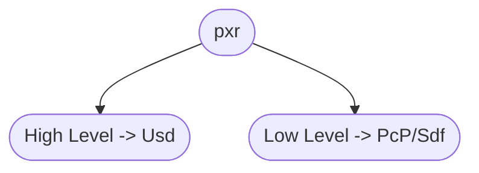

# API Overview [API概述]
Before we dive into the nitty gritty details, let's first have a look at how the USD API is structured.

[ 在我们深入了解具体细节之前，我们首先看一下 USD API 的结构。]

Overall there are two different API "levels":

[ 总体而言，有两个不同级别的 API]



Most tutorials focus primarily on the high level API, as it is a bit more convenient when starting out. The more you work in Usd though, the more you'll start using the lower level API. Therefore this guide will often have examples for both levels.

[ 大多数教程主要介绍高级 API，因为它在开始时使用更方便一些。不过，随着您使用 USD 越多，就越会开始使用较低级别的 API。因此，本指南通常会提供两个级别 API 的示例。]

~~~admonish tip
We'd actually recommend starting out with the lower level API as soon as you can, as it will force you to write performant code from the start.

[ 我们实际上建议尽快开始使用低级API，因为它将迫使您从一开始就编写高性能的代码]
~~~

Now there are also a few other base modules that supplement these two API levels, we also have contact with them in this guide:

[ 这里有一些其他基础模块对这两个级别 API 的补充，我们也在本指南中与它们进行了连接：]

- **Gf**: The **G**raphics **F**oundations module provides all math related classes and utility functions (E.g matrix and vector data classes)

    [ Gf：图形基础模块, 提供所有数学相关的类和通用函数（例如矩阵和矢量的数据类）]
- **Vt** : The **V**alue **T**ypes module provides the value types for what USD can store. Among these is also the `Vt.Array`, which allows us to efficiently map USD arrays (of various data types like int/float/vectors) to numpy arrays for fast data processing.

    [ Vt：值类型模块, 提供 USD 可以存储值的类型。例如 Vt.Array ，它允许我们高效的将 USD 数组（各种数据类型，如 int/float/vectors）映射到 numpy 数组，以实现快速数据处理]
- **Plug**: This module manages USD's [plugin framework](../core/plugins/overview.md).

    [ Plug：该模块管理USD的[插件框架](../core/plugins/overview.md)]
- **Tf**: The **T**ools **F**oundations module gives us access to profiling, debugging and C++ utilities (Python/Threading). It also houses our type registry (for a variety of USD classes).

    [ Tf：工具类模块, 使我们能够访问分析、调试和 C++ 实用程序（Python/多线程）。它还包含我们的类型注册表（针对各种 USD 类别）]

For a full overview, visit the excellently written [USD Architecture Overview - Official API Docs](https://openusd.org/release/api/_usd__overview_and_purpose.html#Usd_ArchitecturalOverview) section.

[ 如需完整描述文档，请访问撰写更出色的 USD 官方架构文档 [USD Architecture Overview](https://openusd.org/release/api/_usd__overview_and_purpose.html#Usd_ArchitecturalOverview)]

## TL;DR - API Overview In-A-Nutshell [概述]
Here is the TL;DR version. Usd is made up of two main APIs:

[这是 TL;DR 摘要版本. USD 由两个主要 API 组成]

- High level API - 高级 API:
    - [Usd Core API](https://openusd.org/release/api/usd_page_front.html)
- Low level API - 低级 API:
    - [Sdf - Scene Description Foundations](https://openusd.org/release/api/sdf_page_front.html)
    - [Pcp - PrimCache Population (Composition)](https://openusd.org/release/api/pcp_page_front.html)

Individual components of Usd are loaded via a [plugin based system](./plugins/overview.md), for example Hydra, kinds, file plugins (Vdbs, abc) etc.

[ USD 的各个组件通过基于[插件系统](./plugins/overview.md)加载，例如 Hydra、kinds、file plugins(Vdbs、abc)等]

Here is a simple comparison:

[ 这是一个简单的对照]

~~~admonish info title=""
```python
{{#include ../../../code/core/elements.py:apiHighVsLowLevel}}
```
~~~

## What should I use it for?

[ 我应该用它做什么？]

~~~admonish tip
You'll be using these two API levels all the time when working with Usd.
The high level API is often used with read ops, the low level with write ops or inspecting the underlying caches of the high level API.

[ 在使用 USD时，您将一直使用这两个API级别. 高级API通常用于读取操作，低级API用于写入操作或检查高级API的底层缓存]
~~~

## Resources [资源]
- [USD Architecture Overview - Official API Docs](https://openusd.org/release/api/_usd__overview_and_purpose.html#Usd_ArchitecturalOverview)
- [Common USD API Classes](./resources.md)

## When should I use what?

[ 我应该在什么时候使用什么？]

As a rule of thumb, you use the high level API when:

[ 根据经验，您可以在以下情况下使用高级 API]

~~~admonish info title=""
- Reading data of a stage
- Using Usd Schema Classes (E.g.  [UsdGeomMesh](https://openusd.org/dev/api/class_usd_geom_mesh.html), [UsdClipsAPI](https://openusd.org/release/api/class_usd_clips_a_p_i.html), [UsdGeomPrimvarsAPI](https://openusd.org/release/api/class_usd_geom_primvars_a_p_i.html)) 
~~~

And the low level API when:

[当出现以下情况时应使用低级 API ]

~~~admonish info title=""
- Creating/Copying/Moving data of a layer
- Performance is critical (When is it ever not?)
~~~

## High Level API [高级API]
The Usd Core API docs page is a great place to get an overview over the high level API:

[  Usd Core API 文档页面是了解高级 API 概述的好地方]

- [Usd Core API](https://openusd.org/release/api/usd_page_front.html)

Basically everything in the pxr.Usd namespace nicely wraps things in the pxr.Sdf/pxr.Pcp namespace with getters/setters, convenience classes and functions.

[ 基本上, pxr.Usd命名空间中的内容都通过 getter/setter、convenience classes以及functions，对pxr.Sdf/pxr.Pcp命名空间中的内容进行了良好的封装。]

Therefore it is a bit more OOP oriented and follows C++ code design patterns.

[ 因此, 它更偏向于面向对象编程，并遵循C++的代码设计模式。]

~~~admonish important
This level always operates on the composed state of the stage. This means as soon as you are working stages, you'll be using the higher level API. It also takes care of validation data/setting common data, whereas the lower level API often leaves parts up to the user.

[ 这个级别API始终在 stage 的合成状态下运行. 这意味着只要您正在使用stage，您就会使用高级API. 它还负责验证数据/设置通用数据，而低级API通常会将部分工作留给用户]
~~~


## Low Level API [低级API]
Great entry points for the lower level API:

[ 了解低级别 API 最好的地方]

- [Sdf - Scene Description Foundations](https://openusd.org/release/api/sdf_page_front.html)

- [Pcp - PrimCache Population (Composition)](https://openusd.org/release/api/pcp_page_front.html)

This level always operates individual layers. You won't have access to the stage aka composed view of layers.

[ 该级别始终操作各个层. 您将无法访问stage 即图层的合成视图]

## Workflows [工作流程]
The typical workflow is to do all read/query operations in the high level API by creating/accessing a stage and then to do all the write operations in the low level API.

[ 典型的工作流程是通过使用高级 API 来创建/访问 stage 并执行所有读取/查询操作，然后使用低级 API 执行所有写入操作]

In DCCs, the data creation is done by the software, after that it is your job to massage the data to its final form based on what your pipeline needs:

[ 在DCC 软件中，数据创建是由软件完成的，之后您需要根据您的流程需求将数据调整为最终形式]

In the daily business, you'll be doing this 90% of the time:

[ 在日常业务中，90% 的时间你都会这样做：]

- Rename/Remove prims
- Create additional properties/attributes/relationships
- Add metadata

~~~admonish danger title=""
Sounds simple, right? Ehm right??

[听起来很简单，对吧？ 嗯~，对吧？？]
~~~

Well yes and no. This guide tries to give you good pointers of common pitfalls you might run into.

[ 嗯，是，也不是。本指南旨在为您可能遇到的常见问题提供良好的指导]

So let's get started with specifics!

[ 那么让我们开始了解具体细节吧！]


