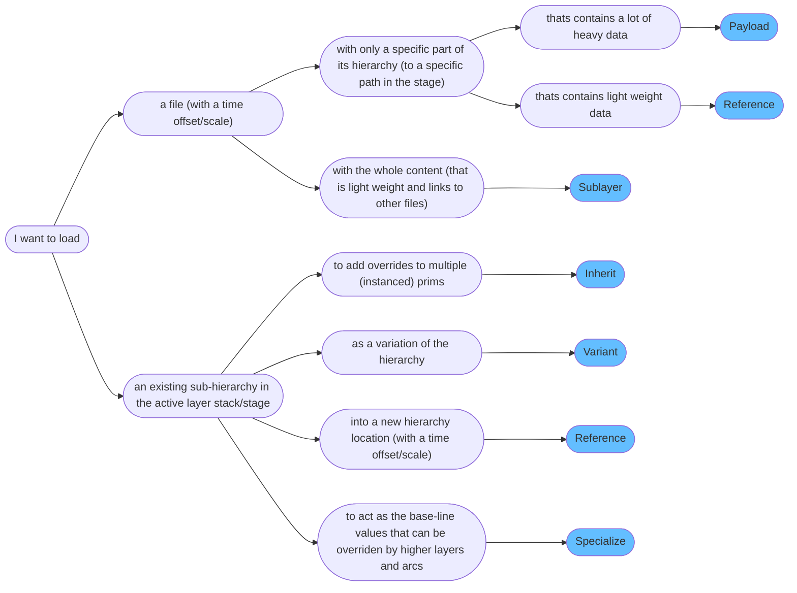
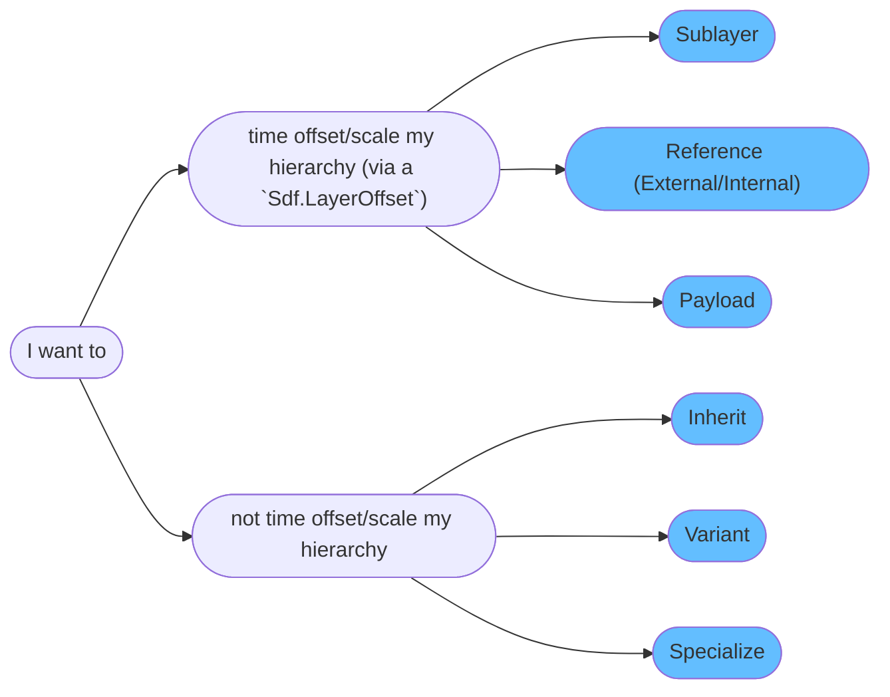
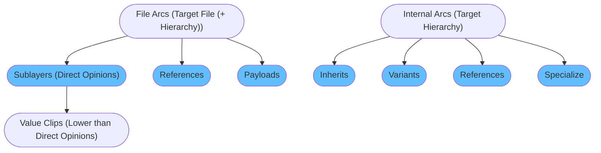

# Composition Strength Ordering (LIVRPS)
In this section we'll cover how composition arcs work and interact with each other. We cover how to create composition arcs via code in our [composition arcs](./arcs.md) section. This section will also have code examples, but with the focus on practical usage instead of API structure.

[ 在本节中，我们将介绍合成弧如何工作以及如何相互作用. 我们在合成弧部分介绍了如何通过代码创建[合成弧](./arcs.md) . 本节还将提供代码示例，但重点是实际用法而不是 API 结构]

~~~admonish tip
We have a supplementary Houdini scene, that you can follow along with, available in this [site's repository](https://github.com/LucaScheller/VFX-UsdSurvivalGuide/tree/main/files/composition). All the examples below will walk through this file as it easier to prototype and showcase arcs in Houdini via nodes, than writing it all in code.

[ 我们有一个补充的 Houdini 场景，您可以按照该场景进行操作，该场景可在 [本站点的存储库](https://github.com/LucaScheller/VFX-UsdSurvivalGuide/tree/main/files/composition) 中. 下面的所有示例都将遍历此文件，因为通过节点在 Houdini 中制作原型和展示弧比将其全部写入代码更容易]
~~~

# Table of Contents [目录]
1. [Composition Strength Ordering In-A-Nutshell](#summary)
1. [What should I use it for?](#usage)
1. [Resources](#resources)
1. [Overview](#overview)
1. [Composition Strength Ordering](#compositionStrengthOrdering)
1. [Composition Arc Categories](#compositionArcCategory)
    1. [Composition Arc By Use Case](#compositionArcCategoryByUseCase)
    1. [Composition Arc By Time Offset/Scale Capability](#compositionArcCategoryByTimeOffset)
    1. [Composition Arc By Target Type (File/Hierarchy)](#compositionArcCategoryByTargetType)
1. [Composition Arcs](#compositionArcs)
    1. [Sublayers / Local Direct Opinions](#compositionArcSublayer)
        1. [Value Clips](#compositionArcValueClips)
    1. [Inherits](#compositionArcInherit)
    1. [Variants](#compositionArcVariant)
        1. [Nested Variants](#compositionArcVariantNested)
        1. [Variant Data Lofting](#compositionArcVariantLofting)
        1. [Sharing data among variants](#compositionArcVariantSharing)
        1. [Efficiently re-writing existing data as variants](#compositionArcVariantReauthor)
    1. [References](#compositionArcReference)
        1. [Composition encapsulation for references (and payloads)](#compositionArcReferencePayloadEncapsulation)
        1. [Nested composition and list editable op order](#compositionArcReferenceStrongWeakerListOrder)
    1. [Payloads](#compositionArcPayload)
        1. [Workflows for loading payloads over references in shots](#compositionArcPayloadLoadWorkflow)
    1. [Specializes](#compositionArcSpecialize)
1. [Instancing in USD](#compositionInstance)

## TL;DR - Composition Arcs In-A-Nutshell [概述]<a name="summary"></a>
Here are the arcs in their composition strength order and their main intent:

[ 以下是按照合成弧权重强弱顺序和主要意图列出的列表]

- **L**ocal Opinions/Sublayers**: The sublayer arc is used to build up your stage root layer stack. They can be time offset/scaled via a Sdf.LayerOffset, see our code examples.

    [ Local Opinions/Sublayers：sublayer 合成弧用于构建 stage 根图层堆栈. 它们可以通过 Sdf.LayerOffset 进行时间偏移/缩放，请参见我们的代码示例]
- **I**nherits: The inherit arc is used to add overrides to existing (instanceable) prims. The typical use case is to apply an edit to a bunch of referenced in assets that were loaded as instanceable without losing instance-ability and without increasing the prototype count. It does not support adding a time offset via Sdf.LayerOffset.

    [ Inherits：继承弧用于向现有的（可实例化的）prim添加覆盖. 典型用例是将编辑应用于一批作为可实例化的引用资产，同时不失去实例化的能力并且不增加 prim 的数量. 它不支持通过 Sdf.LayerOffset 添加时间偏移]
- **V**ariants: The variant arc is used to allow users to switch through different variations of sub-hierarchies. It does not support adding any time offsets via Sdf.LayerOffsets.

    [ Variants：变体弧允许用户在子层级结构的不同变体之间进行切换. 它不支持通过 Sdf.LayerOffsets 添加任何时间偏移]
- **R**eferences: The reference arc is one of the most used arcs. Its main purpose is to aggregate scene description data from other files or sub-hierarchies. It is the only arc that has both file loading and internal hierarchy linking/loading possibilities. It does support adding time offsets via Sdf.LayerOffsets.

    [ References：引用弧它的主要目的是从其他文件或子层级结构中聚合场景数据. 它是唯一既具有文件加载功能又具有内部层级结构链接/加载可能性的弧. 它支持通过 Sdf.LayerOffsets 添加时间偏移]
- **P**ayloads: The payload arc is also one of the most used arcs. Its main purpose is to load heavy data. This means it is the arc that you'll use when loading any type of renderable geometry. It does support adding time offsets via Sdf.LayerOffsets.

    [ Payloads：payloads 弧它的主要目的是加载大量数据. 这意味着您将使用此弧加载任何类型的可渲染几何体. 它支持通过 Sdf.LayerOffsets 添加时间偏移]
- **S**pecializes: The specialize arc is used to supply "template" like values to your prim hierarchy. Any other arc can then overrides these. If we update the "template", all overrides from other arcs are kept. It does not support adding a time offset via Sdf.LayerOffset.

    [ Specializes：specialize 弧用于向 prim 层级结构提供“模板”值. 然后任何其他合成弧都可以覆盖这些值. 如果我们更新了“模板”，其他合成弧的所有覆盖都将保留. 它不支持通过 Sdf.LayerOffset 添加时间偏移]
- **(F)** allback value: If no value is found, [schemas](../elements/schemas.md) can provide fallback values.

    [ (F)allback value: 如果找不到值， [schemas](../elements/schemas.md) 可以提供默认返回值]

This is a very nuanced topic, therefore we recommend working through this section to fully understand it.

[ 这是一个非常微妙的话题，因此，我们建议您通过本节的学习来充分理解它]

## What should I use it for? <a name="usage"></a>

[ 我应该用它做什么？]

~~~admonish tip
We'll be using composition arcs to load data from different files and hierarchy locations. This is the core mechanism that makes USD powerful, as we can layer/combine our layers in meaningful ways.

[ 我们将使用合成弧从不同文件和层级结构位置加载数据 这是使 USD 强大的核心机制，因为我们通过有意义的方式分层/组合我们的层]

For USD to be able to scale well, we can also "lock" the composition on prims with the same arcs, so that they can use the same data source. This allows us to create instances, which keep our memory footprint low.

[ 为了使 USD 能够很好地扩展，我们还可以将组合“锁定”在具有相同弧的 prims 上，以便它们可以使用相同的数据源. 这允许我们创建实例，从而保持较低的内存占用]
~~~

## Resources [资源]<a name="resources"></a>
- [USD Glossary - LIVRPS Composition Strength Ordering](https://openusd.org/release/glossary.html#livrps-strength-ordering)
- [USD Glossary - Direct Opinions](https://openusd.org/release/glossary.html#direct-opinion)
- [USD Glossary - Inherits](https://openusd.org/release/glossary.html#usdglossary-inherits)
- [USD Glossary - Variants](https://openusd.org/release/glossary.html#usdglossary-variant)
- [USD Glossary - References](https://openusd.org/release/glossary.html#usdglossary-references)
- [USD Glossary - Payloads](https://openusd.org/release/glossary.html#usdglossary-payload)
- [USD Glossary - Specializes](https://openusd.org/release/glossary.html#usdglossary-specializes)
- [USD Instancing](https://openusd.org/release/api/_usd__page__scenegraph_instancing.html)

## Overview [概述]<a name="overview"></a>
USD's composition arcs each fulfill a different purpose. As we can attach attach all arcs (except sublayers) to any part of the hierarchy other than the pseudo root prim. When loading our data, we have a pre-defined load order of how arcs prioritize against each other. Each prim (and property) in our hierarchy then gets resolved (see our [Inspecting Compositon](./pcp.md) section) based on this order rule set and the outcome is a (or multiple) value sources, that answer data queries into our hierarchy.

[ USD 的合成弧各有不同的目的. 我们可以将所有弧（除 sublayers 外）附加到除 pseudo root prim 层级结构的任何部分. 在加载数据时我们有一个预定义的加载顺序，用于确定弧之间的优先级. 然后根据这个顺序规则集，层级结构中的每个 prim (和属性) 都会得到解析（请参阅[Inspecting Compositon](./pcp.md)）并且结果是一个（或多个）原始值，用于回答我们对层级结构的数据查询]

All arcs, except the `sublayer` arc, target (load) a specific prim of a layer stack (**NOT layer**). This allows us to rename the prim, where the arc is created on, to something different, than what the arc's source hierarchy prim is named. An essential task that USD performs for us, is mapping paths from the target layer to the source layer (stack).

[ 除了`sublayer`弧之外，所有弧都针对（加载）层堆叠（而非单独的层）中的特定 prim. 这使得我们可以将弧创建时所针对的 prim 重命名为与弧源层级结构 prim 不同的名称. USD 为我们执行的一项基本任务是映射从目标层到源层（堆栈）的路径]

~~~admonish important title="Important | Good-To-Knows"
- Composition arcs target layer stacks, not individual layers. This just means that they recursively load what is in a layer.

[ 合成弧目标图层堆栈，而不是单个图层. 这仅仅意味着它们递归地加载层中的内容]
- When arcs target a non root prim, they do **not** receive parent data that usually "flows" down the hierarchy. This means that primvars, material bindings or transforms from ancestor prims do not get "inherited" (we don't mean the inherited arc here). They **do** see the composition result though. So for example if your file reference targets a prim inside a variant, it can't change the variant as the variant is not in the stage it was referenced into to.

[ 当弧以非根 prim 为目标时，它们通常不会接收沿层级结构“流动”的父数据. 这意味着 primvars、material bindings 或来自祖先 prims 的变换不会被“继承”（我们在这里不是指继承的弧）但他们确实看到了合成结果. 因此如果您的文件引用针对变体中的 prim，则它无法更改该变体，因为该变体不在其引用的阶段]
- Internal composition arcs (inherit/internal references/specialize) cannot target ancestor or child arcs. We can only target sibling prims or prims that are at/under a different "/" stage root prim.

[ 内部合成弧（inherit/internal references/specialize）不能以祖先或子弧为目标. 我们只能定位同级 prim 或位于不同“/”阶段根 prim 下的 prim]
- Composition arcs only look in the active layer stack and in "higher" layer stacks (layer stacks that reference/payload the active layer stack).

[ 合成弧仅查看活动层堆栈和“更高”层堆栈（reference/payload 激活层堆栈的层堆栈）]
~~~

## Composition Strength Ordering <a name="compositionStrengthOrdering"></a>
To prioritize how different arcs evaluate against each other, we have `composition strength ordering`. This is a fancy word for "what layer (file) provides the actual value for my prim/property/metadata based on all available composition arcs". (I think we'll stick to using `composition strength ordering` 😉).

[ 为了确定不同弧之间如何相互影响的优先级，我们采用了“合成强度顺序” 这实际上是一个高级词汇，用于描述 “在所有可用的合成弧中，哪一层（文件）为 prim/property/metadata 提供了实际的值” (我想我们会坚持使用“合成强度顺序”这个说法😉)]

All arcs, except sublayers, make use of list editing, see our [fundamentals](./fundamentals.md#compositionFundamentalsListEditableOps) for a detailed explanation. We highly recommend reading it first before continuing.

[ 除子 sublayers 外的所有弧都使用列表编辑，请参阅[基础知识](./fundamentals.md#compositionFundamentalsListEditableOps) 以获取详细说明. 我们强烈建议您在继续之前先阅读它]

Let's look at the order:

[ 我们看一下顺序]


~~~admonish quote title="Credits"
All credits for this info graphic go to [Remedy-Entertainment - Book Of USD](https://remedy-entertainment.github.io/USDBook/terminology/LIVRPS.html). Check out their site, it is another great value source for USD.

[ 此信息图的所有学分均归 [Remedy-Entertainment - Book Of USD](https://remedy-entertainment.github.io/USDBook/terminology/LIVRPS.html) 查看他们的网站，这是另一个 USD 重要价值来源]
~~~

USD refers to this with the acronym `L(V)IVRPS(F)`:

[ USD 用缩写 L(V)IVRPS(F) 来指代]

- **L**ocal: Search for [direct opinions](https://openusd.org/release/glossary.html#direct-opinion) in the active root layer stack.

    [ Local：在激活的根层堆栈中搜索[直接权重](https://openusd.org/release/glossary.html#direct-opinion)]
    - **V**alue Clips: Search for [direct opinions](https://openusd.org/release/glossary.html#direct-opinion) from value clips. These are weaker than direct opinions on layers.

        [ Value Clips：从值剪辑中搜索[直接权重](https://openusd.org/release/glossary.html#direct-opinion). 比 layers 上的直接权重弱]
- **I**nherits: Search for inherits affecting the path. This searches in the (nested) layer stack by recursively applying *LIVRP* (No specializes) evaluation.

    [ Inherits: 搜索路径影响的继承. 通过在层堆栈中递归地应用LIVRP(不包含specialize)来评估结果]
- **V**ariant Sets: Search for variants affecting the path. This searches in the (nested) layer stack by recursively applying *LIVRP* (No specializes) evaluation.

    [ Variant Sets: 搜索路径影响的变体. 通过在层堆栈中递归地应用LIVRP(不包含specialize)来评估结果]
- **R**eferences: Search for references affecting the path. This searches in the (nested) layer stack by recursively applying *LIVRP* (No specializes) evaluation.

    [ References: 搜索路径影响的引用. 通过在层堆栈中递归地应用LIVRP(不包含specialize)来评估结果]
- **P**ayloads: Search for payloads affecting the path. This searches in the (nested) layer stack by recursively applying *LIVRP* (No specializes) evaluation.

    [ Payloads: 搜索路径影响的 Payloads. 通过在层堆栈中递归地应用LIVRP(不包含specialize)来评估结果]
- **S**pecializes: Search for specializes affecting the path. This searches in the (nested) layer stack by recursively applying full *LIVRPS* evaluation. This causes the specialize opinions to always be last.

    [ Specializes: 搜索路径影响的 specializes. 这会在（嵌套的）层堆栈中通过递归应用完整的LIVRPS来评估结果. 这导致specialize的权重总是最后的]
- **(F)** allback value: Look for [schema](../elements/schemas.md) fallbacks.

    [ (F)allback value：查看 [schema](../elements/schemas.md) 的返回值]

Now if you just didn't understand any of that, don't worry! We'll have a look where what arc is typically used in the examples below.

[ 现在，如果您不明白其中任何一点，请不要担心！我们将看看下面的示例中通常使用合成弧的地方]

~~~admonish important title="Important | Nested Composition Arc Resolve Order"
When resolving nested composition arcs and value clips, the arc/value clip metadata, that is authored on the closest ancestor parent prim or the prim itself, wins. In short to quote from the USD glossary `“ancestral arcs” are weaker than “direct arcs”`. To make our lives easier, we recommend having predefined locations where you author composition arcs. A typical location is your asset root prim and a set/assembly root prim.

[ 当解析嵌套合成弧和值剪辑时，在最接近的父级 prim 或 prim 本身创建的弧/值剪辑元数据获胜. 根据 USD 术语表 "祖先弧" 弱于 "直接弧" 为了让我们的工作更加便捷，我们建议在特定位置创建合成弧. 典型的位置是资产 root prim 和 set/assembly root prim]
~~~

## Composition Arc Categories <a name="compositionArcCategory"></a>
Let's try looking at arcs from a use case perspective. Depending on what we want to achieve, we usually end up with a specific arc designed to fill our needs.

[ 让我们尝试从用例的角度来看待合成弧.根据我们想要实现的目标，我们通常会设计出一个特定的合成弧来满足我们的需求]

### Composition Arc By Use Case <a name="compositionArcCategoryByUseCase"></a>
Here is a comparison between arcs by use case. Note that this is only a very "rough" overview, there are a few more things to pay attention to when picking the correct arc. It does help to first understand what the different arcs try to achieve though.

[ 以下是按用例对合成弧进行的比较. 请注意，这只是一个非常“粗略”的概述，在选择合适的合成弧时，还需要注意一些其他事项. 首先了解不同合成弧试图实现的目标确实很有帮助]

~~~admonish tip title=""

~~~

### Composition Arc By Time Offset/Scale Capability <a name="compositionArcCategoryByTimeOffset"></a>
Some arcs can specify a time offset/scale via a`Sdf.LayerOffset`.

[ 某些弧可以通过 Sdf.LayerOffset 指定时间偏移/缩放]

~~~admonish tip title=""

~~~

### Composition Arc By Target Type (File/Hierarchy) <a name="compositionArcCategoryByTargetType"></a>
Here is a comparison between arcs that can target external layers (files) and arcs that target another part of the hierarchy.

[ 以下是可以针对外部层（文件）的弧与针对层级结构的其他部分的弧之间的比较]

~~~admonish tip title=""

~~~


## Composition Arcs <a name="compositionArcs"></a>
Let's gets practical! Below will go through every arc individually and highlight what is important.

[ 让我们变得实用吧！下面将分别介绍每个合成弧并突出显示重要的内容]

~~~admonish tip
We have a supplementary Houdini scene, that you can follow along with, available in this [site's repository](https://github.com/LucaScheller/VFX-UsdSurvivalGuide/tree/main/files/composition). All the examples below will walk through this file as it easier to prototype and showcase arcs in Houdini via nodes, than writing it all in code.

[ 我们有一个补充的 Houdini 场景，您可以按照该场景进行操作，该场景可在 [本站点的存储库](https://github.com/LucaScheller/VFX-UsdSurvivalGuide/tree/main/files/composition) 中找到. 下面的所有示例都将遍历此文件，因为通过节点在 Houdini 中制作原型和展示弧比将其全部写入代码更容易]
~~~

### Sublayers / Local Direct Opinions <a name="compositionArcSublayer"></a>
The sublayer arc is used to build up your stage [root layer stack](./fundamentals.md#compositionFundamentalsLayerStack). They can be time offset/scaled via a `Sdf.LayerOffset`, see our [code examples](./arcs.md#compositionArcSublayer).

[ sublayer 弧用于构建 stage [root layer stack](./fundamentals.md#compositionFundamentalsLayerStack) 它们可以通过 Sdf.LayerOffset 进行时间偏移/缩放，请参阅[代码示例](./arcs.md#compositionArcSublayer)]

~~~admonish tip title="Pro Tip | What do we use sublayers for?"
Typically we'll be using sublayers for mainly these things:

[ 通常我们将使用 sublayers 主要用于以下目的]
- As a mechanism to separate data when working in your DCCs. On file write we usually flatten layers to a single flattened output(s)(if you have multiple save paths set). Why not put everything on the same layer? We can use the layer order as a form of control to A. allow/block edits (or rather seeing them have an effect because of weaker opinion strength) B. Sort data from temporary data.

    [ 作为在 DCC 中工作时分离数据的一种机制. 在文件写入时我们通常会将图层合并为单个扁平化的输出（如果设置了多个保存路径）为什么不把所有东西都放在同一图层上呢？ 我们可以利用图层顺序作为一种控制形式 A. 允许/阻止编辑（更确切地说，由于较弱的意见强度而看到它们的效果）B. 将数据从临时数据中分离出来]
- To load in references and payloads. That way all the heavy lifting is not done (and should not be done) by the sublayer arc.

    [ 用于加载 references 和 payloads 这样繁重的任务就不会（也不应该）由 sublayer 弧来完成]
- In shot workflows to load different shot layers. Why don't we do this via references or payloads you might be asking yourself? As covered in our [fundamentals](./fundamentals.md#compositionFundamentalsEncapsulation) section, anything your reference or payload in will be encapsulated. In shot workflows we want to keep having access to list editable ops. For example if we have a layout and a lighting layer, the lighting layer should still be able to remove a reference, that was created in the layout layer.

    [ 在镜头工作流程中加载不同的镜头图层. 你可能会问我们为什么不通过 references 或 payloads 来实现这一点呢？ 正如我们在 [基础知识](./fundamentals.md#compositionFundamentalsEncapsulation) 部分所提到的，你的 references 或 payloads 中的任何内容都会被封装起来. 在镜头工作流程中我们希望继续能够访问列表可编辑操作. 例如 我们有一个 layout 层和一个 lighting 层，lighting 层仍然应该能够删除在 layout 层中创建的引用]
~~~

~~~admonish tip title="Pro Tip | Editing sublayer arcs via the USD API"
If you want to create/edit sublayer arcs via code, see our [Composition Arc - Code API](./arcs.md#compositionArcSublayer) section.

[ 如果您想通过代码创建/编辑 sublayer 弧，请参阅我们的 [合成弧 - 代码 API](./arcs.md#compositionArcSublayer) 部分]
~~~

Let's look at how sublayers are used in native USD:

[ 我们来看看原生 USD 中如何使用 sublayers]

When creating a stage we have two layers by default:

[ 创建 stage 时，我们默认有两层]

- **Session Layer**: This is a temp layer than doesn't get applied on disk save. Here we usually put things like viewport overrides.

    [ 会话层：这是一个临时层，不会应用于磁盘保存. 通常我们会在此处放置一些内容，例如 viewport overrides]
- **Root Layer**: This is the base layer all edits target by default. We can add sublayers based on what we need to it. When calling `stage.Save()`, all sublayers that are dirty and not anonymous, will be saved.

    [ 根层：这是所有编辑默认指向的基础层. 我们可以根据需求向其中添加 sublayer 当调用 stage.Save() 时，所有已修改且非匿名的子层都将被保存]

How are sublayers setup in Houdini?

[ Houdini 中的子图层是如何设置的？]

In Houdini every node always edits the top most root layer sublayer (in USD speak the layer to edit is called the **edit target**). This way we don't have to worry about what our layer, we want to write to, is. In the scene graph panel the session layer is displayed under the root layer, it is actually over (higher) than the root layer.

[ 在Houdini中，每个节点总是编辑最顶层的根层子层（在USD中，要编辑的层被称为 edit target）这种方式使得我们不必担心我们想要写入的层是什么. 在 scene graph panel 中，会话层显示在根层下方，但实际上它的层级是高于根层的]

To summarize how Houdini makes node editing a layer based system possible (at least from what we can gather from reverse engineering):

[ Houdini 通过其独特的节点系统，使得基于层的编辑成为可能. 以下是对其如何实现这一功能的总结（至少我们可以从逆向工程中收集到的信息来看出这一点）]

Every node stashes a copy of the top most layer (Houdini calls it the **active layer**), that way, when we switch from node to node, it transfers back the content as soon as it needs to be displayed/cooked. This does have a performance hit (as covered in our [Houdini performance](../../dcc/houdini/performance/overview.md)) section. It also spawns a new stage per node when necessary, for example when a python LOP node or python parm expression accesses the previous node's stage. This mechanism gives the user the control to spawn new layers when needed. By default your network is color coded by what the active layer is.

[ 在Houdini中，每个节点都会存储最顶层（Houdini称之为激活层）的一个副本. 这种方式使得当我们在不同节点之间切换时，一旦需要显示或计算内容，它就会将内容传回. 尽管这种机制提供了很大的灵活性，但它确实会对性能产生一定的影响(如在 [Houdini performance](../../dcc/houdini/performance/overview.md) 部分所述). 此外当 Python LOP node 或 python parm expression 访问前一个节点的 stage 时，它还会为每个节点生成一个新的 stage . 这种机制使得用户能够在需要时控制创建新的层. 默认情况下您的 network 会根据激活层显示不同的颜色，这有助于用户更直观地理解和管理他们的场景]


Houdini writes all your scene graph panel viewport overrides into session layer sublayers. By default these are not shown in the UI, you can view them by looking at the layer content though.

[ Houdini 将所有场景图面板的 viewport overrides 写入会话层的 sublayer 中. 默认情况下这些不会显示在 UI 中，但您可以通过查看图层内容来查看它们]


Instead of using layers non-anonymous save paths (layer identifiers) directly, all layers created in your session are anonymous layers (with Houdini specific metadata that tracks the save path). We're guessing that this is because all layers without a save path get merged into the next available layer with a save path on file save. If no layer has a save path, all content gets flattened into the layer file path you put on the USD rop.

[ 在 Houdini 中，与直接使用非匿名保存路径（层标识符）的层不同，会话中创建的所有层都是匿名层. 这些匿名层带有 Houdini 特定的元数据，用于跟踪保存路径. 这种设计可能是因为在文件保存时，所有没有保存路径的层都会被合并到下一个具有保存路径的可用层中. 如果所有层都没有保存路径，那么所有内容都会被展平到用户在 USD rop 上设置的层文件路径中]


#### Value Clips <a name="compositionArcValueClips"></a>
We cover value clips in our [animation section](../elements/animation.md). Value clips are USD's mechanism for loading per frame (or per chunk) files, so that we don't have a single gigantic file for large caches.

[ 在 [动画](../elements/animation.md) 部分我们介绍了值剪辑（Value Clips）. 值剪辑是 USD 加载每帧（或每块）文件的一种机制. 通过这种方式，我们不必创建单个巨大的缓存文件]

Their opinion strength is lower than direct (sublayer) opinions, but higher than anything else. This of course is only relevant if we author time samples and value clips in the same layer. If we have multiple layers, then it behaves as expected, so the highest layers wins.

[ 他的权重强度低于直接（sublayer）权重，但高于其他任何权重. 当然，只有当我们在同一层中创建时间样本和值剪辑时才有意义. 如果我们有多个层，那么它会按预期工作，即最高层的权重会胜出]

~~~admonish tip title="Pro Tip | Editing value clips via the USD API"
Value clips are written via metadata entries on prims. If you want to create/edit value clips via code, see our [value clips](../elements/animation.md#value-clips-loading-time-samples-from-multiple-files) section.

[ 值剪辑是通过 prims 上的元数据条目写入的. 如果您想通过代码创建/编辑值剪辑，请参阅 [值剪辑](../elements/animation.md#value-clips-loading-time-samples-from-multiple-files)]
~~~

Here is a comparison between a layer with value clip metadata and time samples vs separate layers with each.
Houdini's "Load Layer For Editing", simply does a `active_layer.TransferContent(Sdf.Layer.FindOrOpen("/Disk/Layer.usd"))`, in case you are wondering, so it fakes it as if we created the value clip metadata in the active layer.

[ 下面是使用带有值剪辑元数据和时间样本的层与使用单独的层（每个层都包含这些元素）之间的比较. 在Houdini中，“Load Layer For Editing” 功能实际上是通过 active_layer.TransferContent(Sdf.Layer.FindOrOpen("/Disk/Layer.usd")) 来实现的. 这意味着它会将指定路径（如“/Disk/Layer.usd”）上的层的内容传输到当前激活的层中，从而模拟出我们在激活层中创建了值剪辑元数据的效果]

<video width="100%" height="100%" controls autoplay muted loop>
  <source src="./houdiniCompositionSublayerValueClip.mp4" type="video/mp4" alt="Houdini Sublayer Value Clip">
</video>

~~~admonish tip title="Pro Tip | How do we load value clipped files?"
We cover a production based example of how to load value clips in our [Composition for production](../../production/composition.md) section. Here are some import things to keep in mind:

[ 我们在 [面向生产的合成](../../production/composition.md) 部分中介绍了一个基于实际生产的案例，展示了如何加载价值剪辑. 这里有一些重要的注意事项需要牢记]
- When making prims instanceable, the value clip metadata has to be under the instanceable prim, as the value clip metadata can't be read from outside of the instance (as it would then mean each instance could load different clips, which would defeat the purpose of instanceable prims).

    [ 当使 prim 可实例化时，价值剪辑元数据必须位于可实例化的 prim 之下，因为价值剪辑元数据无法从实例外部读取（因为这将意味着每个实例都可以加载不同的剪辑，从而违背了可实例化 prim 的初衷）]
- Value clip metadata can't be inherited/internally referenced/specialized in. It must reside on the prim as a direct opinion.

    [ 价值剪辑元数据不能 inherited/internally referenced/specialized 它必须直接存在于 prim 上作为直接意见]

See the production examples for how to best load value clips.

[ 请参阅生产示例，了解如何最好地加载价值剪辑]
~~~

### Inherits <a name="compositionArcInherit"></a>
The inherit arc is used to add overrides to existing (instanceable) prims. The typical use case is to apply an edit to a bunch of referenced in assets that were loaded as instanceable without losing instance-ability and without increasing the prototype count. It does **not** support adding a time offset via `Sdf.LayerOffset`.

[ 继承弧用于向现有的（可实例化的）prims 添加覆盖. 其典型用例是对一批作为可实例化加载的引用资产应用编辑，同时保持它们的可实例化特性，并且不增加 prototype 的数量. 它并不支持通过 Sdf.LayerOffset 来添加时间偏移]

~~~admonish tip title="Pro Tip | What do we use inherits for?"
- We use inherit arcs as a "broadcast" operator for overrides: When we want to apply an edit to our hierarchy in multiple places, we typically create a class prim, whose child prims contain the properties we want to modify. After that we create an inherit arc on all prims that should receive the edit. As it is the second highest arc behind direct opinions, it will always have the highest composition strength, when applied to instanceable prims, as instanceable prims can't have direct opinions.

    [ 我们使用继承弧作为覆盖的“广播”操作符：当我们想在层级结构的多个位置应用编辑时，通常会创建一个 class prim，其 child prims 包含我们想要修改的属性. 之后我们在所有应该接收编辑的 prim 上创建继承弧. 由于它是仅次于直接意见的第二种最高弧，因此当应用于可实例化的 prim 时，它将始终具有最高的合成强度，因为可实例化的 prim 不能有直接意见]
- The inherit arc lookup is never [encapsulated](./fundamentals.md#compositionFundamentalsEncapsulation), the inherit arc list-editable op is. This means that any layer stack, that re-creates the prims that that the inherit targets, gets used by the inherit. This does come at a performance cost, as the composition engine needs to check all layer stacks from where the arc was authored and higher for the hierarchy that the inherit targets.

    [ 继承弧的查找永远不会被 [封装](./fundamentals.md#compositionFundamentalsEncapsulation)，而继承弧的列表编辑操作会被封装. 这意味着任何重新创建继承目标的 prim 图层堆栈都会被继承使用. 这确实会带来性能开销，因为合成引擎需要检查从弧被创建的位置到层级结构中继承目标所在位置及以上的所有图层堆栈]
- The inherit arc commonly gets used together with the [class prim specifier](../elements/prim.md#primSpecifier). The class prim specifier is specifically there to get ignored by default traversals and to provide template hierarchies that can then get inherited (or internally referenced/specialized) to have a "single source to multiple targets" effect.

    [ 继承弧通常与 clas prim 指定符一起使用. [class prim specifier](../elements/prim.md#primSpecifier) 指定符专门用于在默认遍历中被忽略，并提供可以作为模板的层级结构，然后可以通过继承（或 internally referenced/specialized）来实现“单一源到多个目标”的效果]
- Depending on if we are working on shots or assets are common practices:

    [ 具体使用继承弧的方式取决于我们是在处理镜头还是资产]
    - **Assets**: When creating assets, we can author a `/__CLASS__/<assetName>` inherit. When we use the asset in shots, we can then easily add overrides to all assets of this type, by creating prims and properties under that specific class prim hierarchy. While this sounds great in theory, artists often want to only selectively apply an override to an asset. Therefore having the additional performance cost of this arc in assets is something might not worth doing. See the next bullet point.

        [ 资产：在创建资产时我们可以编写一个 `/__CLASS__/<assetName>` 的继承. 当我们在镜头中使用该资产时，就可以通过在特定的 calss prim 层级结构下创建 prim 和 properties，轻松地为所有这种类型的资产添加覆盖. 虽然这在理论上听起来很好但艺术家通常只想选择性地为资产应用覆盖. 因此在资产中使用这种弧可能带来额外的性能开销, 使其并不值得. 请参阅下一点]
    - **Shots**: This is where inherits shine! We usually create inherits to:

        [ 镜头：这正是继承发挥作用的地方！我们通常创建继承来]
        - Batch apply render geometry settings to (instanceable) prims. This is a great way of having a single control point to editing render settings per different areas of interest in your scene.

            [ 批量应用 渲染几何体设置到（可实例化的）prim. 这是为不同兴趣区域编辑渲染设置提供单一控制点的绝佳方式]
        - Batch apply activation/visibility to instanceable prims. This way we don't increase the prototype count.

            [ 批量应用 激活/可见性到可实例化的 prim 这样，我们就不会增加原型计数]
~~~

~~~admonish tip title="Pro Tip | Editing inherit arcs via the USD API"
If you want to create/edit inherit arcs via code, see our [Composition Arc - Code API](./arcs.md#compositionArcInherit) section.

[ 如果您想通过代码创建/编辑继承弧，请参阅我们的 [组合弧 - 代码 API](./arcs.md#compositionArcInherit) 部分]
~~~

In the accompanying [Houdini file](https://github.com/LucaScheller/VFX-UsdSurvivalGuide/tree/main/files/composition) you can find the inherit example from the [USD Glossary - Inherit](https://openusd.org/release/glossary.html#usdglossary-inherits) section.

[ 在随附的 [Houdini file](https://github.com/LucaScheller/VFX-UsdSurvivalGuide/tree/main/files/composition) 中，您可以从 [USD Glossary - Inherit](https://openusd.org/release/glossary.html#usdglossary-inherits) 部分找到继承示例]

~~~admonish tip title="Pro Tip | Add inherits to instanceable prims"
Here is a typical code pattern we'll use when creating inherits:

[ 这是我们在创建继承时将使用的典型代码模式]
```python
from pxr import Sdf
...
# Inspect prototype and collect what to override
prototype = prim.GetPrototype()
...
# Create overrides
class_prim = stage.CreateClassPrim(Sdf.Path("/__CLASS__/myCoolIdentifier"))
edit_prim = stage.DefinePrim(class_prim.GetPath().AppendChild("leaf_prim"))
edit_prim.CreateAttribute("size", Sdf.ValueTypeNames.Float).Set(5)
...
# Add inherits
instance_prims = prototype.GetInstances()
for instance_prim in instance_prims:
    inherits_api = instance_prim.GetInherits()
    inherits_api.AddInherit(class_prim.GetPath(), position=Usd.ListPositionFrontOfAppendList)    
```
~~~

Let's look at some more examples.

[ 让我们看一些更多的例子]

~~~admonish danger title="Pro Tip | Inherit Performance Cost"
As mentioned above, an inherit "only" searches the active layer stack and layer stacks the reference/payload the active layer stack. That means if we create an inherit in a "final" stage (A stage that never gets referenced or payloaded), there is little performance cost to using inherits.

[ 如上所述，继承“仅”搜索激活层堆栈，并且层堆栈 reference/payload 激活层堆栈. 这意味着如果我们在“最终” stage（永远不会被 reference/payload 的 stage）创建继承，则使用继承的性能成本很小]
~~~


Here is the composition result for the left node stream. (For how to log this, see our [Inspecting composition](./pcp.md) section).

[ 以下是左侧分支的合成结果. （关于如何记录此结果，请参见 [Inspecting composition](./pcp.md)]


Vs the right node stream:

[ 与右侧分支相比]


If we actually switch to an reference arc for the "shot style" inherit stream, we won't see a difference. So why use inherits here? As inherits are higher than variants, you should prefer inherits, for these kind of "broadcast" operations. As inherits also don't support time offsetting, they are the "simplest" arc in this scenario that does the job 100% of the time.

[ 如果我们实际上切换到“镜头样式”继承流的参考弧，我们不会看到明显的区别. 那么为什么在这里要使用继承呢？由于继承的优先级高于变体，对于这种“广播”操作，你应当更倾向于使用继承. 同时因为继承也不支持时间偏移，它们在这种场景下是最“简单”的合成，能够100%完成所需的工作]


~~~admonish tip title="Pro Tip | Advanced Inherits - Making USD simple again!"
When you've worked a while in USD, you sometimes wonder why we need all these different layering rules. Why can't life be simple for once?

[ 当您在 USD 领域工作了一段时间后，您有时会想知道为什么我们需要所有这些不同的分层规则. 为什么生活就不能简单一点呢？]

Head over to our [Composition in production](../../production/composition.md) section for a more production related view on composition. There we discuss how to get the best out of each arc, without making it overly complicated.

[ 前往我们的 [作中的合成](../../production/composition.md) 部分，了解更多与制作相关的合成视图. 在那里我们讨论如何充分利用每个合成弧，而不使其过于复杂]
~~~

### Variants <a name="compositionArcVariant"></a>
The variant arc is used to allow users to switch through different variations of sub-hierarchies. It does **not** support adding any time offsets via `Sdf.LayerOffset`s.

[ 变体弧用于允许用户在子层级结构的不同变体之间进行切换. 它不支持通过 Sdf.LayerOffset 添加任何时间偏移]

~~~admonish tip title="Pro Tip | What do we use variants for?"
- We use it as a mechanism to swap between (wait for it ...) variations of a hierarchy. The main applications are:

    [ 我们使用它作为一种机制，在（等待揭晓……）层级结构的各种变体之间进行切换. 它的主要应用场景包括]
    - **Assets**: Instead of having multiple assets with variations based of off a single base asset, we can store one asset and add variants. That way it is cleaner to track throughout the pipeline.

        [ 资产：与其创建多个基于单一基础资产的变体资产，我们可以存储一个资产并为其添加变体. 这样在整个流程中跟踪会更为清晰]
    - **Shots**: Variants in shots are typically used when a sequence based hierarchy needs to be replaced by a per shot variation. While you could also solve this by just deactivating the prims your need per shot or via sublayer ordering (if you overwrite the same prims), variants offer a cleaner workflow. This way we can keep the hierarchy at the same place and all our lighting department needs to do is target the same hierarchy, when picking what to render. Since variants swap out a whole sub section of a hierarchy, we also ensure that the geometry is not getting any unwanted attributes from other layers.

        [ 镜头：镜头中的变体通常用于当需要用一个基于镜头的变体来替换基于序列的层次结构时. 虽然你也可以通过简单地禁用每个镜头所需的 prim 或通过 sublayer 排序（覆盖相同的 prim）来解决这个问题，但变体提供了更干净的工作流程. 这样我们可以将层级结构保持在同一位置，我们的灯光部门只需要在挑选要渲染的内容时，针对相同的层级结构进行操作即可. 由于变体会替换层级结构的一个完整子部分，我们也确保了几何体不会从其他层获取任何不需要的属性]
- We can have any number of nested variants. A typical example is having multiple model variants, which each in return have different LOD (level of detail) variants.

    [ 我们可以拥有任意数量的嵌套变体. 一个典型的例子是拥有多个模型变体，每个模型变体又有不同的细节级别（LOD）变体]
- We can also use it as a mechanism to share mesh data. For example if we have a car asset, we can write the car without a variant and then add all car accessories (which don't overlap hierarchy-wise with the car meshes) as variants. That way the artists can swap through what they need on top of the "base" model.

    [ 我们也可以使用它作为一种机制来共享网格数据. 例如我们有一个汽车资产，我们可以先编写没有变体的汽车，然后将所有汽车配件（在层级结构上与汽车网格不重叠）作为变体添加. 这样艺术家就可以在他们需要的“基础”模型之上进行切换]
- We don't need to have a variant selection. If we block or unset the selection, no variant will be selected/loaded, which results in an empty hierarchy. Fallbacks for variant set selections can be configured via the USD API or a USD plugin ([API Docs](https://openusd.org/dev/api/class_usd_stage.html), search for 'Variant Management')

    [ 我们不需要变体选择. 如果我们阻止或取消设置选择，将不会选择/加载任何变体，从而导致一个空的层级结构. 可以通过 USD API 或 USD 插件配置变体集选择的备选方案（[API 文档](https://openusd.org/dev/api/class_usd_stage.html)，搜索“Variant Management”）]
- How are variants structured? Variants are written "inline", unlike the inherit/reference/payload/specialize arcs, they do not point to another hierarchy path. Instead they are more similar to child prims (specs). We usually then write other arcs, like payloads, into the variants, that do the actual heavy data loading.

    [ 变体是如何构造的？ 变体是“内联”编写的，与 inherit/reference/payload/specialize 弧不同，它们不指向另一个层级结构路径. 相反它们更像 child prims（specs）我们通常会在变体中编写其他弧，如 payloads 来执行实际的重数据加载]
- We can also use variants as the mechanism to "variant away" arcs that have been encapsulated. More info in our [fundamentals section](./fundamentals.md#compositionFundamentalsEncapsulation).

    [ 我们还可以将变体用作一种机制，以“变体消失”已封装的弧. 更多信息请参见我们的 [基础知识](./fundamentals.md#compositionFundamentalsEncapsulation) 部分]
~~~

~~~admonish tip title="Pro Tip | Editing variant arcs via the USD API"
If you want to create/edit variant arcs via code, see our [Composition Arc - Code API](./arcs.md#compositionArcVariant) section.

[ 如果您想通过代码创建/编辑变体弧，请参阅我们的 [合成弧 - 代码 API](./arcs.md#compositionArcVariant) 部分]
~~~

Let's talk about technical details:
Variant sets (the variant set to variant name mapping) is managed via list editable ops.
The actual variant data is not though. It is written "in-line" into the prim spec via the `Sdf.VariantSetSpec`/`Sdf.VariantSpec` specs, so that's why we have dedicated specs. This means we can add variant data, but hide it by not adding the variant set name to the `variantSets` metadata.

[ 让我们谈谈技术细节：变体集（变体集到变体名称映射）是通过列表可编辑操作进行管理的. 但实际的变体数据并非如此. 它通过 Sdf.VariantSetSpec / Sdf.VariantSpec specs “内联”写入 prim specs，因此我们有专用规范. 这意味着我们可以添加变体数据，通过不将变体集名称添加到 variantSets 元数据来隐藏它]

Let's first look at a simple variant.

[ 让我们首先看一个简单的变体]

~~~admonish tip title=""
```python
def Xform "car" (
    variants = {
        string color = "colorA"
    }
    prepend variantSets = "color"
)
{
    variantSet "color" = {
        "colorA" {
            def Cube "cube"
            {
            }
        }
        "colorB" {
            def Sphere "sphere"
            {
            }
        }
    }
}
```
~~~

We can also block a selection, so that nothing gets loaded:

[ 我们还可以 block 选择，以便不加载任何内容]

~~~admonish tip title=""
```python
def Xform "car" (
    variants = {
        string color = ""
    }
    prepend variantSets = "color"
)
{
    variantSet "color" = {
        "colorA" {
            def Cube "cube"
            {
            }
        }
        "colorB" {
            def Sphere "sphere"
            {
            }
        }
    }
}
```
~~~

See our [variant composition arc authoring](./arcs.md#compositionArcVariant) section on how to create this via code.

[ 请参阅 [variant composition arc authoring](./arcs.md#compositionArcVariant), 了解如何通过代码创建它]

#### Nested Variants <a name="compositionArcVariantNested"></a>
When we write nested variants, we can also write the selections into the nested variants. Here is an example, have a look at the `variants = {string LOD = "lowRes"}` dict.

[ 当我们编写嵌套变体时，我们同样可以将选择项写入到嵌套变体中. 下面是一个例子，请看一下这个变体字典：variants = {string LOD = "lowRes"}]

~~~admonish danger title="Pro Tip | Nested Variant Selections"
When we have nested variants the selection is still driven through the highest layer that has a variant selection value (USD speak `opinion`) for each variant selection set. If we don't provide a selection, it will fallback to using the (nested) selection, if one is written. In the example below, if we remove the `string LOD = "lowRes"` entry on the bicycle prim, the selection will fallback to "highRes" as it will get the selection from the nested variant selection.

[ 当我们有嵌套的变体时，选择仍然由每个变体选择集中具有变体选择值（USD 中的“意见”）的最高层驱动. 如果我们不提供选择，它将回退到使用（嵌套的）选择（如果已编写）. 在下面的示例中，如果我们删除自行车 prim 上的字符串 LOD = "lowRes" 条目，选择将回退到 "highRes"，因为它将从嵌套的变体选择中获取选择]
```python
def Xform "bicycle" (
    variants = {
        string LOD = "lowRes"
        string model = "old"
    }
    prepend variantSets = "model"
)
{
    variantSet "model" = {
        "new" (
            variants = {
                string LOD = "lowRes"
            }
            prepend variantSets = "LOD"
        ) {
            variantSet "LOD" = {
                "lowRes" {
                    def Cylinder "cube"
                    {
                    }

                }
            }

        }
        "old" (
            variants = {
                string LOD = "highRes"
            }
            prepend variantSets = "LOD"
        ) {
            variantSet "LOD" = {
                "highRes" {
                    def Cube "cube"
                    {
                    }

                }
                "lowRes" {
                    def Sphere "sphere"
                    {
                    }

                }
            }

        }
    }
}
```
~~~

~~~admonish tip title="Pro Tip | Nested Variant Naming Conventions"
When working with nested variants in production, we recommend locking down the naming convention for the variant set names as well as the nested order. We also recommend **not** creating nested variants that only exists for a specific parent variant. This way, variant sets don't "randomly" come into existence based on other nested variant selections.

[ 在生产中处理嵌套变体时，我们建议使用固定的命名约定来为变体集命名并确定嵌套的顺序. 同时我们不建议创建仅存在于特定父变体中的嵌套变体. 这样变体集就不会出现因为其他嵌套变体的选择而“随机”化]

That way all your code knows where to look when authoring variants and authoring variants can be automated.

[ 这样当编写变体时您的所有代码都会知道应该查看哪个位置，并且编写变体的工作可以自动化]
~~~

#### Variant Data Lofting <a name="compositionArcVariantLofting"></a>
In production we usually create variants in our asset layer stack. The common practice is to put your whole asset content behind a single payload (or to load individual asset layers behind a payload) that contain the variants. When unloading payloads, we still want to be able to make variant selections (or at least see what is available). In order for us to do this, we can "loft" the payload structure to the asset prim. Lofting in this case means, re-creating all variants, but without content. That way UIs can still pick up on the variant composition, but not load any of the data.

[ 在生产环境中我们通常会在资产层堆栈中创建变体. 常见的做法是将整个资产内容置于一个 payload 中（或者将单个资产层置于 payload 中），这个 payload 包含了变体. 在卸载 payload 时我们仍希望能够进行变体选择（或至少查看有哪些变体可用）.为了实现这一点我们可以将 payload 结构“loft”到资产 prim 上. 在这里 “loft” 意味着重新创建所有变体但不包含内容. 这样用户界面仍然可以检测到变体的构成，但不会加载任何数据]

One key problem of lofting the info is, that we have to dive into any nested variant to actually see the nested content. Since this is a one-off operation that can be done on publish, it is fine.

[ 将信息“loft”的一个关键问题是，我们必须深入到嵌套变体中去实际查看嵌套的内容. 由于这是可以在发布时完成的一次性操作，因此没有问题]

~~~admonish question title="Still under construction!"
It is on our to do list to build a code example for this.

[ 为此构建一个代码示例已在我们的待办事项列表中]
~~~

~~~admonish danger title=""
```python
def Xform "root_grp" (
    prepend payload = @asset_data@</root_grp>
    variants = {
        string LOD = "highRes"
        string model = "old"
    }
    prepend variantSets = "model"
)
{
    variantSet "model" = {
        "new" (
            prepend variantSets = "LOD"
        ) {
            variantSet "LOD" = {
                "lowRes" {

                }
            }

        }
        "old" (
            prepend variantSets = "LOD"
        ) {
            variantSet "LOD" = {
                "highRes" {

                }
                "lowRes" {

                }
            }

        }
    }
}
```
~~~

Here is a comparison in Houdini with unloaded/loaded payloads with lofted variant data.

[ 以下是 Houdini 中 unloaded/loaded payloads 和 loft 变体数据的比较]

<video width="100%" height="100%" controls autoplay muted loop>
  <source src="./houdiniCompositionVariantLoft.mp4" type="video/mp4" alt="Houdini Composition Variant Loft">
</video>

#### Sharing data among variants <a name="compositionArcVariantSharing"></a>
To share data among variants, we can either payload/reference the same data into each variant. We can also write our data that should be shared outside of the variant and then only add hierarchy overrides/additions via the variants.

[ 为了在变体之间共享数据，我们可以将相同的数据作为 payload 或 reference 添加到每个变体中. 另一种方法是将需要共享的数据写在变体之外，然后仅通过变体添加层级结构 overrides 或 additions]

Here is how it can be setup in Houdini:

[ 以下是在 Houdini 中的设置方法]

<video width="100%" height="100%" controls autoplay muted loop>
  <source src="./houdiniCompositionVariantShare.mp4" type="video/mp4" alt="Houdini Composition Variant Share">
</video>

#### Efficiently re-writing existing data as variants <a name="compositionArcVariantReauthor"></a>
Via the low level API we can also copy or move content on a layer into a variant. This is super powerful to easily create variants from caches.

[ 通过底层 API，我们还可以将一个图层上的内容复制或移动到变体中. 这对于从缓存中轻松创建变体来说非常强大]

Here is how it can be setup in Houdini:

[以下是在 Houdini 中的设置方法]

<video width="100%" height="100%" controls autoplay muted loop>
  <source src="./houdiniCompositionVariantCopyMove.mp4" type="video/mp4" alt="Houdini Composition Variant Copy/Move">
</video>

Here is the code for moving variants:

[ 这是移动变体的代码]

~~~admonish tip title=""
```python
{{#include ../../../../code/core/composition.py:compositionArcVariantMoveHoudini}}
```
~~~

And for copying:

[ [ 这是复制变体的代码]]

~~~admonish tip title=""
```python
{{#include ../../../../code/core/composition.py:compositionArcVariantCopyHoudini}}
```
~~~

### References <a name="compositionArcReference"></a>
The reference arc is one of the most used arcs. Its main purpose is to aggregate scene description data from other files or sub-hierarchies. It is the only arc that has both file loading and internal hierarchy linking/loading possibilities. It does support adding time offsets via `Sdf.LayerOffset`s.

[ reference 弧是最常用的弧之一. 它的主要目的是从其他文件或子层级结构中聚合场景数据. 它是唯一同时具有文件加载和内部层级结构链接/加载功能的弧. 它支持通过 Sdf.LayerOffsets 添加时间偏移]

~~~admonish tip title="Pro Tip | What do we use references for?"
- The reference arc is one of the most used arcs in USD: Its main use case is to combine smaller pieces of scene description into larger aggregates. Its main applications are:

    [ 引用弧是 USD 中最常用的弧之一：它的主要用途是将较小的场景描述片段组合成较大的聚合体. 其主要应用包括]
	- **Assets**: For assets we mainly stick to payloading in the individual layers (model/fx/materials) or we create a single payload that then references all the individual layers. So depending on how you build your asset structure, you might end up not using references, except for when building assembly type assets. Assemblies are USD files that reference other USD files for a logical grouping of assets, for example a film set or city.

        [ 资产：对于资产我们主要坚持在单独的层级（模型/特效/材质）中进行加载，或者我们创建一个单独的 payload，然后引用所有单独的层级. 因此根据您构建资产结构的方式，除了在构建装配类型资产时, 您可能最终不会使用引用. 装配 USD 文件引用其他 USD 文件以对资产进行逻辑分组，例如 电影场景或城市]
	- **Shots**: This is the most common place of usage for references. We use references to bring in our assets or assemblies. We also use it to time offset assets or existing hierarchies, as the reference arc can point to another prim path in the active layer stack. This makes it a powerful tool to drive (time) variations of assets in shots.

        [ 镜头：这是引用最常见的使用场景. 我们使用引用来导入我们的资产或装配. 我们还使用它来时间偏移资产或现有层级，因为引用弧可以指向激活层级堆栈中的另一个 prim 路径. 这使得它成为驱动镜头中资产（时间）变化的强大工具]
- As written in the previous bullet point, the reference arc should aggregate data. That means the files it is loading should not be heavy, but contain only (lofted) metadata and references/payloads to other files.

    [ 正如前一点所写引用弧应该聚合数据. 这意味着它加载的文件不应过重，而应仅包含（轻量级）元数据和对其他文件的 references/payloads]
- The reference arc targets a specific prim in the hierarchy. When using references to load a file, we either point to a specific prim we want to load from that file or we don't specify a prim and then the value of the "defaultPrim" layer metadata gets used. The default prim has to be a direct child prim of the pseudo root prim "/".

    [ 引用弧针对层级结构中的特定 prim. 当使用引用来加载文件时我们要么指向我们想从该文件中加载的特定 prim 要么不指定原始体然后使用 “defaultPrim” 层级元数据的值. defaultPrim 必须是 pseudo root prim "/" 的直接 child prim]
- The reference arc (as the payload arc) uses the principle of encapsulation. This means once a file is referenced in, the composition arcs in the file can't be list-edited any more.

    [ 引用弧（与 payload 弧一样）使用封装的原则. 这意味着一旦文件被引用，该文件中的合成弧就不能再进行列表编辑了]
~~~

~~~admonish tip title="Pro Tip | Editing reference arcs via the USD API"
If you want to create/edit reference arcs via code, see our [Composition Arc - Code API](./arcs.md#compositionArcReference) section.

[ 如果您想通过代码创建/编辑参考弧，请参阅我们的 [合成弧 - 代码 API](./arcs.md#compositionArcReference) 部分]
~~~

#### Composition encapsulation for references (and payloads) <a name="compositionArcReferencePayloadEncapsulation"></a>
Let's have a look at encapsulation of the list-editable ops of composition arcs:

[ 我们看一下合成弧 列表编辑操作的封装]

<video width="100%" height="100%" controls autoplay muted loop>
  <source src="houdiniCompositionReferenceEncapsulate.webm" type="video/mp4" alt="Houdini Reference Encapsulation">
</video>

As you can see, once we start loading another written USD file, we can't remove any composition arcs.

[ 正如您所看到的，一旦我们开始加载另一个已编写的USD文件，我们就无法移除任何组合弧]

Let's compare this to other list-editable ops, like relationships:

[ 让我们将其与其他列表编辑操作（例如 relationships）进行比较]

<video width="100%" height="100%" controls autoplay muted loop>
  <source src="houdiniCompositionListEditableRelationship.mp4" type="video/mp4" alt="Houdini Relationship Encapsulation">
</video>

As you can see they don't have the same restrictions as composition arc list-editable ops.

[ 正如你所看到的，它们没有组合弧列表编辑操作那样的限制]

Encapsulation also affects what referenced (payload) content "sees". Inherits and specialized do not have this restriction, only their arc structure is encapsulated/"locked", but they remain live in the sense that they still look at the live composed prims that they target.

[ 封装也会影响被 referenced (payload) 所“看到”的内容. Inherits 和 specializes 并没有这种限制，只有它们的弧结构被封装/“锁定”，但它们仍然保持活跃状态，即它们仍然查看它们所指向的实时组合的 prims]

As mentioned in our [fundamentals section](./fundamentals.md), encapsulation affects the list-editable op. It also affects what payloads/references "see" when they load their content. Inherit and specialize arcs are kept "live", they always look at the current layer stack for what to load. Internal references do not, they only look at the active layer stack. As soon as the internally referenced content is loaded via a payload/reference into another layer stack, it only sees the layer stack where it came from. Let's look at an example:

[ 正如我们在 [基础](./fundamentals.md) 部分提到的，封装会影响列表编辑操作. 它还会影响 payloads/references 所“看到”的内容. Inherit 和 specialize 始终保持“活跃”状态，它们始终查看当前图层堆栈以决定加载什么内容. Internally referenced 则不同，它们只查看激活层堆栈. 一旦通过 payload/reference 将内部引用的内容加载到另一个图层堆栈中，它就只能看到它来自的图层堆栈. 让我们看一个例子：]

<video width="100%" height="100%" controls autoplay muted loop>
  <source src="houdiniCompositionReferenceInheritSpecializeEncapsulate.mp4" type="video/mp4" alt="Houdini Reference/Inherit/Specialize Encapsulation">
</video>

As you can see in the live layer stack, the edit to the radius has the same result on all internal arcs. As soon as we reference it though (same with if we payload it), "only" the inherit and specialize arc are kept live.

[ 正如在实时图层堆栈中所看到的，对半径的编辑对所有内部弧都有相同的结果. 但是，一旦我们 reference 引用它（或者将其设为 payload），那么“只有” inherit 和 specialize 弧会保持活跃]


#### Nested composition and list editable op order <a name="compositionArcReferenceStrongWeakerListOrder"></a>
Remember how with list editable ops we can specify if we want to pre-/append to the list op? Let's take a look how that works, when working with nested references, for example in assemblies:

[ 还记得如何使用列表编辑操作来指定是否要预先/附加的列表操作吗？让我们看看在使用嵌套引用时（例如 assemblies）它是如何工作的]

<video width="100%" height="100%" controls autoplay muted loop>
  <source src="houdiniCompositionReferenceStrongWeaker.mp4" type="video/mp4" alt="Houdini Relationship Encapsulation">
</video>

As you can see, as soon as the encapsulated assembly ref is brought it, it doesn't matter if our asset scaled box ref is weaker or stronger. Why? In this case it is actually due to being the closer arc to the "box" prim. The closer (ancestor-wise) a composition arc is authored to a prim, the higher its strength will be when we have nested arcs.

[ 正如您所看到的，一旦将封装好的 assembly 通过 reference 引入，我们资产中的 scaled box 引用是强引用还是弱引用并不重要. 为什么呢？在这种情况下，它是距离“box” prim 更近的弧. 在编写时，一个合成弧离一个 prim 越近（从祖先角度），当我们有嵌套的弧时，它的强度就会越高]

### Payloads <a name="compositionArcPayload"></a>
The payload arc is also one of the most used arcs. Its main purpose is to load heavy data. This means it is the arc that you'll use when loading any type of renderable geometry. It does support adding time offsets via `Sdf.LayerOffset`s.

[ payload 也是使用最常用的弧之一. 其主要目的是加载大量数据. 这意味着当你加载任何类型的可渲染几何体时，就会使用这种弧. 它还支持通过 Sdf.LayerOffsets 添加时间偏移]

~~~admonish tip title="Pro Tip | What do we use payloads for?"
- You might be wondering why we should use payloads when we have references? The answer is USD's hierarchy loading mechanisms. Payloads are special, in that we can tell USD to not load any payloads or only specific hierarchies with payloads when working with stages. We cover it in more detail in our [Loading Mechanisms](../elements/loading_mechanisms.md) section. This makes payload's main purpose loading heavy data.

    [ 您可能会好奇既然我们有了 references，为什么还要使用 payloads 呢？ 答案是 USD 的层级加载机制. payloads 之所以特殊是因为我们可以告诉 USD 在处理 stage 时不要加载任何 payloads 或者只加载具有 payloads 的特定层级. 我们在 [加载机制](../elements/loading_mechanisms.md) 部分中对此进行了更详细的介绍. 这使得 payloads 的主要用途是加载大量数据]
- The payload arc is therefore also one of the most used arcs in USD, its main applications are:

    [ 因此 payloads 弧也是 USD 中最常用的弧之一，其主要应用包括]
	- **Assets**: Any layer in your asset, that contains geometry/renderable data, should be behind a payload. We can also first aggregate different files via references and then load this aggregated file via a payload. The important thing is that when we load the asset into the shot, we can opt-out of having to load the heavy data directly.

        [ 资产：资产中的任何层级如果包含几何体/可渲染数据，都应该放在 payloads 后面. 我们还可以通过 references 先聚合不同的文件，然后通过 payloads 加载这个聚合的文件. 重要的是当我们将资产加载到镜头中时，我们可以选择不直接加载大量数据]
	- **Shots**: In shots we use payloads to bring in shot relevant caches, most importantly animation and FX caches. Now you might have noticed that payloads are lower than references. This means if we want to load an fx cache over an asset that was brought in as a reference, we either have to first import the payload somewhere else and then link to it via an inherit or variant, or we don't load it as a payload and bring it in as a reference. More on how this affects performance below.

        [ 镜头：在镜头中我们使用 payloads 来引入与镜头相关的缓存，最重要的是动画和特效缓存. 现在您可能已经注意到 payloads 的优先级低于 reference 这意味着如果我们想在 reference 引入的资产之上加载特效缓存，要么先将 payloads 导入到其他地方然后通过继承或变体与之链接. 要么不将其作为 payloads 加载而是将其作为 reference 引入. 下面将更详细地介绍这对性能的影响]
- The payload arc targets a specific prim in the hierarchy. When using payloads to load a file, we either point to a specific prim we want to load from that file or we don't specify a prim and then the value of the "defaultPrim" layer metadata gets used. The default prim has to be a direct child prim of the pseudo root prim "/".

    [ payload 弧针对层级结构中的特定 prim. 当使用 payload 加载文件时要么指向该文件中的特定 prim，要么不指定 prim 然后使用 “defaultPrim” 层级元数据的值. defaultPrim 必须是 pseudo root prim "/" 的直接 child prim]
- The payload arc (as the reference arc) uses the principle of encapsulation. This means once a file is payloaded in, the composition arcs in the file can't be list-edited any more. See the reference section above for more info. Now with payloads this isn't an issue that much, because typically we use payloads to point to a cache file that carries the raw data and not other cache files.

    [ payload 弧（与 reference 弧一样）使用封装的原则. 这意味着一旦文件被加载为 payload 该文件中的合成弧就不能再进行列表编辑了. 有关更多信息，请参阅上面的 reference 部分. 现在对于 payload 来说这并不是一个大问题，因为通常我们使用 payload 来指向包含原始数据的缓存文件，而不是其他缓存文件]
- Payloads can also be time offset via an `Sdf.LayerOffset`.

    [ payloads 也可以通过 Sdf.LayerOffset 进行时间偏移]
~~~

~~~admonish tip title="Pro Tip | Editing payload arcs via the USD API"
If you want to create/edit payload arcs via code, see our [Composition Arc - Code API](./arcs.md#compositionArcPayload) section.

[ 如果您想通过代码创建/编辑有效负载弧，请参阅我们的 [合成弧 - 代码 API](./arcs.md#compositionArcPayload) 部分]
~~~

#### Workflows for loading payloads over references in shots <a name="compositionArcPayloadLoadWorkflow"></a>
Let's take a look at how we can bring in payloads in shots:

[ 让我们看一下如何在镜头中引入 payloads]

<video width="100%" height="100%" controls autoplay muted loop>
  <source src="houdiniCompositionPayloadOverReference.mp4" type="video/mp4" alt="Houdini Payload over Reference">
</video>

As you can see, we could bring it in as a reference, when it "collides" with an existing asset reference, so that the shot data wins (the color and updated position in this case). When we unload the asset payload, you'll notice that we still have reference shot data. Remember when we talked about how composition builds a value source index (prim/property index) in our [fundamentals section](./fundamentals.md)? In theory, USD doesn't load the actual values of attributes until a render delegate queries for it. So as long as we don't access the attributes (via UI panels/code), the hierarchy is still loaded, but the heavy data is not pulled yet. Now there are still downsides: USD still has to build the hierarchy, so there is a file read (USD is smart enough to only read the hierarchy structure and not load the full data). It also depends if your hydra delegate is smart enough to filter out prims, that can't be rendered. So in summary: We don't recommend doing this, but the option is there, and it will not impact performance as much as you think in small to midsize hierarchies.

[ 正如您所看到的，当它与现有的资产引用“冲突”时，我们可以将其作为参考引入, 使镜头数据获胜（在这种情况下是颜色和位置的更新）. 当我们卸载资产 payload 时，您会发现我们仍然有引用的镜头数据. 还记得我们在[基础部分](./fundamentals.md)讨论过组合是如何构建值源索引 (prim/property index) 的吗？在理论上，在渲染委托查询属性之前, USD不会加载属性的实际值. 因此只要我们不访问属性（通过 UI 面板/代码）虽然层级结构会加载但是大量数据不会加载. 不过这样做仍然存在一些缺点：USD 需要构建层级结构，因此需要进行文件读取（USD足够智能，只读取层级结构而不加载完整数据）. 这也取决于您的hydra代理是否足够智能，能够过滤掉无法渲染的 prim. 总而言之：我们不建议这样做，但这个选项是存在的，并且在中小型层级结构中它不会像您想象的那样对性能产生太大影响]

For an production view on composition, check out our [Composition in Production](../../production/composition.md) section, where we look at this in detail.

[ 关于合成在生产中的视图，您可以查看 [Composition in Production](../../production/composition.md) 我们在这里对此进行了详细探讨]

### Specializes <a name="compositionArcSpecialize"></a>
The specialize arc is used to supply a base set of values to prims. You might be thinking, isn't that similar to what a schema should be doing? Well yes, but a specialize arc targets a whole hierarchy vs schemas only affect a single prim(type) at a time. The specialize arc is usually something we only want to use in assets (mostly materials) or in shots when we create new hierarchies that have nothing to do with any existing hierarchies. You can think of the specialize arc as the counter part to the inherit arc, as it does the same thing but only with the guaranteed lowest value opinion strength vs highest opinion strength. It does **not** support adding a time offset via `Sdf.LayerOffset`.

[ specialize 用于向 prims 提供一组基础值. 你可能会想这不是类似于 schema 应该做的事情吗？确实如此，但 specialize 针对的是整个层级结构，而 schema 每次只影响单个 prim（类型）. 我们通常只在资产（主要是材质）或镜头中创建与现有层级结构无关的新层级结构时使用 specialize .你可以将 specialize 视为继承弧（inherit arc）的对立部分，虽然它们做同样的事情，但 specialize 有最低的权重，而 inherit 有最高权重. 它不支持通过 Sdf.LayerOffset 添加时间偏移]

To quote from the USD glossary:

[ 引用美元术语表]

~~~admonish quote title=""
The specializes behavior is desirable in this context of building up many unique refinements of something whose base properties we may want to continue to update as assets travel down the pipeline, but without changing anything that makes the refinements unique.

[ 对于那些需要频繁更新基础属性，但又希望保持细化版本的独特性来说，specializes 行为是可取的. 我们希望基础属性随着资产在流程中的传递时能够继续保持更新，同时又不改变基础属性在各个细化版本中针对性的调整 ]
~~~

The specializes behavior is desirable in this context of building up many unique refinements of something whose base properties we may want to continue to update as assets travel down the pipeline, but without changing anything that makes the refinements unique.

[ 当我们需要进行精细化内容调整，并希望在资产沿着制作流程传递, 能够更新基础属性，但不改变那些进行了精细化调整的内容时候, specializes 是可取的]

~~~admonish tip title="Pro Tip | What do we use specializes for?"
- We use specialize arcs as a "broadcast" operator for supplying a template-like hierarchy: When we want to supply a "base" hierarchy to multiple places, we typically create a class prim, whose child prims contain the properties we want to modify. After that we create a specialize arc on all prims that should receive the hierarchy.

    [ 我们使用 specialize 弧作为“广播”运算符来提供类似模板的层级结构：当我们想为多个位置提供“基础”层级结构时，我们通常创建一个 class prim，其 child prims 包含我们想要修改的属性. 之后我们在所有应该接收层级的 prim 上创建一个 specialize 弧]
- The specialize arc lookup is never [encapsulated](./fundamentals.md#compositionFundamentalsEncapsulation), the specialize arc list-editable op is. This means that any layer stack, that re-creates the prims that that the specialize targets, gets used by the specialize. This does come at a performance cost, as the composition engine needs to check all layer stacks from where the arc was authored and higher for the hierarchy that the specialize targets.

    [ specialize 弧的查找永远不会封装，而 specialize 弧的列表编辑操作是封装的. 这意味着任何重新创建特殊化目标的 prim 层堆栈都会被特殊化使用. 这确实会带来性能成本，因为合成引擎需要检查从弧被创建的位置到更高的所有层堆栈，以查找特殊化目标所在的层级结构]
- The specialize arc commonly gets used together with the [class prim specifier](../elements/prim.md#primSpecifier). The class prim specifier is specifically there to get ignored by default traversals and to provide template hierarchies that can then get inherited (or internally referenced/specialized) to have a "single source to multiple targets" effect.

    [ specialize 弧通常与 class prim 标识符一起使用. class prim 标识符特别用于在默认遍历中被忽略，并提供可以作为模板的层级结构，然后这些模板可以被继承（或内部引用/特殊化）从而实现“单一来源到多个目标”的效果]
- Depending on if we are working on shots or assets are common practices:

    [ 根据我们是在处理镜头还是资产，常见的做法有所不同]
    - **Assets**: As assets provide the data for our shot content, specializes are more typical here.

        [ 资产：由于资产为我们的镜头内容提供数据，因此在这里使用 specializes 的情况更为典型]
        - When creating assets, we can author a `/__CLASS__/<assetName>` specialize. When we use the asset in shots, we can then easily add "underrides" to all assets of this type, by creating prims and properties under that specific class prim hierarchy. Since specializes have the lowest strength, any other composition arc that provides data will win in any higher layer. While this sounds great in theory, artists often want to only selectively apply an override to an asset. Therefore having the additional performance cost of this arc in assets is something might not worth doing.

            [ 在创建资产时，我们可以编写一个 `/__CLASS__/<assetName>` specialize. 当我们在镜头中使用资产时，我们可以通过在特定 class prim 层级结构下创建 prim 和 properties 轻松地为该类型的所有资产添加“下划线”. 由于 specializes 的优先级最低，因此在任何更高层中提供数据的任何其他合成弧都会获胜. 虽然在理论上这听起来不错，但艺术家通常只想选择性地将覆盖应用于资产. 因此在资产中使用这种弧带来的额外性能成本可能并不值得]
        - The other common case is to use them for materials:

            [ 另一种常见的情况是将其用于材质]
            - We put all of our materials under a `/__CLASS__` and then specialize it to the asset materials. This way asset (material) variants can add overrides to the materials. We could also use an internal reference arc to achieve this, depending on how you structure your composition though it would defeat the purpose of even a non direction opinion style authoring. For example if we payload individual asset layers together (e.g. fx_layer.usd, model_layer.usd), then the internal reference would be encapsulated and not live anymore. Whereas a specialize would be.

                [ 我们将所有材质放在 `/__CLASS__` 下，然后将其 specialize 为资产材质.资产（材料）变体可以添加对材料的覆盖. 我们也可以使用内部参考弧来实现这一点，这取决于你如何构建你的构图，但这会违背没有直接意见风格的初衷. 例如我们将单独的资产层（例如 fx_layer.usd、model_layer.usd）一起打包，那么内部引用就会被封装不再实时生效. 而 specialize 则会保持实时性]
            - We specialize materials with each other. You can find the example from the USD glossary below that shows how this works.

                [ 同时对材质进行 specialize 您可以在下面的 USD 词汇表中找到展示这一工作原理的示例]
    - **Shots**: In shots, specializes are more rare, as the shot layer stack is the "final" layer stack that gets rendered. Some use cases might be:

        [ 镜头：在镜头中 specializes 的情况较为少见，因为镜头层堆栈是用于渲染的 “最终” 层堆栈. 一些使用场景是]
        - Batch apply render geometry settings to (instanceable) prims. This is a great way of having a single control point to editing render settings per different areas of interest in your scene. This has the same intent as inherits, the difference is that existing overrides are kept in place, as with inherits they are not (unless they are direct opinions on sublayers).

            [ 批量应用渲染几何体设置到（可实例化的）prim 上. 这是使用单个控制点来编辑场景中不同区域的渲染设置的好方法. 这与继承具有相同的作用，不同之处在于现有的覆盖被保留在适当的位置，而继承则不然（除非它们是对子层的直接意见）]
        - Building a template hierarchy for new content hierarchies that don't 'over' over any existing prims.

            [ 为新的内容层级结构 构建模板层级结构，该模板层级结构不会“覆盖”任何现有的 prims]
~~~

~~~admonish tip title="Pro Tip | Editing specialize arcs via the USD API"
If you want to create/edit specialize arcs via code, see our [Composition Arc - Code API](./arcs.md#compositionArcSpecialize) section.

[ 如果您想通过代码创建/编辑专用弧，请参阅我们的 [合成弧 - 代码 API](./arcs.md#compositionArcSpecialize) 部分]
~~~

In the accompanying [Houdini file](https://github.com/LucaScheller/VFX-UsdSurvivalGuide/tree/main/files/composition) you can find the specialize example from the [USD Glossary - Specializes](https://openusd.org/release/glossary.html#usdglossary-specializes) section.

[ 随附的 [Houdini file](https://github.com/LucaScheller/VFX-UsdSurvivalGuide/tree/main/files/composition) 中，您可以从 [USD Glossary - Specializes](https://openusd.org/release/glossary.html#usdglossary-specializes) 部分找到 specialize 示例]

Let's look at some more examples.

[ 让我们看一些更多的例子]

~~~admonish danger title="Pro Tip | Specialize Performance Cost"
As with inherits, an specialize "only" searches the active layer stack and layer stacks the reference/payload the active layer stack. That means if we create a specialize in a "final" stage (A stage that never gets referenced or payloaded), there is little performance cost to using specializes.

[ 与继承一样 specialize “仅”搜索激活层堆栈和激活层堆栈的 reference/payload 这意味着如果我们在“最终” stage（永远不会被 referenced or payloaded 的 stage）创建一个 specialize，那么使用 specialize 几乎没有性能成本]
~~~


Here is the composition result (For how to log this, see our [Inspecting composition](./pcp.md) section).

[ 这是合成结果（有关如何记录此结果，请参阅 [Inspecting composition](./pcp.md) 部分）]


Let's compare it to the inherit visualization:

[ 让我们将其与继承可视化进行比较]


You might have expected it to look the exact same way, so why does it not? The answer lies in the composition calculation as described by our diagram in the [Composition Strength Ordering](#compositionStrengthOrdering) section. (At least that's how we read the graph, if this is wrong, please correct us!) Specializes are special (hehe) in that, since they are the lowest arc, they can just directly look at the layer stacks of where they should specialize from as to "following" the composition arc structure. (It still follows, but builds a list of flattened sources in full LIVRPS mode (because it always has to follow all arcs because it is the weakest arc) as to recursively following the source by looking into files in LIVRP mode (no "S") and stopping on first source hit).

[ 你可能期望 specialize 看起来与其他弧完全相同，那么为什么不是呢？答案在于组合计算，正如我们在 [Composition Strength Ordering](#compositionStrengthOrdering) 部分中的图表所描述的那样.（至少这是我们对图表的理解，如果错了，请指正我们！）specialize 之所以特殊，因为它是权重最低的弧，它们可以直接查看应该从哪些层堆栈进行 specialize “following”组合弧结构.（它仍然遵循组合弧结构，但在完整的 LIVRPS 模式下构建一个扁平化源列表（因为它必须始终遵循在所有弧中它是最弱的弧），以便通过以LIVRP模式（没有“S”）查看文件来递归地遵循源，并在首次找到源时停止）]

If we look at the right hand node output graph, this becomes more clear.

[ 如果我们看一下右侧节点输出图，就会变得更加清楚]


Vs inherits:

[ VS 继承]


Let's have a look at the example from the [USD Glossary - Specializes](https://openusd.org/release/glossary.html#usdglossary-specializes) section:

[ 让我们看一下 [USD Glossary - Specializes](https://openusd.org/release/glossary.html#usdglossary-specializes) 部分的示例]

<video width="100%" height="100%" controls autoplay muted loop>
  <source src="houdiniCompositionInheritVsInternalReferenceVsSpecialize.mp4" type="video/mp4" alt="Houdini Inherit vs Internal Reference vs Specialize">
</video>

This shows the individual arcs in action and also again the effect of encapsulation when using internal references.

[ 这显示了正在运行的各个弧，以及使用内部引用时封装的效果]


## Instancing in USD <a name="compositionInstance"></a>
You might be wondering: "Huh, why are we talking about instancing in the section about composition?". The answer is: The two are actually related.

[ 您可能想知道：“呃，为什么我们要在有关组合的部分中讨论 instancing ？” 答案是：两者实际上是相关的]

Let's first define what instancing is:

[ 我们首先定义什么是实例化]

~~~admonish tip title=""
Instancing is the multi re-use of a part of the hierarchy, so that we don't have to load it into memory multiple times. In USD speak the term for the "base" copy, all instances refer to, is **Prototype**.

[ 实例化是对层级结构的一部分进行多次重用，这样我们就不必多次将其加载到内存中. 在 USD 中所有实例所指的“基础”副本的术语是原型]
~~~

~~~admonish danger title=""
Instancing is what keeps things fast as your stage content grows. It should be one of the main factors of how you design your composition setup.

[ 随着 stage 内容的增长，实例化可以让事情保持快速. 它应该是影响您如何设合成模板的主要因素之一]
~~~

USD has two ways of handling data instancing:

[ USD 有两种处理数据实例的方式]

- **Explicit**: Explicit data instancing via [`UsdGeom.PointInstancer`](https://openusd.org/dev/api/class_usd_geom_point_instancer.html) prims. The idea is simple: Given a set of array attributes made up of positions, orientations, scales (and velocity) data, copy a `Prototype` to each point. In this case prototype refers to any prim (and its sub-hierarchy) in your stage. We usually group them under the point instancer prims for readability.

    [ 显式实例化: 显式实例化是通过 [`UsdGeom.PointInstancer`](https://openusd.org/dev/api/class_usd_geom_point_instancer.html) prim 实现的. 这种方式的思路很简单：给定一组由位置、方向、缩放（以及速度）数据组成的数组属性，将一个“Prototype”复制到每个点上. 这里的“prototype ”指的是 Stage 中的任何 prim（及其子层级）为了提高可读性我们通常会在点实例化 prim 下将这些 prototype 分组]

- **Implicit**: Implicit instances are instances that are marked with the `instanceable` metadata. Now we can't just mark any hierarchy prim with this data. (Well we can but it would have no effect.) This metadata has to be set on prims that have composition arcs written. Our usual case is an asset that was brought in via a reference. What USD then does is "lock" the composition and create on the fly `/__Prototype_<index>` prim as the base copy. Any prim in your hierarchy that has the exact same let's call it **composition hash** (exact same composition arcs), will then re-use this base copy. This also means that we can't edit any prim beneath the `instanceable` marked prim.


    [ 隐式实例化: 隐式实例是用 instanceable 元数据标记的实例. 但需要注意的是我们不能随意给任何层级 prim 标记这个元数据（虽然技术上可以，但不会有任何效果） 这个元数据必须设置在有合成弧的 prim 上. 常见的情况是这个 prim 是通过 reference 导入的资产, 然后 USD 所做的就是“锁定”组合并动态创建 `/__Prototype_<index>` prim 作为 prim 副本. 在层级结构中任何有 composition hash（完全相同合成弧）的 prim ，都将复用这个副本. 这也意味着我们不能编辑 instanceable 标记的 prim 下的任何 prim]

See the official docs [here](https://openusd.org/release/api/_usd__page__scenegraph_instancing.html) for a lengthy explanation.

[ 参阅[官方文档](https://openusd.org/release/api/_usd__page__scenegraph_instancing.html)以获得详细的解释]

~~~admonish danger title="Pro Tip | Prototype Count"
We should always keep an eye on the prototype count, as it is a good performance indicator of if our composition structure is well setup.

[ 我们应该始终关注原型数量，因为它是衡量我们的组合结构是否设置良好的性能指标]

We can also access the implicit prototypes via Python. They are not editable and on the fly re-spawned every time you edit your stage, so don't count on their naming/path/content to be the same.

[ 我们还可以通过 Python 访问隐式原型. 它们不可编辑并且每次编辑 stage 时都会重新生成，因此不要指望它们的命名/路径/内容相同]

We often do use them though to find the prims they are the prototype of. That way we can add arcs (for example an inherit) and still keep the prototype count the same, as the overall unique compositions structures stay the same.

[ 我们经常使用它们来寻找它们的原型. 这样我们就可以添加弧（例如继承）并仍然保持原型数量相同，因为整体独特的组合结构保持不变]
```python
print("Prototype Count", len(stage.GetPrototypes()))
```
~~~

In Houdini we can show the implicit prototypes by enabling the "Show Implicit Prototype Primitives" option in the sunglasses menu in our scene graph tree panel.

[ 在Houdini中，我们可以通过在 scene graph tree panel 的"墨镜按钮"的菜单中启用“Show Implicit Prototype Primitives”选项来显示隐式 prototypes]


Here is how we can check if a prim is inside an instance or inside a prototype:

[ 以下是我们如何检查 prim 是否位于 instance 内部或 prototype 内部]

~~~admonish tip title=""
```python
{{#include ../../../../code/core/composition.py:compositionInstanceable}}
```
~~~

Here is an example of how we can't edit the content within an instanceable prim. Instead we have to create a hierarchy (in this case a `/__CLASS__` hierarchy) where we inherit from. As you can see the prototype count changes depending on if we apply the inherit to only a single reference or all. (Houdini shows the `/__class__` prim in the righ click menu, this is because the Houdini test assets where setup with an inherit by default that always runs on all assets. Since we only want to selectively broadcast our edit, we have to create a different class hierarchy.)

[ 这个例子说明了我们不能编辑 instanceable prim 内的内容. 相反我们必须创建一个从中继承的层级结构（在这个例子中是 `/__CLASS__` 层级结构） 你可以看到 prototype 计数会根据我们是将继承应用于单个引用还是全部引用而发生变化 (Houdini 在右键菜单中显示了 `/__class__` prim，这是因为 Houdini 测试资产默认设置了继承，该继承始终在所有资产上运行. 由于我们只想选择性地广播我们的编辑，因此我们必须创建一个不同的类层级结构)]

<video width="100%" height="100%" controls autoplay muted loop>
  <source src="./houdiniCompositionInstanceableInherit.mp4" type="video/mp4" alt="Houdini Composition Variant Copy/Move">
</video>

