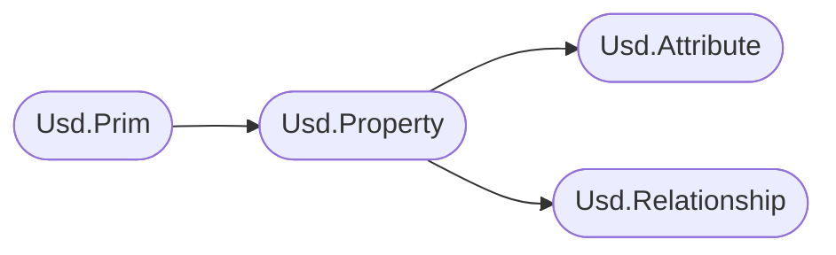
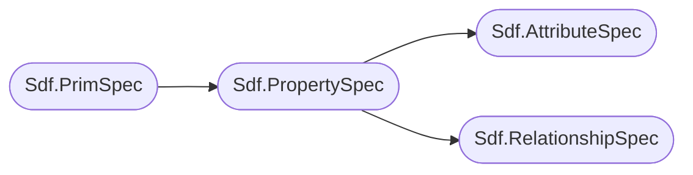

# Data Containers (Prims & Properties) [数据容器]
For Usd to store data at the paths, we need a data container.
To fill this need, Usd has the concept of `prims`. 
Prims can own properties, which can either be `attributes` or `relationships`. These store all the data that can be consumed by clients. Prims are added to layers which are then written to on disk Usd files.

[ 为了让 USD 可以在 paths 上存储数据, 我们需要一个数据容器. 为了满足这个需求，USD 提出了 prims 的概念. Prim 可以拥有 properties 可以是 attributes 或 relationships.
它们存储用户可以使用的所有数据. Prims 被添加到 layers 中，然后写入磁盘上的 .usd 文件]

In the high level API it looks as follows:

[ 在高级 API 中，它看起来如下]

In the low level API:

[ 在低级 API 中，它看起来如下]

### Structure
Large parts of the (high level and parts of the low level) API follow this pattern:

[ 大部分（高级和部分低级）API 遵循以下模式]

- \<ContainerType\>.Has\<Name\>() or \<ContainerType\>.Is\<Name\>()
- \<ContainerType\>.Create\<Name\>()
- \<ContainerType\>.Get\<Name\>()
- \<ContainerType\>.Set\<Name\>()
- \<ContainerType\>.Clear\<Name\>() or .Remove\<Name\>()

The high level API also has the extra destinction of \<ContainerType\>.HasAuthored\<Name\>() vs .Has\<Name\>().
`HasAuthored` only returns explicitly defined values, where `Has` is allowed to return schema fallbacks.

[ 高级 API 还有一个额外的区分，即  \<ContainerType\>.HasAuthored\<Name\>() vs .Has\<Name\>() 之间的区别. HasAuthored 返回明确定义的值，而 Has 则可以返回基于 schema 的默认返回值]

The low level API only has the explicitly defined values, as does not operate on the composed state and is therefore not aware of schemas (at least when it comes to looking up values).

[ 低级 API 仅具有显式定义的值，因为不能操作合成的状态，因此不知道结构（至少在查找值的时候是这样的）]

Let's do a little thought experiment:

[让我们做一个小小的实验]

- If we were to compare Usd to .json files, each layer would be a .json file, where the nested key hierarchy is the Sdf.Path. Each path would then have standard direct key/value pairs like `typeName`/`specifier` that define metadata as well as the `attributes` and `relationships` keys which carry dicts with data about custom properties.

    [ 如果我们将 .usd 与 .json 文件进行比较，那么每一层都是一个 .json 文件，其中嵌套键的结构是 Sdf.Path. 每个 path 将具有准确的键/值对，如 typeName/specifier 它们定义了元数据，以及attributes和relationships 这其中包含自定义属性的数据的字典]
- If we would then write an API for the .json files, our low level API would directly edit the keys. This is what the Sdf API does via `Sdf.PrimSpec`/`Sdf.PropertySpec`/`Sdf.AttributeSpec`/`Sdf.RelationshipSpec` classes. These are very small wrappers that set the keys more or less directly. They are still wrappers though.

    [ 如果我们为 .json 文件编写 API，那么低级的 API 将直接编辑键值. 这就是 Sdf API 通过 Sdf.PrimSpec / Sdf.PropertySpec / Sdf.AttributeSpec / Sdf.RelationshipSpec 所做的事情. 这些是非常小的封装，它们基本上等于直接设置键值, 但它们仍然是封装的]
- To make our lives easier, we would also create a high level API, that would call into the low level API. The high level API would then be a public API, so that if we decide to change the low-level API, the high level API still works. Usd does this via the `Usd.Prim`/`Usd.Property`/`Usd.Attribute`/`Usd.Relationship` classes. These classes provide OOP patternss like Getter/Setters as well as common methods to manipulate the underlying data.

    [ 为了让我们使用起来更轻松，我们还将创建一个高级 API，它会去调用低级 API. 高级 API 将成为 public API, 因此, 如果我们决定修改低级 API，高级 API 仍然有效. USD API 通过 Usd.Prim / Usd.Property / Usd.Attribute / Usd.Relationship 来完成此操作. 这些类提供了像 Getter/Setter 这样面向对象的操作方式以及操作底层数据的通用方法]

This is in very simplified terms how the Usd API works in terms of data storage.

[ 这是对 USD API 在数据存储操作方面的简单理解]

# Table of Contents [目录]
1. [API Overview In-A-Nutshell](#summary)
2. [What should I use it for?](#usage)
3. [Resources](#resources)
4. [Overview](#overview)
    1. [Prims](./prim.md)
    2. [Properties](./property.md)

## TL;DR - Data Containers (Prims/Properties/Attributes/Relationships) In-A-Nutshell [数据容器的概述] 
- In order to store data at our `Sdf.Path`s, we need data containers. Usd therefore has the concept of `Usd.Prim`s/`Sdf.PrimSpec`s, which can hold `Usd.Property`ies/`Sdf.PropertySpec`s

    [ 为了在 Sdf.Path 中存储数据，我们需要数据容器. 因此 usd 有 Usd.Prim s/ Sdf.PrimSpec s 的概念，可以容纳 Usd.Property / Sdf.PropertySpec s]
- To distinguish between data and data relations, `Usd.Property`ies are separated in:

    [ 为了区分数据和数据关系， Usd.Property 被分隔为]
    - `Usd.Attribute`s/`Sdf.AttributeSpec`s: These store data of different types (float/ints/arrays/etc.)

        [ Usd.Attribute s/ Sdf.AttributeSpec s：存储不同类型的数据（浮点/整数/数组/等）]
        - `UsdGeom.Primvar`s: These are the same as attributes with extra features:

            [ UsdGeom.Primvar s：扩展功能的属性]
            - They are created the same way as attributes, except they use the `primvars.<myAttributeName>` namespace.

                [ 它们的创建方式与属性相同，只不过它们使用 primvars.\<myAttributeName\> 命名空间 ]
            - They get inherited down the hierarchy if they are of constant interpolation (They don't vary per point/vertex/prim).

                [ 如果它们是固定的值（不会因 point/vertex/prim 而变化），则它们会沿层级结构向下继承 ]
            - They are exported to Hydra (Usd's render scene description abstraction API), so you can use them for materials/render settings/etc.

                [ 它们被导出到 Hydra（Usd 渲染场景的抽象 API），您就可以将它们用于材质/渲染设置/等 ]
    - `Usd.Relationship`s/`Sdf.RelationshipSpec`s: These store mapping from prim to prim(s) or attribute to attribute.

        [ Usd.Relationship s/ Sdf.RelationshipSpec s：存储从 prim 到 prim(s) 或 属性到属性 的映射 ]

## What should I use it for? 

[我应该用它做什么？]

~~~admonish tip
In production, these are the classes you'll have the most contact with. They handle data creation/storage/modification. They are the heart of what makes Usd be Usd.

[ 在生产环境中，这些是你将接触最多的类. 它们负责数据的创建、存储和修改. 它们是USD的核心所在]
~~~

## Resources [资源]
- [Usd.Prim](https://openusd.org/dev/api/class_usd_prim.html)
- [Usd.Property](https://openusd.org/dev/api/class_usd_property.html)
- [Usd.Attribute](https://openusd.org/dev/api/class_usd_attribute.html)
- [Usd.Relationship](https://openusd.org/dev/api/class_usd_relationship.html)
- [Sdf.PrimSpec](https://openusd.org/dev/api/class_sdf_prim_spec.html)
- [Sdf.PropertySpec](https://openusd.org/dev/api/class_sdf_property_spec.html)
- [Sdf.AttributeSpec](https://openusd.org/dev/api/class_sdf_attribute_spec.html)
- [Sdf.RelationshipSpec](https://openusd.org/dev/api/class_sdf_relationship_spec.html)

## Overview [概述]
We cover the details for prims and properties in their own sections as they are big enough topics on their own:

[ 我们在 prim 和 properties 各自的章节中有详细的介绍，因为它们本身就是一个很大的主题]

- [Prims](./prim.md)
- [Properties](./property.md)