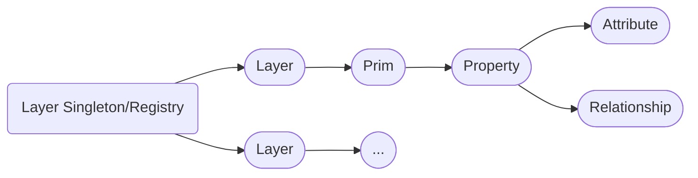
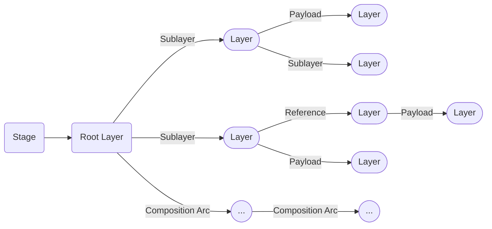

# Layers & Stages
Layers and stages are the main entry point to accessing our data stored in USD.

[ Layers 和 stages 是访问 USD 存储数据的主要入口]

# Table of Contents [目录]
1. [Layers & Stages In-A-Nutshell](#summary)
1. [What should I use it for?](#usage)
1. [Resources](#resources)
1. [Overview](#overview)
1. [Layers](#layerOverview)
    1. [Layer Singleton](#layerSingleton)
    1. [(Anonymous) Layer Identifiers](#layerIdentifier) 
    1. [Layers Creation/Import/Export](#layerImportExport)
    1. [Dependencies](#layerDependencies)
    1. [Layer Metrics](#layerMetrics)
    1. [Permissions](#layerPermissions)
    1. [Muting](#layerMuting)
    1. [Composition](#layerCompositionArcs)
    1. [Traversal and Prim/Property Access](#layerTraversal)
    1. [Time Samples](#layerTimeSamples)
    1. [Metadata](#layerMetadata)
1. [Stages](#stageOverview)
    1. [Configuration](#stageConfiguration)
        1. [Asset Resolver](#stageAssetResolver)
        1. [Stage Metrics](#stageMetrics)
        1. [Stage Time Sample Interpolation](#stageTimeSampleInterpolation)
        1. [Variant/Prim Type Fallbacks](#stageFallbacks)
        1. [Color Management](#stageColormanagement)
        1. [Default Render Settings](#stageRenderSettingsDefault)
        1. [Metadata](#stageMetadata)
    1. [Composition](#stageComposition)
    1. [Loading mechanisms ](#stageLoadingMechanisms)
    1. [Stage Layer Management (Creation/Save/Export)](#stageLayerManagement)
    1. [Traversal and Prim/Property Access](#stageTraversal)

## TL;DR - Layers & Stages In-A-Nutshell [概述]<a name="summary"></a>
**Layers**
- Layers are managed via a singleton pattern: Each layer is only opened once in memory and is identified by the layer identifier. When stages load a layer, they point to the same data in memory.

    [ 层通过单例模式进行管理：每个层仅在内存中打开一次，并由层标识符标识. 当 stage 加载层时，它们指向内存中的相同数据]
- Layers identifiers can have two different formats:

    [ 层标识符可以有两种不同的格式]
    - Standard identifiers: `Sdf.Layer.CreateNew("/file/path/or/URI/identifier.<ext(.usd/.usdc/.usda)>")`, these layers are backed by a file on disk

        [ 标准标识符： Sdf.Layer.CreateNew("/file/path/or/URI/identifier.<ext(.usd/.usdc/.usda)>") ，这些层由磁盘上的文件支持]
    - Anonymous identifiers: `Sdf.Find('anon:<someHash(MemoryLocation)>:<customName>')`, these are in-memory only layers

        [ 匿名标识符： Sdf.Find('anon:<someHash(MemoryLocation)>:<customName>' )，这些只是内存中的层]

**Stages**
- A stage is a view of a set of composed layers. You can think of it as the viewer in a view--model design. Each layer that the stage opens is a data source to the data model. When "asking" the stage for data, we ask the view for the combined (composed) data, which then queries into the layers based on the value source found by our composition rules.

    [ stage 是合成层的视图. 你可以将其视为 视图<-->模型 的查看器. stage 打开的每个层都是数据模型的数据源. 当“查询” stage获取数据时，我们实际上是在请求视图提供合成层的数据，然后基于我们的组合规则找到的值源来查询各个层]
- When creating a stage we have two layers by default:

    [ 创建 stage 时，我们默认有两层]
    - **Session Layer**: This is a temp layer than doesn't get applied on disk save. Here we usually put things like viewport overrides.

        [ 会话层：这是一个临时层，不会应用于磁盘保存. 通常我们会在此处放置一些内容，如 viewport overrides]
    - **Root Layer**: This is the base layer all edits target by default. We can add sublayers based on what we need to it. When calling `stage.Save()`, all sublayers that are dirty and not anonymous, will be saved.

        [ 根层：这是所有编辑默认指向的基础层. 我们可以根据需求向其中添加子层. 当调用 stage.Save() 时，所有已修改且非匿名的子层都将被保存]

## What should I use it for? <a name="usage"></a>

[ 我应该用它做什么？]

~~~admonish tip
Stages and layers are what make USD work, it is our entry point to accessing our hierarchies.

[ Stages 和 layers 是 USD 发挥作用的基础，它是我们访问层级结构的入口点]
~~~

## Resources [资源]<a name="resources"></a>
- [Sdf.Layer](https://openusd.org/dev/api/class_sdf_layer.html)
- [Usd.Stage](https://openusd.org/release/api/class_usd_stage.html)
- [Usd.EditTarget](https://openusd.org/release/api/class_usd_edit_target.html)

## Overview [概述]<a name="overview"></a>
This section will focus on what the `Sdf.Layer` and `Usd.Stage` classes have to offer. For an explanation of how layers work together, please see our [compsition section](../composition/overview.md).

[ 本节将重点关注 Sdf.Layer 和 Usd.Stage 类所提供的功能. 有关图层如何协同工作的解释，请参阅我们的[合成](../composition/overview.md) 章节]

~~~admonish tip title="Pro Tip | Advanced Concepts and Utility Functions for Layers/Stages"
There are also utility methods available, that are not in the `Sdf.Layer`/`Usd.Stage` namespace.
We cover these in our [advanced concepts in production](../../production/concepts.md) section.

[ 还有一些实用方法可用，但它们不在 Sdf.Layer / Usd.Stage 命名空间中. 我们在 [advanced concepts in production](../../production/concepts.md)  中涵盖了这些内容]
~~~

## Layers <a name="layerOverview"></a>


Layers are the data container for our prim specs and properties, they are the part of USD that actually holds and import/exports the data.

[ Layers 是 prim specs 和 properties 的数据容器，是 USD 中实际保存和导入/导出数据的部分]

~~~admonish tip title="Layers - In-A-Nutshell"
- Layers are managed via a singleton pattern: Each layer is only opened once in memory and is identified by the layer identifier.

    [ 层通过单例模式进行管理：每个层仅在内存中打开一次，并由层标识符标识]
- Layers identifiers can have two different formats:

    [ 层标识符可以有两种不同的格式]
    - Standard identifiers: `Sdf.Layer.CreateNew("/file/path/or/URI/identifier.<ext(.usd/.usdc/.usda)>")`

        [ 标准标识符： Sdf.Layer.CreateNew("/file/path/or/URI/identifier.<ext(.usd/.usdc/.usda)>)]
    - Anonymous identifiers: `Sdf.Find('anon:<someHash(MemoryLocation)>:<customName>'`

        [ 匿名标识符： Sdf.Find('anon:<someHash(MemoryLocation)>:\<customName\>]
- Layers store our prim and property specs, they are the data container for all USD data that gets persistently written to file. When we want to edit layers directly, we have to use the low-level API, the high level API edits the stage, which in return forwards the edits to the layer that is set by the active edit target.

    [ 层存储 prim 和 property specs 是所有 USD 数据的容器，这些数据会被持久化地写入文件. 当我们想要直接编辑层时，必须使用低级 API, 而高级 API 则用于编辑 Stage 这些编辑随后会被转发到 active edit target 设置的层 ]
- The `Sdf.FileFormat` plugin interface allows us to implement plugins that convert the content of (custom) file format's to the USD's prim/property/metadata data model. This is how USD manages the [USD crate (binary)](https://openusd.org/release/glossary.html#crate-file-format), alembic and vdb formats.

    [ Sdf.FileFormat 插件接口允许我们定制插件将（自定义）文件格式的内容转换为 USD 的 prim/property/metadata 模型数据. 这是 USD 如何管理 [USD crate (binary)](https://openusd.org/release/glossary.html#crate-file-format)、Alembic 和 VDB 等格式的方式]
- USD's [crate (binary)](https://openusd.org/release/glossary.html#crate-file-format) format allows layers to be lazily read and written to. Calling `layer.Save()` multiple times, flushes the in-memory content to disk by appending it to the .usd file, which allows us to efficiently write large layer files. This format can also read in hierarchy data without loading property value data. This way we have low IO when opening files, as the property data gets lazy loaded on demand. This is similar to how we can parse image metadata without reading the image content.

    [ USD's [crate (binary)](https://openusd.org/release/glossary.html#crate-file-format) 格式允许图层进行延迟读写. 多次调用 layer.Save() 会将内存中的内容, 通过追加到 .usd 文件中的方式保存到磁盘上, 从而使我们能够高效地写入大型层文件. 这种格式还可以在不加载属性值的情况下读取层级结构数据. 这样我们在打开文件时具有较低的IO开销，因为属性数据会根据需要延迟加载. 这类似于我们在不读取图像内容的情况下解析图像元数据的方式]
~~~

### Layer Singleton <a name="layerSingleton"></a>
Layers in USD are managed by a singleton design pattern. This means that each layer, identified by its layer identifier, can only be opened once. Each stage that makes use of a layer, uses the same layer. That means if we make an edit on a layer in one stage, all other stages will get changed notifications and update accordingly.

[ USD 中的层采用单例设计模式进行管理. 这意味着每个层（由层标识符进行标识）只能打开一次. 每个使用该层的 stage 都使用相同的内存数据. 这意味着如果我们在一个 stage 上的层进行编辑，所有其他 stage 都将收到更改通知并据此进行更新]

We get all opened layers via the `Sdf.Layer.GetLoadedLayers()` method.

[ 我们通过 Sdf.Layer.GetLoadedLayers() 方法获取所有打开的层]

~~~admonish tip title=""
```python
for layer in Sdf.Layer.GetLoadedLayers():
    print(layer.identifier)
# Skip anonymous layers
for layer in Sdf.Layer.GetLoadedLayers():
    if layer.anonymous:
        continue
    print(layer.identifier)
```
~~~

If a layer is not used anymore in a stage and goes out of scope in our code, it will be deleted. Should we still have access the to Python object, we can check if it actually points to a valid layer via the `layer.expired` property.

[ 如果一个层在 stage 中不再被使用，并且在我们的代码中超出了作用域，它就会被删除. 如果我们仍然可以访问 Python 对象，我们可以通过 layer.expired 属性来检查它是否实际上指向了一个有效的层。]

As also mentioned in the next section, the layer identifier is made up of the URI(Unique Resource Identifier) and optional arguments. The layer identifier includes the optional args. This is on purpose, because different args can potentially mean a different file.

[ 正如下一节也将提到的，层标识符由 URI（统一资源标识符）和可选参数组成. 层标识符包含了可选参数，这么做的目的是因为不同的参数可能意味着不同的文件]

To demonstrate the singleton behavior let's try changing a layers content in Houdini and then view the layer through two different unrelated stages. (In Houdini every LOPs node is a separate stage):

[ 为了演示单例行为，让我们尝试在 Houdini 中更改层的内容，然后通过两个不相关的不同 stage 查看该层.（在Houdini中，每个LOPs节点都是一个独立的 stage ）]

<video width="100%" height="100%" controls autoplay muted loop>
  <source src="layerSingleton.mp4" type="video/mp4" alt="Houdini Layer Singleton">
</video>

The snippet from the video:

[ 视频中的代码]

~~~admonish tip title=""
```python
from pxr import Sdf
flippy_layer = Sdf.Layer.FindOrOpen("/opt/hfs19.5/houdini/usd/assets/rubbertoy/geo.usdc")
pig_layer = Sdf.Layer.FindOrOpen("/opt/hfs19.5/houdini/usd/assets/pig/geo.usdc")
flippy_layer.TransferContent(pig_layer)
```
~~~

"No flippy_layer, where did you go?" Luckily all of our edits were just in memory, so if we just call layer.Reload() or refresh the layer via the reference node, all is good again.

[ "坏了,flippy_layer了去哪儿了？”幸运的是，我们所有的编辑都在内存中，所以如果我们只是调用 layer.Reload() 或通过引用节点刷新图层，一切都会恢复正常]

Should you ever use this in production as a way to broadcast an edit of a nested layer? We wouldn't recommend it, as it breaks the WYSIWYG paradigm. A better approach would be to rebuild the layer stack (this is what Houdini's "Edit Target Layer" node does) or we remap it via our asset resolver. In Houdini you should never use this method, as it can cause very strange stage caching issues.

[ 你是否应该在生产环境中使用这种方法来嵌套层的编辑？我们不建议这样做，因为它打破了所见即所得的原则. 更好的方法是重建层堆栈（这是Houdini的“Edit Target Layer”节点所做的），或者通过我们的资源解析器重新映射它. 在Houdini中，你永远不应该使用这种方法，因为它可能导致非常奇怪的 stage 缓存问题]

### (Anonymous) Layer Identifiers <a name="layerIdentifier"></a>

[ (匿名)层标识符]

Layer identifiers come in two styles:

[ 层标识符有两种样式]

- Standard identifiers: `Sdf.Layer.CreateNew("URI.<ext(.usd/.usdc/.usda)>")`

    [ 标准标识符： Sdf.Layer.CreateNew("URI.<ext(.usd/.usdc/.usda)>")]
- Anonymous identifiers: `Sdf.Find('anon:<someHash(MemoryLocation)>:<customName>')`

    [ 匿名标识符： Sdf.Find('anon:<someHash(MemoryLocation)>:\<customName\>)']

We can optionally add file format args: `Sdf.Layer.CreateNew("URI.<ext>:SDF_FORMAT_ARGS:<ArgNameA>=<ArgValueA>&<ArgNameB>=<ArgValueB>")`

[ 我们可以选择添加文件格式参数： Sdf.Layer.CreateNew("URI.\<ext\>:SDF_FORMAT_ARGS:\<ArgNameA\>=\<ArgValueA\>&\<ArgNameB\>=\<ArgValueB\>")]

Anonymous layers have these special features:

[ 匿名层具有以下特殊功能]

- They are in-memory layers that have no real path or asset information fields.

    [ 它们是内存层，没有真实路径或资产信息字段]
- We can additionally give a custom name suffix, so that we can identify the layer better visually

    [ 我们可以额外给出自定义名称后缀，以便我们可以更直观地识别图层]
- The identifier is not run through the asset resolver (Edit: I have to verify this again, but I'm fairly certain)

    [ 标识符并未通过资源解析器处理（编辑：我需要再次验证这一点，但我已经相当确定了）]
- They cannot be saved via `layer.Save()`, it will return an error

    [ 它们无法通过 layer.Save() 保存，它将返回错误]
- We can convert them to "normal" layers, by assigning a non-anonymous identifier (`layer.identifier="/file/path/myIdentifier.usd"`), this also removes the save permission lock.

    [ 我们可以通过分配一个非匿名标识符（layer.identifier="/file/path/myIdentifier.usd"）来将它们转换为“普通”层，这也会移除保存权限锁]

When using standard identifiers, we use the URI not the absolute resolved path. The URI is then resolved by our [asset resolver](../plugins/assetresolver.md). We often need to compare the URI, when doing so be sure to call `layer_uri, layer_args = layer.SplitIdentifier(layer.identifier)` to strip out the optional args or compare using the resolve URI `layer.realPath`.

[ 当使用标准标识符时，我们使用的是 URI 而不是绝对解析路径. URI 会通过我们的 [资源解析器](../plugins/assetresolver.md) 进行解析. 在需要比较 URI 时，请确保调用 layer_url，layer_args = layer.SplitIdentifier(layer.identifier) 来去除可选参数，或者使用解析后的 layer.realPath 进行比较]

~~~admonish danger
The layer identifier includes the optional args. This is on purpose, because different args can potentially mean a different file.

[ 层标识符包括可选参数. 这么做的目的是因为不同的参数可能意味着不同的文件]
~~~

If we write our own [file format plugin](https://openusd.org/dev/api/_sdf__page__file_format_plugin.html), we can also pass in these args via attributes, but only non animated.

[ 如果我们编写自己的 [文件格式插件](https://openusd.org/dev/api/_sdf__page__file_format_plugin.html)，我们也可以通过属性来传递这些参数，但只能是非动画的]

~~~admonish tip title=""
```python
{{#include ../../../../code/core/elements.py:layerIdentifier}}
```
~~~

### Layers Creation/Import/Export <a name="layerImportExport"></a>

Here is an overview of how we can create layers:

[ 以下是我们如何创建图层的概述]

~~~admonish danger title="Pro Tip  | Saving and Reloading"
- We can call layer.Save() multiple times with the USD binary format (.usd/.usdc). This will then dump the content from memory to disk in "append" mode. This avoids building up huge memory footprints when creating large layers.

    [ 我们可以使用 USD 二进制格式（.usd/.usdc）多次调用 layer.Save() 然后，这将以“追加”模式将内容从内存转储到磁盘. 这可以避免在创建大型图层时占用大量内存]
- Calling `layer.Reload()` on anonymous layers clears their content (destructively). So make sure you can really dispose of it as there is no undo method.

    [ 在匿名层上调用 layer.Reload() 会清除其内容（破坏性地）. 因此，请确保您确实可以处理它，因为没有撤消方法]
- To reload all (composition) related layers, we can use `stage.Reload()`. This calls `layer.Reload()` on all used stage layers.

    [ 要重新加载所有（组合）相关图层，我们可以使用 stage.Reload() 这会在所有使用的舞台层上调用 layer.Reload()]
- Calling `layer.Reload()` consults the result of `layer.GetExternalAssetDependencies()`. These return non USD/composition related external files, that influence the layer. This is only relevant when using non USD file formats.

    [ 调用 layer.Reload() 会参考 layer.GetExternalAssetDependencies() 的结果(返回与 USD /组合无关的外部文件). 这仅在使用非USD 文件格式时会这样做]
~~~

~~~admonish tip title=""
```python
{{#include ../../../../code/core/elements.py:layerImportExport}}
```
~~~

### Dependencies <a name="layerDependencies"></a>
We can also query the layer dependencies of a layer.

[ 我们还可以查询图层的图层依赖关系]

~~~admonish tip title="Pro Tip | Inspecting dependencies"
The most important methods are:

[ 重要的方法]
- `layer.GetCompositionAssetDependencies()`: This gets layer identifiers of sublayer/reference/payload composition arcs. This is only for the active layer, it does not run recursively.

    [ layer.GetCompositionAssetDependencies() ：获取 sublayer/reference/payload 组合弧的层标识符 这仅适用于活动层它不会递归运行]
- `layer.UpdateCompositionAssetDependency("oldIdentifier", "newIdentifier")`: The allows us to remap any sublayer/reference/payload identifier in the active layer, without having to edit the list-editable ops ourselves. Calling `layer.UpdateCompositionAssetDependency("oldIdentifier", "")` removes a layer.

    [ layer.UpdateCompositionAssetDependency("oldIdentifier", "newIdentifier") ：允许我们重新映射活动层中的任何 sublayer/reference/payload 标识符，而无需自己编辑 list-editable ops. 调用 layer.UpdateCompositionAssetDependency("oldIdentifier", "") 会删除一层]
~~~

In our example below, we assume that the code is run in Houdini.

[ 在以下示例中，我们假设代码是在Houdini中运行的]

~~~admonish tip title=""
```python
{{#include ../../../../code/core/elements.py:layerDependencies}}
```
~~~

Now there are also utility functions available in the `UsdUtils` module ([USD Docs](https://openusd.org/dev/api/flatten_layer_stack_8h.html)):

[ UsdUtils 模块中还提供了实用函数 ([USD Docs](https://openusd.org/dev/api/flatten_layer_stack_8h.html))]

- **UsdUtils.ExtractExternalReferences**: This is similar to `layer.GetCompositionAssetDependencies()`, except that it returns three lists: `[<sublayers>], [<references>], [<payloads>]`. It also consults the assetInfo metadata, so result might be more "inclusive" than `layer.GetCompositionAssetDependencies()`.

    [ UsdUtils.ExtractExternalReferences：这个函数与 layer.GetCompositionAssetDependencies() 类似，不同之处在于它返回三个列表：[\<sublayers\>], [\<references\>], [\<payloads\>], 此外它还参考了assetInfo 元数据 因此结果可能比layer.GetCompositionAssetDependencies() 更加“全面”]
- **UsdUtils.ComputeAllDependencies**: This recursively calls `layer.GetCompositionAssetDependencies()` and gives us the aggregated result.

    [ UsdUtils.ComputeAllDependency：这会递归调用 layer.GetCompositionAssetDependencies() 并为我们提供聚合结果]
- **UsdUtils.ModifyAssetPaths**: This is similar to Houdini's output processors. We provide a function that gets the input path and returns a (modified) output path.

    [ UsdUtils.ModifyAssetPaths：这类似于 Houdini 的 output processors. 我们提供一个函数来获取输入路径并返回（修改后的）输出路径]

### Layer Metrics <a name="layerMetrics"></a>
We can also set animation/time related metrics, these are stored via metadata entries on the layer itself.

[ 我们还可以设置动画/时间相关度量，这些度量通过层本身的元数据条目存储]

~~~admonish info title=""
```python
(
    timeCodesPerSecond = 24
    framesPerSecond = 24
    startTimeCode = 1
    endTimeCode = 240
    metersPerUnit = 0.01
    upAxis = "Z"
)
```
~~~

As this is handled via metadata, we cover it in detail our [Animation (Time related metrics)](./animation.md#animationMetadata), [Scene Unit Scale/UpAxis - FAQ](../../production/faq.md) and [Metadata](./metadata.md#metadataMetricsLayer) sections.

[ 由于这是通过元数据处理的，我们在 [Animation (Time related metrics)](./animation.md#animationMetadata), [Scene Unit Scale/UpAxis - FAQ](../../production/faq.md) 和 [Metadata](./metadata.md#metadataMetricsLayer) 部分中对其进行了详细的介绍]

The `metersPerUnit` and `upAxis` are only intent hints, it is up to the application/end user to correctly interpret the data and change it accordingly.

[ “metersPerUnit”和“upAxis”只是信息提示，应用程序/最终用户需要正确地解释数据并据此进行更改]

The time related metrics should be written into all layers, as we can then use them to quickly inspect time related data in the file without having to fully parse it.

[ 与时间相关的度量应该写入所有层中，这样我们就可以快速检查文件中的时间相关数据，而无需完全解析整个文件]

### Permissions <a name="layerPermissions"></a>
We can lock a layer to not have editing or save permissions. Depending on the DCC, this is automatically done for your depending on how you access the stage, some applications leave this up to the user though.

[ 我们可以锁定一个图层，使其不具有编辑或保存权限. 这取决于 DCC 工具，根据您访问舞台的方式这会自动为您完成. 不过，有些应用程序会将此决定权留给用户]

Anonymous layers can't be saved to disk, therefore for them `layer.permissionToSave` is always `False`.

[ 匿名图层无法保存到磁盘，因此对于它们来说 layer.permissionToSave 始终是 False 。]

~~~admonish tip title=""
```python
{{#include ../../../../code/core/elements.py:layerPermissions}}
```
~~~

### Muting <a name="layerMuting"></a>
Muting layers can be done globally on the layer itself or per stage via `stage.MuteLayer(layer.identifier)`/`stage.UnmuteLayer(layer.identifier)`.
When doing it globally on the layer, it affects all stages that use the layer. This is also why the mute method is not exposed on a layer instance, instead we call it on the `Sdf.Layer` class, as we modify muting on the singleton.

[ muting 可以通过在层本身或者在每个舞台上通过 stage.MuteLayer(layer.identifier)/stage.UnmuteLayer(layer.identifier) 来屏蔽图层. 当在图层上进行全局屏蔽时，它会影响所有使用该图层的 stage. 这也是为什么屏蔽方法没有直接在图层实例上公开的原因，相反，我们在 Sdf.Layer 类上调用它，因为我们是在修改单例上的屏蔽状态]

More info on this topic in our [loading data](./loading_mechanisms.md) section.

[ 有关此主题的更多信息，请参阅我们的 [加载数](./loading_mechanisms.md)据部分]

~~~admonish tip title=""
```python
{{#include ../../../../code/core/elements.py:layerMuting}}
```
~~~

### Composition <a name="layerCompositionArcs"></a>
All composition arcs, excepts sublayers, are created on prim(specs). Here is how we edit sublayers (and their `Sdf.LayerOffsets`) on `Sdf.Layer`s:

[ 除了子图层外，所有组合弧都是在 prim(specs) 上创建的. 以下是如何在 Sdf.Layers 上编辑子图层（及其 Sdf.LayerOffsets ）的方法]

~~~admonish tip title=""
```python
{{#include ../../../../code/core/composition.py:compositionArcSublayer}}
```
~~~

For more info on composition arcs (especially the sublayer arc) see our [Composition](../composition/arcs.md#compositionArcSublayer) section.

[ 有关合成弧（尤其是子层弧）的更多信息，请参阅我们的 [合成](../composition/arcs.md#compositionArcSublayer) 部分]


#### Default Prim
As discussed in more detail in our [composition](../composition/overview.md) section, the default prim specifies the default root prim to import via reference and payload arcs. If it is not specified, the first prim in the layer is used, that is not [abstract](./prim.md#primSpecifier) (not a prim with a class specifier) and that is [defined](./prim.md#primSpecifier) (has a `Sdf.SpecifierDef` define specifier), unless we specify them explicitly. We cannot specify nested prim paths, the path must be in the root (`Sdf.Path("/example").IsRootPrimPath()` must return `True`), setting an invalid path will not error, but it will not working when referencing/payloading the file.

[ 正如我们在 [合成](../composition/overview.md) 部分详细讨论的，默认 prim 指定了通过 reference 和 payload 导入的 root prim 如果我们没有明确指定默认 prim 那么将使用图层中的第一个非 [抽象](./prim.md#primSpecifier)（不带有类说明符的 prim ）且已 [定义](./prim.md#primSpecifier)（具有Sdf.SpecifierDef定义说明符）的 prim. 我们无法指定嵌套的 prim path，path 必须位于 root（Sdf.Path("/example").IsRootPrimPath() 必须返回 True ）设置无效路径不会报错但在 referencing/payloading 文件时它将不起作用]

We typically use this in asset layers to specify the root prim that is the asset.

[ 我们通常在资产层中使用它来指定作为资产的 root prim]

~~~admonish info title=""
```python
{{#include ../../../../code/core/elements.py:layerDefaultPrim}}
```
~~~

### Traversal and Prim/Property Access <a name="layerTraversal"></a>
Traversing and accessing prims/properties works a tad different:

[ 遍历和访问 prims/properties 的方式有点不同]

- The `layer.Get<SpecType>AtPath` methods return `Sdf.Spec` objects (`Sdf.PrimSpec`, `Sdf.AttributeSpec`, `Sdf.RelationshipSpec`) and not USD high level objects.

    [ layer.Get\<SpecType\>AtPath 方法返回 Sdf.Spec 对象（ Sdf.PrimSpec 、 Sdf.AttributeSpec 、 Sdf.RelationshipSpec ），而不是 USD 高级对象]
- The traverse method doesn't return an iterable range, instead it is "kernel" like. We pass it a function that each path in the layer gets run through.

    [ 遍历方法并不直接提供一个可以迭代的元素范围，而是接受一个函数作为参数，并自动将该函数应用于图层中的每个路径.]

~~~admonish tip title=""
```python
{{#include ../../../../code/core/elements.py:layerTraversal}}
```
~~~

### Time Samples <a name="layerTimeSamples"></a>
In the high level API, reading and writing time samples is handled via the `attribute.Get()/Set()` methods. In the lower level API, we use the methods exposed on the layer.

[ 在高级 API 中，读取和写入时间样本是通过 attribute.Get()/Set() 方法处理的. 在较低级别的 API 中，我们使用该层公开的方法]

~~~admonish info title=""
```python
{{#include ../../../../code/core/elements.py:layerTimeSamples}}
```
~~~

See our [animation section](./animation.md) for more info about how to deal with time samples.

[ 有关如何处理时间样本的更多信息，请参阅我们的[动画](./animation.md)部分]


### Metadata <a name="layerMetadata"></a>
Layers, like prims and properties, can store metadata. Apart from the above mentioned layer metrics, we can store custom metadata in the `customLayerData` key or create custom metadata root keys as discussed in our [metadata plugin](../plugins/metadata.md) section. This can be used to track important pipeline related data without storing it on a prim.

[ Layers 和 prims/properties 一样，都可以存储元数据. 除了上述的层标识数据之外，我们还可以在 customLayerData 中存储自定义元数据，或者按照 [metadata plugin](../plugins/metadata.md) 部分所讨论的，创建自定义元数据键. 这可以用于跟踪重要的与流程相关的数据，而无需将其存储在 prim 上]

~~~admonish info title=""
```python
{{#include ../../../../code/core/elements.py:metadataLayer}}
```
~~~

See our [Metadata](./metadata.md#metadataLayerStage) section for detailed examples for layer and stage metadata.

[ 有关 layer 和 stage 元数据的详细示例，请参阅我们的[元数据](./metadata.md#metadataLayerStage)部分]


## Stages
Stages offer a view on a set of composed layers. We cover [composition](../composition/overview.md) in its on section, as it is a complicated topic.

[ stages 提供了一系列合成图层的接口, 由于合成是一个复杂的话题, 我们将在 [composition](../composition/overview.md) 独立的部分中详细讨论合成]



Unlike layers, stages are not managed via a singleton. There is the [Usd.StageCache](https://openusd.org/dev/api/class_usd_stage_cache.html) class though, that would provide a similar mechanism. We usually don't use this though, as our DCCs manage the lifetime cycle of our stages.

[ 与 layers 不同的是 Stages 不是通过单例来管理的, 尽管存在 [Usd.StageCache](https://openusd.org/dev/api/class_usd_stage_cache.html) 类它提供了一个类似的机制. 但我们通常不使用它，因为我们的 DCC 软件会管理我们 stages 的生命周期]

If a stage goes out of scope in our code, it will be deleted. Should we still have access the to Python object, we can check if it actually points to a valid layer via the `stage.expired` property.

[ 如果代码中的 Stage 超出了作用域，它将会被删除. 如果我们仍然可以访问该 Python 对象，我们可以通过 stage.expired 属性来检查它是否实际指向一个有效的图层]

When creating a stage we have two layers by default:

[ 创建 stage 时，我们默认有两层]

- **Session Layer**: This is a temp layer than doesn't get applied on disk save. Here we usually put things like viewport overrides.

    [ 会话层：这是一个临时层，不会应用于磁盘保存. 通常我们会在此处放置一些内容，如 viewport overrides]
- **Root Layer**: This is the base layer all edits target by default. We can add sublayers based on what we need to it. When calling `stage.Save()`, all sublayers that are dirty and not anonymous, will be saved.

    [ 根层：这是所有编辑默认指向的基础层. 我们可以根据需求向其中添加子层. 当调用 stage.Save() 时，所有已修改且非匿名的子层都将被保存]


### Configuration <a name="stageConfiguration"></a>
Let's first look at some configuration related options we can set on the stage.

[ 让我们先看看可以在 stage 上设置的一些配置选项]

#### Asset Resolver  <a name="stageAssetResolver"></a>
The stage can be opened with a [asset resolver context](../plugins/assetresolver.md#assetResolverContext). The context needs to be passed in on stage open, it can be refreshed afterwards (if implemented in the resolver). The resolver context object itself is bound to the runtime of the the stage though. The asset resolver context is just a very simple class, that our custom asset resolver can attach data to to help with path resolution.

[ Stage 可以通过 [asset resolver context](../plugins/assetresolver.md#assetResolverContext) 来打开. 在打开 stage 时，需要传入该 context，之后也可以对其进行刷新操作（如果解析器中实现了这一功能）. 然而，解析器的 context 对象本身是绑定到 stage 的运行时的. 资产解析器的 context 只是一个非常简单的类，我们的自定义资产解析器可以将数据附加到它上面，以辅助路径解析]

In terms of asset resolution there are only two methods exposed on the stage class:

[ 在资产解析方面，stage 类上只暴露了两种方法]

- `stage.GetPathResolverContext()`: Get the resolver context object.

    [ stage.GetPathResolverContext() ：获取解析器 context 对象]
- `stage.ResolveIdentifierToEditTarget()`: Resolve an asset identifier using the stage's resolver context.

    [ stage.ResolveIdentifierToEditTarget() ：使用 stage 的解析器 context 解析资产标识符]

We cover how to use these in our [asset resolver](../plugins/assetresolver.md) section, where we also showcase asset resolver reference implementations that ship with this guide.

[ 我们在资产 [解析器](../plugins/assetresolver.md) 部分介绍了如何使用它们，还展示了本指南附带的资产解析器参考实现]

#### Stage Metrics  <a name="stageMetrics"></a>
As discussed in the above [layer metrics section](#layerMetrics), we can set animation/time related metrics. The stage class also exposes methods to do this, which just set the metadata entries on the root layer of the stage.

[ 正如在之前的 [layer metrics](#layerMetrics) 部分所讨论的，我们可以设置与动画/时间相关的标识. Stage类也提供了方法来执行这一操作，这些方法只是设置 stage 的 root layer 上的元数据]

The time related metrics should be written into all layers, as we can then use them to quickly inspect time related data in the file without having to fully parse it.

[ 与时间相关的标识应该写入所有图层，这样我们就可以快速检查文件中的时间相关数据，而无需对整个文件进行复杂的解析]

We cover it in detail our [Animation (Time related metrics)](./animation.md#animationMetadata), [Scene Unit Scale/UpAxis - FAQ](../../production/faq.md) and [Metadata](./metadata.md#metadataMetricsLayer) sections.

[ 在 [Animation (Time related metrics)](./animation.md#animationMetadata), [Scene Unit Scale/UpAxis - FAQ](../../production/faq.md) 和 [Metadata](./metadata.md#metadataMetricsLayer) 中都有详细的介绍]

#### Stage Time Sample Interpolation <a name="stageTimeSampleInterpolation"></a>
We can set how time samples are interplated per stage.

[ 我们可以设置每个 stage 对时间样本怎样进行插值]

The possible stage interpolation types are:

[ 可能的 stage 插值类型有]
- Usd.InterpolationTypeLinear: Interpolate linearly (if array length doesn't change and data type allows it))

    [ Usd.InterpolationTypeLinear：线性插值（如果数组长度不变且数据类型允许）]
- Usd.InterpolationTypeHeld: Hold until the next time sample

    [ Usd.InterpolationTypeHeld：保持直到下一个时间样本]

~~~admonish tip title=""
```python
from pxr import Usd
stage = Usd.Stage.CreateInMemory()
print(stage.GetInterpolationType()) # Returns: Usd.InterpolationTypeLinear
stage.SetInterpolationType(Usd.InterpolationTypeHeld)
```
~~~

Checkout our [animation section](./animation.md) for more info on how animation and time samples are treated in USD.

[ 查看我们的[动画](./animation.md)部分，了解有关于 USD 如何处理动画和时间样本的更多信息]

#### Variant/Prim Type Fallbacks <a name="stageFallbacks"></a>
We can also provide fallback values for:

[ 我们还可以提供默认值]

- [Variant selections](https://openusd.org/release/api/class_usd_stage.html#a34d1d78fe8e31f0ba439d2265d694af5): If no explicit variant selection is written, we can define a default fallback.

    [ [Variant selections](https://openusd.org/release/api/class_usd_stage.html#a34d1d78fe8e31f0ba439d2265d694af5)：如果没有明确的变体选择被写入，我们可以定义一个默认值]
- [Concrete typed prims](./schemas.md#summary): If a prim definition is not found, we can provide a fallback to be used instead. See the [official docs](https://openusd.org/release/api/_usd__page__object_model.html#Usd_OM_FallbackPrimTypes) for more info.

    [ [Concrete typed prims](./schemas.md#summary)：如果未找到 prim 定义，我们可以提供默认值来替代. 请参阅[官方文档](https://openusd.org/release/api/_usd__page__object_model.html#Usd_OM_FallbackPrimTypes) 以获取更多信息]

#### Color Management <a name="stageColormanagement"></a>
~~~admonish question title="Still under construction!"
This sub-section is still under development, it is subject to change and needs extra validation.

[ 该子部分仍在开发中，可能会发生变化并且需要额外的验证]
~~~

~~~admonish tip title=""
```python
# Get: 'GetColorConfiguration', 'GetColorManagementSystem', 'GetColorConfigFallbacks'
# Set: 'SetColorConfiguration', 'SetColorManagementSystem', 'SetColorConfigFallbacks'
```
~~~

#### Default Render Settings <a name="stageRenderSettingsDefault"></a>

We can supply a render settings prim path on our root layer that can be used as a default by applications.

[ 我们可以在 root layer 上设置 render settings prim path，应用程序可以将其用作默认值 ]

See our [Metadata](./metadata.md#metadataRenderSettingsPrimPath) section for more information.

[ 有关更多信息，请参阅 [Metadata](./metadata.md#metadataRenderSettingsPrimPath)]


#### Metadata <a name="stageMetadata"></a>
Setting metadata on the stage, redirects the edits to the root layer.
We discuss this in detail in our [metadata section](./metadata.md).

[ 在 stage 上设置元数据会将编辑重定向到 root layer. 我们将在[元数据](./metadata.md) 部分详细讨论这一点]

~~~admonish tip title=""
```python
{{#include ../../../../code/core/elements.py:stageMetadata}}
```
~~~

### Composition <a name="stageComposition"></a>
We cover in detail how to inspect composition in our [composition section](../composition/overview.md).

[ 我们在 [合成](../composition/overview.md) 章节详细介绍了如何检查合成]

Stages offer access to the [Prim Cache Population](../composition/pcp.md) cache via `stage._GetPcpCache()`. We almost never interact with it this way, instead we use the methods dicussed in our [inspecting composition](../composition/pcp.md) section.

[ stages 通过 stage._GetPcpCache() 提供对 [Prim Cache Population](../composition/pcp.md) 缓存的访问. 我们几乎从不以这种方式与其交互，而是使用我们在 [合成检查](../composition/pcp.md) 中讨论的方法]

We also have access to our instanced prototypes, for more info on what these are and how they can be inspected/used see our [composition instanceable prims](../composition/livrps.md#compositionInstance) section.

[ 我们还可以访问实例化 prototypes. 有关这些是什么以及如何检查/使用它们的更多信息，请参阅 [composition instanceable prims](../composition/livrps.md#compositionInstance)]

Lastly we control the edit target via the stage. The edit target defines, what layer all calls in the high level API should write to.

[ 最后，我们通过 stage 控制编辑目标. 编辑目标定义了高级API中的所有调用应该写入哪个图层]

When starting out with USD, you'll mostly be using it in the form of:

[ 当开始使用 USD 时，您主要会以以下形式使用它]

~~~admonish tip title=""
```python
stage.SetEditTarget(layer)
# We can also explicitly create the edit target:
# Or
stage.SetEditTarget(Usd.EditTarget(layer))
# Or
stage.SetEditTarget(stage.GetEditTargetForLocalLayer(layer))
# These all have the same effect.
```
~~~

In Houdini we don't have to manage this, it is always the highest layer in the active layer stack. Houdini gives it to us via `hou.node.activeLayer()` or `node.editableLayer`in python LOP nodes.

[ 在Houdini中，我们不必管理它，它始终是活动层堆栈中的最高层. Houdini 通过 python LOP 节点中的 hou.node.activeLayer() 或 node.editableLayer 将其提供给我们]

More info about edit targets in our [composition fundamentals](../composition/fundamentals.md) section.

[ 有关编辑目标的更多信息，请参阅[composition fundamentals](../composition/fundamentals.md)]

### Loading mechanisms <a name="stageLoadingMechanisms"></a>
Stages are the controller of how our [Prim Cache Population (PCP)](../composition/pcp.md) cache loads our composed layers. We cover this in detail in our [Traversing/Loading Data](./loading_mechanisms.md) section. Technically the stage just exposes the PCP cache in a nice API, that forwards its requests to the its pcp cache `stage._GetPcpCache()`, similar how all `Usd` ops are wrappers around `Sdf` calls.

[ stage 是控制我们如何通过 [Prim Cache Population (PCP)](../composition/pcp.md) 缓存加载合成层的控制器。我们在 [Traversing/Loading Data](./loading_mechanisms.md) 部分中详细讨论了这一点. 从技术上讲，stage 只是将 PCP 缓存以友好的 API 形式公开，并将其请求转发给它的 pcp 缓存 stage._GetPcpCache()，这与所有 Usd 操作都是 Sdf 调用的包装器类似]

Stages control:
- **Layer Muting**: This controls what layers are allowd to contribute to the composition result.

    [ Layer Muting：控制哪些层对合成结果做出贡献]
- **Prim Population Mask**: This controls what prim paths to consider for loading at all.

    [ Prim Population Mask: 控制加载哪些 prim paths]
- **Payload Loading**: This controls what prim paths, that have payloads, to load.

    [ Payload Loading: 控制加载哪些 payloads]

### Stage Layer Management (Creation/Save/Export) <a name="stageLayerManagement"></a>
When creating a stage we have two layers by default:

[ 创建 stage 时，我们默认有两层]

- **Session Layer**: This is a temp layer than doesn't get applied on disk save. Here we usually put things like viewport overrides.

    [ 会话层：这是一个临时层，不会应用于磁盘保存. 通常，我们会在此处放置一些内容，如 viewport overrides]
- **Root Layer**: This is the base layer all edits target by default. We can add sublayers based on what we need to it. When calling `stage.Save()`, all sublayers that are dirty and not anonymous, will be saved.

    [ 根层：这是所有编辑默认指向的基础层. 我们可以根据需求向其中添加子层. 当调用 stage.Save() 时，所有已修改且非匿名的子层都将被保存]

Let's first look at layer access, there are two methods of special interest to us:

[ 首先我们来看看图层访问，有两种方法特别值得我们关注]

- `stage.GetLayerStack()`: Get all the layers in the active [layer stack](../composition/fundamentals.md#layerStack)

    [ stage.GetLayerStack() ：从激活层 [堆栈](../composition/fundamentals.md#layerStack) 中获取所有图层]
- `stage.GetUsedLayers(includeClipLayers=True)`: Get all layers that are currently used by the stage. We can optionally exclude value clip layers. This is only a snapshot, as layers might be "varianted" away or in the case of value clips, we only get the active chunk file.

    [ stage.GetUsedLayers(includeClipLayers=True)：获取当前 stage 使用的所有图层. 我们可以选择性地排除值剪辑层. 这只是一个快照，因为层可能会被"varianted"，或者在值剪辑的情况下，我们只获取激活的块文件]

The following example is run in Houdini:

[ 以下在 Houdini 中运行的示例]

~~~admonish tip title=""
```python
{{#include ../../../../code/core/elements.py:stageLayerAccess}}
```
~~~

As you might have noticed, when calling `stage.GetLayerStack()`, we didn't get the pig reference. Let's have a look how we can get all composition arc layers of the active layer stack:

[ 您可能已经注意到，在调用 stage.GetLayerStack() 时，我们没有获得 pig reference 让我们看看如何获​​取激活层堆栈的所有合成弧]

~~~admonish tip title=""
```python
{{#include ../../../../code/core/elements.py:stageLayerStackUsedLayers}}
```
~~~

If you are confused what a layer stack, check out our composition [layer stack](../composition/fundamentals.md#layerStack) section for a detailed breakdown.

[ 如果您对层堆栈感到困惑，请查看我们的合成 [层堆栈](../composition/fundamentals.md#layerStack)]

Let's have a look at stage creation and export:

[ 我们来看看 stage 创建和导出]

~~~admonish tip title=""
```python
{{#include ../../../../code/core/elements.py:stageLayerManagement}}
```
~~~

### Traversal and Prim/Property Access <a name="stageTraversal"></a>
USD stage traversing and accessing prims/properties works via the high level API.

[ USD stage 遍历和访问 prims/properties 是通过高级 API 实现的]
- The `stage.Get<SpecType>AtPath` methods return `Usd.Object` objects (`Usd.Prim`, `Usd.Attribute`, `Usd.Relationship`).

    [ stage.Get\<SpecType\>AtPath 方法返回 Usd.Object 对象（ Usd.Prim 、 Usd.Attribute 、 Usd.Relationship ）]
- The traverse method returns an iterable that goes through the prims in the stage.

    [ traverse 方法返回一个遍历 stage prims 的可迭代对象]

We cover stage traversals in full detail in our [Traversing/Loading Data (Purpose/Visibility/Activation/Population)
](./loading_mechanims) section.

[ 我们在  [Traversing/Loading Data (Purpose/Visibility/Activation/Population)
](./loading_mechanims) 章节详细介绍了 stage 的遍历]

Here are the basics:

[ 以下是基础知识]

~~~admonish tip title=""
```python
{{#include ../../../../code/core/elements.py:stageTraversal}}
```
~~~