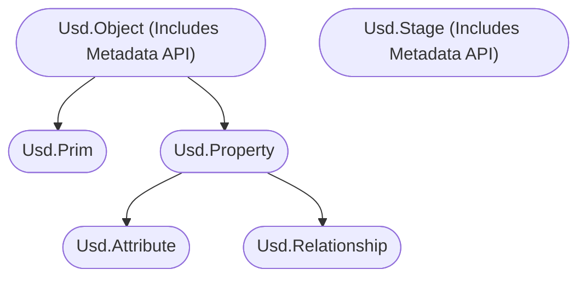
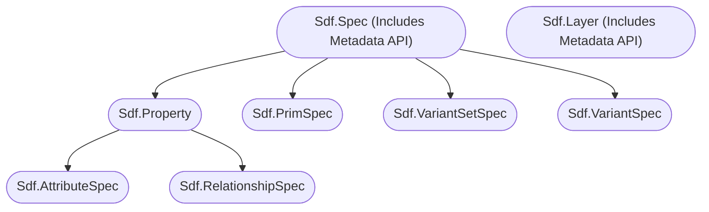

# Metadata [元数据]
Metadata is the smallest building block in Usd. It is part of the base class from which prims and properties inherit from and possesses a slightly different feature set than other parts of Usd.

[ 元数据是 USD 中最小的构建块 它是基类的一部分 prims 和 properties 都从中继承，并且与其他 USD 组件相比，元数据有些不同的特性]

# Table of Contents [目录]
1. [API Overview In-A-Nutshell](#summary)
1. [What should I use it for?](#usage)
1. [Resources](#resources)
1. [Overview](#overview)
1. [Composition/Value resolution](#composition_value_resolution)
1. [Working with metadata in your stages](#practicalExamples)
    1. [Basics (High level API)](#metadataBasics)
    1. [Validation of dict content](#metadataValidateDict)
    1. [Nested key path syntax](#metadataNestedKeyPath)
    1. [Creating custom metadata fields via plugins](#metadataPlugin)
    1. [Reading metadata documentation strings (High level API)](#metadataDocs)
    1. [Authored vs fallback metadata values (High level API)](#metadataAuthored)
    1. [Reading/writing metadata via prim/property specs(Low level API)](#metadataPrimPropertySpec)
    1. [Special metadata fields for prims](#metadataSpecialPrim)
        1. [Active/Activation](#metadataActive)
        1. [Asset Info](#metadataAssetInfo)
        1. [Custom Data](#metadataCustomData) 
        1. [Comment](#metadataComment)
        1. [Icon (UI)](#metadataIcon)
        1. [Hidden (UI)](#metadataHidden)
    1. [Special metadata fields for properties](#metadataSpecialProperty)
        1. [Support for animation (USD speak **variability**)](#metadataVariability)
        1. [Custom vs schema defined properties](#metadataCustom)
    1. [Special metadata fields for layers and stages](#metadataLayerStage)
        1. [Stage/Root Layer Default Render Settings (High/Low level API)](#metadataRenderSettingsPrimPath)
        1. [Stage and layer metrics (FPS/Scene Unit Scale/Up Axis) (High/Low level API)](#metadataMetricsLayer)
        1. [Stage and layer customData metadata (High/Low level API)](#metadataCustomDataLayer)


## TL;DR - Metadata In-A-Nutshell [概述]<a name="summary"></a>
- Metadata attaches additional non-animatable data to prims/properties/layers via a dictionary

    [ 元数据通过字典的形式为 prims/properties/layers 添加额外的非动画数据]
- Composition arcs and core data (specifiers/type names) is added via metadata

    [ 通过元数据可以添加合成弧和核心数据（specifiers/type names）]
- `assetInfo` and `customData` are predefined keys for prim metadata you can track asset/custom data with

    [ assetInfo 和 customData 是给 prim 元数据预定义的键，你可以使用它们来跟踪资产/自定义数据]
- To write to other keys, they must be registered via schemas.

    [ 要向其他键写入数据，必须通过 schemas 进行注册]

## What should I use it for? <a name="usage"></a>

[我应该用它做什么？]

~~~admonish tip
In production, you'll use the `assetInfo`/`customData` prim metadata fields to track any production related data.
You can also use metadata to edit composition arcs, though the high level API offers nice class wrappers that wrap this for you.

[ 在生产中，您将使用 assetInfo / customData 元数据字段来跟踪任何与生产相关的数据. 您还可以使用元数据来编辑合成弧，尽管高级 API 提供了很好的类包装器来为您包装它]

```python
{{#include ../../../../code/core/elements.py:metadataSummary}}
```
~~~

## Resources [资源]<a name="resources"></a>
- [Metadata API Docs](https://openusd.org/release/api/_usd__page__object_model.html#Usd_OM_Metadata)
- [Usd.Object](https://openusd.org/dev/api/class_usd_object.html)
- [Sdf.Spec](https://openusd.org/dev/api/class_sdf_spec.html)

## Overview [概述]<a name="overview"></a>

Here is the class structure for the different API levels:

[ 以下是不同级别 API 的结构]

High Level API

[ 高级 API]



Low Level API

[ 低级 API]



Metadata is different in that it:

[ 元数据的不同之处在于]

- Is the smallest building block in Usd (There are no subclasses) and its data is stored as a dictionary.

    [ 它是 USD 中最小的构成单元（没有子类）并且以字典的方式存储数据]
- Is extremely fast to access

    [ 访问速度极快]
- Can't be time varying:

    [ 不随时间变化]
    - Composition arcs are written into metadata fields on prims, so you can't animate composition.

        [ 合成弧是写入 prims 上的元数据字段中，因此您无法对其进行动画处理]
    - Metadata stored in value clip files is ignored

        [ 存储在值剪辑文件中的元数据将被忽略]
- Is strongly typed via schemas, so you need to register a custom schema if you want custom keys. This way we can ensure fallback values/documentation per key/value and avoid random data flying through your pipelines. For example all your mesh attributes have metadata for exactly what type/role they must match.

    [ USD 是通过 schemas 进行强类型定义，因此如果需要自定义键，则需要注册一个自定义 schemas , 这样我们可以确保每个键/值都有返回值/说明文档，并避免在流程中传输随机混杂的数据. 例如，您所有 mesh 网格的属性中都确切地指明它们必须匹配的类型/角色的元数据]
- There are two special metadata keys for prims:

    [ prims 有两个特殊的元数据键]
    - `assetInfo`: Here you should dump asset related data. This is just a predefined standardized location all vendors/companies should adhere to when writing asset data that should be tracked.

        [ assetInfo：在这里您应该存储与资产相关的数据. 这是一个预定义的标准化位置，所有供应商/公司在编写需要追踪的资产数据时都应该遵守]
    - `customData`: Here you can dump any data you want, a kind of scratch space, so you don't need to add you own schema. If you catch yourself misusing it too much, you should probably generate your own schema.

        [ customData：在这里您可以存储任何您想要的数据. 就像一种临时存储空间因此您不需要添加自己的 schema. 如果您发现自己频繁的使用这个键，那么您可能应该生成自己的 schema]


~~~admonish tip
We go into more detail over in the [schema](./schemas.md) section on how to create or lookup registered schemas.

[ 我们在 [schema](./schemas.md) 部分详细地介绍了如何创建或查找注册的 schemas]
~~~

## Composition/Value resolution <a name="composition_value_resolution"></a>
Metadata is slightly different when it comes to value resolution. (As a reminder: `value resolution` is just a fancy word for "what layer has the winning value out of all your layers where the data will be loaded from"):

[ 在值解析方面，元数据略有不同 （提醒一下：`value resolution` 只是一个想像出来的词语，用于描述 “在所有即将加载的数据层中，哪一层具有最高权重值”）]

- Nested dictionaries are combined

    [ 嵌套字典会被合并]
- Attribute metadata behaves by the same rules as attribute value resolution

    [ 属性元数据的工作方式遵循与属性值解析相同的规则]
- Core metadata (Metadata that affects composition/prim definitions):

    [ 核心元数据（影响合成/ prim 定义）]
    - Composition metadata is composed via Listeditable-Ops. See our section [here](../composition/listeditableops.md) for more details. Be sure to understand these to save your self a lot of head-aches why composition works the way it does.

        [ 元数据的合成是通过 Listeditable-Ops 进行的. 更多详情 [参阅](../composition/listeditableops.md) 请务必理解这些，防止难以理解合成为何如此工作]
    - Specific prim metadata has its own rule set (E.g. prim specifiers).

        [ 特定的 prim 元数据有它自己的规则（例如，prim specifiers）]


## Working with metadata in your stages [ 在 stage 中使用元数据]<a name="practicalExamples"></a>


Let's look at some actual code examples on how to modify metadata.

[ 让我们看一些有关如何修改元数据的实际代码示例]

### Basics (High level API) <a name="metadataBasics"></a>
~~~admonish info title=""
```python
{{#include ../../../../code/core/elements.py:metadataBasics}}
```
~~~

### Validation of dict content [ 字典内容的验证]<a name="metadataBasics"></a>


To create a valid metadata compatible dict, you can validate it:

[ 要创建一个有效的、与元数据兼容的字典，您可以对其进行验证]

~~~admonish info title=""
```python
{{#include ../../../../code/core/elements.py:metadataValidateDict}}
```
~~~
This is useful if you expose setting metadata to your user facing UIs. This will auto-cast Python arrays to VtArray and other Usd internal types. You can also skip this step, it might error later on when setting the data then though.

[ 如果您计划将设置元数据的操作通过 UI 界面暴露给用户的时候这会非常有用. 这会自动将 Python 数组转换为 VtArray 和其他 USD 内部类型. 您也可以跳过此步骤但稍后设置数据时可能会出错]

### Nested key path syntax [ 键值嵌套语法]<a name="metadataBasics"></a>


To access nested dict keys, we use the `:` symbol as the path separator.

[ 要访问嵌套的字典键，我们使用 : 符号作为路径分隔符]

~~~admonish info title=""
```python
{{#include ../../../../code/core/elements.py:metadataNestedKeyPath}}
```
~~~

The `Get`/`Set` methods without the `ByKey`/`ByDictKey` allow you to set root dict keys, e.g. `SetMetadata("typeName", "Xform")`
The `ByKey`/`ByDictKey` take a root key and a key path (with `:` if nested), e.g. `SetMetadataByDictKey('assetInfo', "data:version", 1)` which will result in `{"assetInfo": {"data": "version": 1}}`

[ 不带 ByKey/ByDictKey 的 Get/Set 方法允许您设置根字典键，例如 SetMetadata("typeName", "Xform"). 而带有 ByKey/ByDictKey 的方法则接收一个根键和一个键路径（如果嵌套则使用冒号 :），例如 SetMetadataByDictKey('assetInfo', "data:version", 1)，这将产生如下结果：{"assetInfo": {"data": {"version": 1}}}。]

### Creating custom metadata fields via plugins <a name="metadataPlugin"></a>

[ 通过插件创建自定义元数据字段]

We can easily extend metadata fields via plugins. We cover this in detail in out [metadata plugin](../plugins/metadata.md) section.

[ 我们可以通过插件轻松扩展元数据字段. 我们在 [元数据插件](../plugins/metadata.md) 部分详细介绍了这一点]

### Reading metadata documentation strings (High level API) <a name="metadataDocs"></a>

[ 读取元数据文档字符串（高级 API）]

This is quite useful if you need to expose docs in UIs.

[ 如果您需要在 UI 中公开文档，这非常有用。]

~~~admonish info title=""
```python
{{#include ../../../../code/core/elements.py:metadataDocs}}
```
~~~

~~~admonish note title="Click here to view the result" collapsible=true
```python
{{#include ../../../../code/core/elements.py:metadataDocsResult}}
```
~~~

### Authored vs fallback metadata values (High level API) <a name="metadataAuthored"></a>

[ 编辑与返回元数据值（高级API）]

The getters offer the distinction between retrieving authored or fallback values provided by the schemas that registered the metadata.

[ getters 通过检索 schemas 注册的元数据, 来区分元数据是编辑值还是默认值]

~~~admonish info title=""
```python
{{#include ../../../../code/core/elements.py:metadataAuthored}}
```
~~~

### Reading/writing metadata via prim/property specs(Low level API) <a name="metadataPrimPropertySpec"></a>

[ 通过 prim/property specs 读/写元数据（低级 API）]

Same as with the layer customData, the lower level APIs on prim/property specs expose it to Python via lower camel case syntax in combination with direct assignment, instead of offer getter and setters.

[ 与自定义数据的情况相同，prim/property specs 中的低级 API 通过小写驼峰式命名法结合直接赋值的方式，将其暴露给 Python，而不是提供 getter 和 setter 方法 ]


~~~admonish info title=""
```python
{{#include ../../../../code/core/elements.py:metadataPrimPropertySpec}}
```
~~~
As you can see the higher level API gives us fallback info via the Get(authored) methods. In the lower level API we have to process this data logic ourselves.

[ 正如您所看到的，更高级别的 API 通过 Get(authored) 方法为我们提供了默认值. 在较低级别的 API 中，我们必须自己处理这些数据逻辑 ]


### Special metadata fields for prims <a name="metadataSpecialPrim"></a>

[ prim 的特殊元数据字段]

Here are the most common prim metadata keys we'll be working with.

[ 以下是我们工作中最常见的 prim 元数据键]


#### Active/Activation <a name="metadataActive"></a>
The `active` metadata controls if the prim and its children are loaded or not.
We only cover here how to set the metadata, for more info checkout our [Loading mechansims](./loading_mechanisms.md) section. Since it is a metadata entry, it can not be animated. For animated pruning we must use [visibility](./property.md#visibility).

[ active 控制是否加载 prim 及其子项. 我们在这里仅介绍如何设置元数据，请查看 [加载机制](./loading_mechanisms.md) 部分. 由于它是元数据条目，因此无法进行动画处理. 对于动画修剪我们必须使用 [visibility](./property.md#visibility)]

~~~admonish info title=""
```python
{{#include ../../../../code/core/elements.py:metadataActive}}
```
~~~

#### Asset Info <a name="metadataAssetInfo"></a>
The `assetInfo` metadata carries asset related data. This is just a predefined standardized location all vendors/companies should adhere to when writing asset data that should be tracked.

[ assetInfo 记录与资产相关的数据. 这是一个预定义的标准化位置，所有供应商/公司都应该在编写需要追踪的资产数据时遵循这个标准]

There are currently four standardized keys:

[ 目前有四个标准化的键]

- `identifier` (Sdf.AssetPath): The asset identifier (that the [asset resolver](../plugins/assetresolver.md) can resolve)

    [ identifier（Sdf.AssetPath）：资产标识符（[资产解析器](../plugins/assetresolver.md) 可以解析）]
- `name` (str): The name of the asset.

    [ name（str）：资产名称]
- `version` (str): The version of the asset.

    [ version（str）：资产的版本]
- `payloadAssetDependencies` (Sdf.AssetPathArray()): This is typically attached to the prim where you attach payloads to that when you unloaded payloads, you can still see what is in the file without traversing the actual layer content. It is up to you
to manage the content of this list to be synced with the actual payload(s) content.

    [ payloadAssetDependencies（Sdf.AssetPathArray()）：这通常附加到 payloads 的 prim 上. 当卸载 payloads 时，你仍然可以看到文件中的内容，而无需遍历实际的层内容. 你需要自行管理此列表的内容，以确保它与实际的 payloads 内容保持同步]

~~~admonish info title=""
```python
{{#include ../../../../code/core/elements.py:metadataAssetInfo}}
```
~~~

#### Custom Data <a name="metadataCustomData"></a>

[ 自定义数据]

The `customData` field can be for any data you want, a kind of scratch space, so you don't need to add you own schema. If you catch yourself misusing it too much, you should probably generate your own schema.

[ customData 字段可以用于任何你想要的数据，就像一种临时存储空间因此您不需要添加自己的 schema. 如果您发现自己频繁的使用这个键，那么您可能应该生成自己的 schema]

~~~admonish info title=""
```python
{{#include ../../../../code/core/elements.py:metadataCustomData}}
```
~~~

#### Comments <a name="metadataComment"></a>

[ 注释]

There is also a special key to track user comments:

[ 还有一个特殊的键来跟踪用户注释]

~~~admonish info title=""
```python
{{#include ../../../../code/core/elements.py:metadataComment}}
```
~~~

#### Icon (UI) <a name="metadataIcon"></a>
You can also write an `icon` key into the `customData` dict, which UI applications can then optionally use to draw the prim icon with.

[ 您还可以将 icon 键写入 customData 字典中，然后 UI 应用程序可以选择使用该键来绘制 prim 图标]

~~~admonish info title=""
```python
{{#include ../../../../code/core/elements.py:metadataIcon}}
```
~~~

#### Hidden (UI) <a name="metadataHidden"></a>
There is also a special key `hidden` key that is a UI hint that can be used by applications to hide the prim in views. It is up to the application to implement.

[ 还有一个特殊的键 hidden 键，它是一个 UI 提示，应用程序可以使用它来隐藏视图中的 prim 由应用程序来实现]

This also exists for properties, but is not read by most UIs in apps/DCCs.

[ 属性也存在此属性，但应用程序/DCC 中的大多数 UI 不会读取该属性]

~~~admonish info title=""
```python
{{#include ../../../../code/core/elements.py:metadataHidden}}
```
~~~

### Special metadata fields for properties <a name="metadataSpecialProperty"></a>

[ 属性的特殊元数据字段]

Setting metadata works the same for properties, but they do have a different set of default core metadata.
Here we cover the most important ones.

[ 设置元数据对属性也同样有效，但它们确实拥有不同的一组默认核心元数据. 下面我们将介绍其中最重要的几个]

#### Support for animation (USD speak **variability**) <a name="metadataVariability"></a>

[ 对动画的支持（USD 称之为 variability ）]

The term `variability` in USD just means if a property can have animation ([time samples](./animation.md)) or not. There are two values:

[ USD 中的 variability 仅表示属性是否可以有动画（时间样本）有两个值：]

- `Sdf.VariabilityUniform` (No animation/time samples)

    [ Sdf.VariabilityUniform （无动画/时间样本）]
- `Sdf.VariabilityVarying` (Supports time samples)

    [ Sdf.VariabilityVarying （支持时间样本）]

~~~admonish important
The variability actually only declares the intent of time capabilities of the property. You can still write time samples for uniform variability attributes, there are chances though that something else somewhere in the API/Hydra won't work then though. So as a best practice don't write animated attributes to `Sdf.VariabilityUniform` declared schema attributes. Relationships always have the `Sdf.VariabilityUniform` intent as they can't be animated.

[ variability 实际上只声明了属性的时间能力意图. 您仍然可以为统一可变性属性编写时间样本，虽然可能在 API/Hydra 的某些地方会无不起作用. 因此，作为最佳实践不要为声明为 Sdf.VariabilityUniform 的模式属性编写动画属性. Relationships 总是具有 Sdf.VariabilityUniform 的意图，它们不能被动画化]
~~~

~~~admonish info title=""
```python
{{#include ../../../../code/core/elements.py:metadataVariability}}
```
~~~

#### Custom vs schema defined properties <a name="metadataCustom"></a>

[ 自定义 和 schema 定义的属性]

All properties that are not registered via a [schema](../elements/schemas.md) are marked as `custom`.

[ 所有未通过 [schema](../elements/schemas.md) 注册的属性都标记为 custom ]

This is one of the examples where we can clearly see the benefit of the high level API:
It automatically checks if a property is in the assigned schemas and marks it as `custom` if necessary.

[ 这是我们可以清楚地看到高级 API 好处的示例之一：它会自动检查属性是否在指定的 schemas 中并在必要时将其标记为 custom ]

With the lower level API, we have to mark it ourselves.

[ 对于较低级别的API，我们必须自己标记]

~~~admonish info title=""
```python
{{#include ../../../../code/core/elements.py:metadataCustom}}
```
~~~

### Special metadata fields for layers and stages <a name="metadataLayerStage"></a>

[ layer 和 stage 的特殊元数据字段]

For stages (root layer/session layer) and layers, we can also write a few special fields as covered below.

[ 对于 stages (root layer/session layer) 和 layers，我们还可以写入几个特殊字段，如下所示]

#### Stage/Root Layer Default Render Settings (High/Low level API) <a name="metadataRenderSettingsPrimPath"></a>

[ Stage/Root layer 的默认渲染设置（高级/低级 API）]

We can supply a default render settings prim path on our root layer. This will be used in DCCs as the default render settings to drive Hydra rendering.

[ 我们可以在 root layer 上提供一个默认的渲染设置 prim path. 这将在 DCC 软件中用作默认的渲染设置，以驱动Hydra渲染]

~~~admonish info title=""
```python
{{#include ../../../../code/core/elements.py:metadataRenderSettingsPrimPath}}
```
~~~

For example in Houdini we can then see it marked with the "Default" prefix in our viewport display options.

[ 例如，在 Houdini 中，我们可以在视口显示选项中看到它标有 "Default" 前缀]


#### Stage and layer metrics (FPS/Scene Unit Scale/Up Axis) (High/Low level API) <a name="metadataMetricsLayer"></a>

[ Stage 和 layer 度量（ FPS /场景单位比例/ up 轴）（高级/低级 API ）]

For more info about the FPS, see our [animation](./animation.md#frames-per-second) section.

[ 有关 FPS 的更多信息，请参见我们的 [动画](./animation.md#frames-per-second) 部分]

We can supply an up axis and scene scale hint in the layer metadata, but this does not seem to be used by most DCCs or in fact Hydra itself when rendering the geo. So if you have a mixed values, you'll have to counter correct via transforms yourself.

[ 我们可以在 layer 元数据中提供一个 up 轴和场景比例标识，但似乎大多数 DCC 或 Hydra 本身在渲染几何体时并未使用这些标识. 因此，如果您的度量存在混合情况，您可能需要自行通过变换进行校正 ]

The default scene `metersPerUnit` value is centimeters (0.01) and the default `upAxis` is `Y`.

[ 默认的场景 metersPerUnit 值为厘米（0.01），默认的 upAxis 为 Y 轴]

See [Scene Up Axis API Docs](https://openusd.org/dev/api/group___usd_geom_up_axis__group.html) and [Scene Unit API Docs](https://openusd.org/dev/api/group___usd_geom_linear_units__group.html) for more info.

[ 有关更多信息，请参阅 [Scene Up Axis API Docs](https://openusd.org/dev/api/group___usd_geom_up_axis__group.html) 和 [Scene Unit API Docs](https://openusd.org/dev/api/group___usd_geom_linear_units__group.html)]

~~~admonish info title=""
```python
{{#include ../../../../code/core/elements.py:metadataLayerMetrics}}
```
~~~

#### Stage and layer customData metadata (High/Low level API) <a name="metadataCustomDataLayer"></a>

[ Stage 和 layer 自定义元数据（高/低级别API）]

~~~admonish tip
This is often used to track pipeline relevant data in DCCs. For node based DCCs, this is a convenient way to pass general data down through the node network. For layer based DCCs, this can be used to tag layers (for example to anonymous layers that carry specific pipeline data).

[ 这通常用于在 DCC 软件中追踪与流程相关的数据. 对于基于节点的 DCC 软件，这是一种方便的方式，可以将通用数据通过节点网络传递下去. 对于基于图层的 DCC 软件，这可以用于标记图层（例如 用于携带特定流程数据的匿名图层）]
~~~

Layer metadata, like some other classes in the low level API, uses the lower camel case syntax in combination with direct assignment, instead of offer getter and setters. Here we can just use the standard Python dict methods.

[ Layer metadata 与低级 API 中的其他一些类一样，使用小驼峰式语法与直接赋值相结合，而不是提供 getter 和 setter 我们可以使用标准的 Python dict ]

~~~admonish info title=""
```python
{{#include ../../../../code/core/elements.py:metadataLayer}}
```
~~~

~~~admonish danger
As we are operating on the layer (lower level API), we do not see any composed metadata and instead only the data in the layer we are looking at. The `Usd.Stage` class also offers the metadata methods, it follows a different logic though:
It writes the metadata to the session or root layer. So you won't see any composed metadata of individual layers, only those of the session/root layer (depending on the edit target according to the [docs](https://openusd.org/release/api/class_usd_stage.html#ad2d76f736733f3ad51aa1ea1df6f4d44)

[ 当我们在层（较低级别的 API）上操作时，我们看不到任何组合的元数据，而只能看到我们正在查看的图层中的数据. Usd.Stage 类也提供了元数据方法，但它遵循不同的逻辑：它将元数据写入会话或根图层. 因此，您不会看到单个图层的任何组合元数据，而只能看到会话/根图层的元数据（取决于[文档](https://openusd.org/release/api/class_usd_stage.html#ad2d76f736733f3ad51aa1ea1df6f4d44)中的编辑目标）]
~~~

~~~admonish info title=""
```python
{{#include ../../../../code/core/elements.py:metadataStage}}
```
~~~
