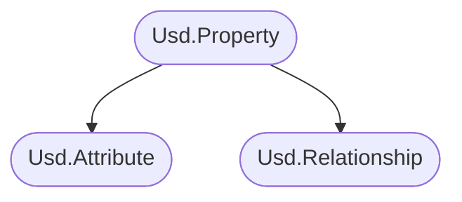
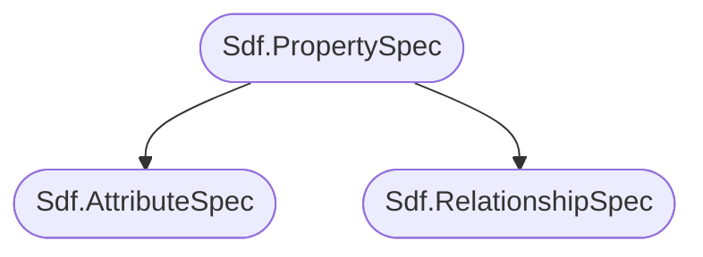

# Properties
For an overview and summary please see the parent [Data Containers](./data_container.md) section.

[ 有关概述简要说明，请参阅 [Data Containers](./data_container.md) 章节]

Here is an overview of the API structure, in the high level API it looks as follows:

[ 以下是 API 结构的概述，在高级 API 中，它如下所示]


In the low level API:

[ 在低级 API 中，它如下所示]



# Table of Contents [目录]
1. [Properties](#propertyOverview)
1. [Attributes](#attributeOverview)
    1. [Attribute Types (Detail/Prim/Vertex/Point) (USD Speak: **Interpolation**)](#attributeInterpolation)
    1. [Attribute Data Types & Roles](#attributeDataTypeRole)
    1. [Static (Default) Values vs Time Samples vs Value Blocking](#attributeAnimation)
        1. [Re-writing a range of values from a different layer](#attributeReauthor)
        1. [Time freezing (mesh) data](#attributeReauthorTimeSampleToStatic)
    1. [Attribute To Attribute Connections (Node Graph Encoding)](#attributeConnections)
    1. [The **primvars** (primvars:<AttributeName>) namespace](#attributePrimvars)
        1. [Reading inherited primvars](#attributePrimvarsInherited)
        1. [Indexed Primvars](#attributePrimvarsIndexed)
    1. [Common Attributes](#attributeCommon):
        1. [Purpose](#attributePurpose)
        1. [Visibility](#attributeVisibility)
        1. [Extents Hint vs Extent](#attributeExtent)
        1. [Xform Ops](#attributeXformOps)
1. [Relationships](#relationshipOverview)
    1. [Material Binding](#relationshipMaterialBinding)
    1. [Collections](#relationshipCollections)
    1. [Relationships Forwarding](#relationshipForwarding)
    1. [Proxy Prim](#relationshipProxyPrim)
1. [Schemas](#propertySchemas)

## Resources [资源]
- [Usd.Property](https://openusd.org/dev/api/class_usd_property.html)
- [Usd.Attribute](https://openusd.org/dev/api/class_usd_attribute.html)
- [Usd.Relationship](https://openusd.org/dev/api/stitch_clips_8h.html#details)
- [Usd.GeomPrimvar](https://openusd.org/release/api/class_usd_geom_primvar.html)
- [Usd.GeomPrimvarsAPI](https://openusd.org/dev/api/class_usd_geom_primvars_a_p_i.html)
- [Usd.GeomImageable](https://openusd.org/release/api/class_usd_geom_imageable.html)
- [Usd.GeomBoundable](https://openusd.org/dev/api/class_usd_geom_boundable.html)

## Properties <a name="propertyOverview"></a>
Let's first have a look at the shared base class `Usd.Property`. This inherits most its functionality from `Usd.Object`, which mainly exposes metadata data editing. We won't cover how metadata editing works for properties here, as it is extensively covered in our [metadata](./metadata.md#metadataSpecialProperty) section.

[ 首先，我们来看一下共享基类 Usd.Property. 它的大部分功能继承自 Usd.Object，Usd.Object 主要提供了元数据编辑的接口. 在这里，我们不会详细介绍 properties 如何编辑元数据，因为这在我们的  [metadata](./metadata.md#metadataSpecialProperty) 章节中已经有详尽的阐述]

So let's inspect what else the class offers:
[ 让我们看一下该类还提供了哪些内容]

~~~admonish info title=""
```python
{{#include ../../../../code/core/elements.py:propertyOverview}}
```
~~~

As you can see, the `.GetProperty`/`.GetAttribute`/`.GetRelationship` methods return an object instead of just returning `None`. This way we can still check for `.IsDefined()`. We can also use them  as "truthy"/"falsy" objects, e.g. `if not attr` which makes it nicely readable.

[ 正如您所看到的 .GetProperty / .GetAttribute / .GetRelationship 方法返回的是一个对象，而不是返回 None .这样我们就可以使用 .IsDefined() 进行检查. 我们还可以将它们用作 “真”/“假” 的判断对象，例如 if not attr 这使得它具有良好的可读性]

For a practical of the `.GetPropertyStack()` method see our [Houdini](../../dcc/houdini/hda/timedependency.md) section, where we use it to debug if time varying data actually exists. We also cover it in more detail in our [composition](../composition/pcp.md) section.

[ 有关 .GetPropertyStack() 方法的实用信息，请参阅我们的 [Houdini](../../dcc/houdini/hda/timedependency.md) 部分，其中我们用它来调试随时间变化的数据是否真实存在. 在 [合成](../composition/pcp.md) 部分更详细地介绍了]

## Attributes <a name="attributeOverview"></a>
Attributes in USD are the main data containers to hold all of you geometry related data. They are the only element in USD that can be [animateable](./animation.md).

[ 属性是在整个 USD 中保存几何相关所有数据的主要数据容器. 它是 USD 中唯一可以设置 [动画](./animation.md) 的元素]


### Attribute Types (Detail/Prim/Vertex/Point) (USD Speak: **Interpolation**) <a name="attributeInterpolation"></a>
To determine on what geo prim element an attribute applies to, attributes are marked with `interpolation` metadata.
We'll use Houdini's naming conventions as a frame of reference here:

[ 为了确定属性应用于哪个 geo prim 元素，属性用 interpolation 元数据进行标记. 我们将使用 Houdini 的命名约定作为参考框架]

You can read up more info in the [Usd.GeomPrimvar](https://openusd.org/release/api/class_usd_geom_primvar.html#Usd_InterpolationVals) docs page.

[ 您可以在 [Usd.GeomPrimvar](https://openusd.org/release/api/class_usd_geom_primvar.html#Usd_InterpolationVals) 文档中阅读更多信息]

- `UsdGeom.Tokens.constant` (Same as Houdini's `detail`attributes): Global attributes (per prim in the hierarchy).

    UsdGeom.Tokens.constant （与 Houdini 的 detail 属性相同）：全局属性（层级结构中的每个 prim ）
- `UsdGeom.Tokens.uniform` (Same as Houdini's `prim` attributes): Per prim attributes (e.g. groups of polygons).

    UsdGeom.Tokens.uniform （与 Houdini 的 prim 属性相同）：每个 prim 上的属性（例如 模型的组信息）
- `UsdGeom.Tokens.faceVarying` (Same as Houdini's `vertex` attributes): Per vertex attributes (e.g. UVs).

    UsdGeom.Tokens.faceVarying （与Houdini的 vertex 属性相同）：每个顶点上的属性（例如 UV）
- `UsdGeom.Tokens.varying` (Same as Houdini's `vertex` attributes): This the same as face varying, except for nurbs surfaces.

    UsdGeom.Tokens.varying （与 Houdini 的 vertex 属性相同）：基本上等同于 faceVarying ，除了 nurbs 曲面
- `UsdGeom.Tokens.vertex` (Same as Houdini's `point` attributes): Per point attributes (e.g. point positions).

    UsdGeom.Tokens.vertex （与Houdini的 point 属性相同）：每个点上的属性（例如 点的位置）

To summarize:

[ 总结一下]

| Usd Name                  | Houdini Name |
|---------------------------|--------------|
|UsdGeom.Tokens.constant    | detail       |
|UsdGeom.Tokens.uniform     | prim         |
|UsdGeom.Tokens.faceVarying | vertex       |
|UsdGeom.Tokens.vertex      | point        |

~~~admonish info title=""
```python
{{#include ../../../../code/core/elements.py:attributeInterpolation}}
```
~~~

~~~admonish tip
For attributes that don't need to be accessed by Hydra (USD's render abstraction interface), we don't need to set the interpolation. In order for an attribute, that does not derive from a schema, to be accessible for the Hydra, we need to namespace it with `primvars:`, more info below at [primvars](#attributePrimvars). If the attribute element count for non detail (constant) attributes doesn't match the corresponding prim/vertex/point count, it will be ignored by the renderer (or crash it).

[ 对于不需要被 Hydra（USD的渲染抽象接口）访问的属性，我们不需要设置插值. 为了让不是从 schema 派生出来的属性能够被Hydra访问，我们需要使用 “primvars:” 命名空间来标记它，关于[primvars](#attributePrimvars)的更多信息请见下文. 如果非 detail (constant) 属性的元素数量与相应的 prim/vertex/point 数量不匹配，那么渲染器将忽略它（或者导致崩溃）]

When we set schema attributes, we don't need to set the interpolation, as it is provided from the [schema](./schemas.md).

[ 当我们设置 schema attributes 时，我们不需要设置插值，因为插值是由 [schema](./schemas.md) 提供的]
~~~

### Attribute Data Types & Roles <a name="attributeDataTypeRole"></a>
We cover how to work with data classes in detail in our [data types/roles](./data_type.md) section. For array attributes, USD has implemented the buffer protocol, so we can easily convert from numpy arrays to USD Vt arrays and vice versa. This allows us to write high performance attribute modifications directly in Python. See our [Houdini Particles](../../dcc/houdini/fx/particles.md) section for a practical example.

[ 我们在 [data types/roles](./data_type.md) 章节详细介绍了如何处理数据. 对于数组属性，USD 已经实现了缓冲区协议，因此我们可以轻松地将 numpy 数组转换为 USD Vt 数组，反之亦然. 这种转换使得在 Python 中可以直接进行高效的属性修改. 请参阅我们在 [Houdini Particles](../../dcc/houdini/fx/particles.md) 章节的一个实际应用的例子]

~~~admonish info title=""
```python
{{#include ../../../../code/core/elements.py:attributeDataTypeRole}}
```
~~~

The role specifies the intent of the data, e.g. `points`, `normals`, `color` and will affect how renderers/DCCs handle the attribute. This is not a concept only for USD, it is there in all DCCs. For example a color vector doesn't need to be influenced by transform operations where as normals and points do.

[ 数据角色明确数据的用途，例如 points 、 normals 、 color 将影响渲染器/DCC 对属性的处理. 这不单单只是 USD 的概念，而是所有 DCC 都有的. 例如，颜色不需要像法线和点那样受到变换操作的影响]

Here is a comparison to when we create an attribute a float3 normal attribute in Houdini.

[ 这是我们在 Houdini 中创建 3 浮点法线属性时的操作]


### Static (Default) Values vs Time Samples vs Value Blocking <a name="attributeAnimation"></a>
We talk about how animation works in our [animation](./animation.md) section.

[ 我们在[动画](./animation.md) 部分讨论动画的工作方式]

~~~admonish important
Attributes are the only part of USD than can encode time varying data.

[ 属性是 USD 中唯一可以编码时间变化的数据]
~~~

~~~admonish info title=""
```python
{{#include ../../../../code/core/elements.py:animationOverview}}
```
~~~

We can set an attribute with a static value (USD speak `default`) or with time samples (or both, checkout the animation section on how to handle this edge case). We can also block it, so that USD sees it as if no value was written. For attributes from schemas with default values, this will make it fallback to the default value.

[ 我们可以设置一个静态值（USD称之为默认值）或者设置时间样本（或者两者都设置，请查看动画部分以了解如何处理这种边缘情况）的属性. 我们也可以设置成 block，这样 USD 就会认为它没有写入任何值. 对于具有默认值的 schemas 属性，这将使其返回默认值]

~~~admonish info title=""
```python
{{#include ../../../../code/core/elements.py:animationDefaultTimeSampleBlock}}
```
For more examples (also for the lower level API) check out the [animation](./animation.md) section.

[ 有关更多案例（或关于低级 API），请查看 [动画](./animation.md) 部分]
~~~

#### Re-writing a range of values from a different layer <a name="attributeReauthor"></a>

~~~admonish danger
An important thing to note is that when we want to re-write the data of an attribute from a different layer, we have to get all the existing data first and then write the data, as otherwise we are changing the value source. To understand better why this happens, check out our [composition](../composition/overview.md) section.

[ 需要注意的一个重要事项是，当我们想要从另一个层重写某个属性的数据时，我们首先需要获取该属性的所有现有数据，然后再写入新的数据. 否则，我们将会改变原始值. 为了更好地理解为什么会出现这种情况，请查阅 [composition](../composition/overview.md)]
~~~

Let's demonstrate this:

[ 让我们来演示一下]

~~~admonish info title="Change existing values | Click to expand code" collapsible=true
```python
{{#include ../../../../code/core/elements.py:attributeReauthor}}
```
~~~

For heavy data it would be impossible to load everything into memory to offset it. USD's solution for that problem is [Layer Offsets](./animation.md#layer-offset-a-non-animateable-time-offsetscale-for-composition-arcs).

[ 对于大量数据，不可能将所有内容加载到内存中. USD 针对该问题的解决方案是  [Layer Offsets](./animation.md#layer-offset-a-non-animateable-time-offsetscale-for-composition-arcs)]

What if we don't want to offset the values, but instead edit them like in the example above?

[ 如果我们不想偏移这些值，而是像上面的示例一样编辑它们怎么办？]

In a production pipeline you usually do this via a DCC that imports the data, edits it and then re-exports it (often per frame and loads it via value clips). So we mitigate the problem by distributing the write to a new file(s) on multiple machines/app instances. Sometimes though we actually have to edit the samples in an existing file, for example when post processing data. In our [point instancer](../../dcc/houdini/fx/pointinstancers.md) section we showcase a practical example of when this is needed.

[ 在实际生产流程中，您通常是通过 DCC 来执行导入数据、编辑数据，然后重新导出 (通常每帧是通过值剪辑加载). 因此，即便有时候我们必须编辑文件中的样本, 我们会通过使用多台计算机/应用程序实例将数据写到多个新的文件上以此来解决该问题. 例如: 每一份数据输出完之后再进行处理. 在 [point instancer](../../dcc/houdini/fx/pointinstancers.md) 章节的例子中，我们解释了什么时候需要这样做]

To edit the time samples directly, we can open the layer as a stage or edit the layer directly. To find the layers you can inspect the layer stack or value clips, but most of the time you know the layers, as you just wrote to them:

[ 要直接编辑时间样本，我们可以将 layer 作为 stage 打开或直接编辑 layer. 要查找图层，您可以检查图层堆栈或值剪辑，但大多数时候您都知道这些 layer (不用去找)，然后就像您刚刚操作的那样去写入]

~~~admonish info title=""
```python
{{#include ../../../../code/core/elements.py:attributeReauthorPerLayer}}
```
~~~

#### Time freezing (mesh) data <a name="attributeReauthorTimeSampleToStatic"></a>
If we want to time freeze a prim (where the data comes from composed layers), we simply re-write a specific time sample to the default value.

[ 如果我们想要冻结单帧 prim（其中数据来自组合层），我们只需将特定时间样本重写为默认值即可 ]

~~~admonish tip title="Pro Tip | Time Freeze | Click to expand code" collapsible=true
```python
{{#include ../../../../code/core/elements.py:attributeReauthorTimeSampleToStatic}}
```
~~~

~~~admonish danger
If you have to do this for a whole hierarchy/scene, this does mean that you are flattening everything into your memory, so be aware! USD currently offers no other mechanism.

[ 如果你需要对整个层级结构/场景进行这样的操作，这意味着你正在将所有内容辗平到内存中，所以请注意！USD目前没有其他机制]
~~~

We'll leave "Time freezing" data from the active layer to you as an exercise.

[ 我们将把激活层中的“时间冻结”数据留给您作为练习]

~~~admonish tip title="Hint | Time Freeze | Active Layer | Click to expand" collapsible=true
We just need to write the time sample of your choice to the `attr_spec.default` attribute and clear the time samples ;

[ 我们只需要将所选的时间样本写入attr_spec.default属性，并清除时间样本即可]
~~~

### Attribute To Attribute Connections (Node Graph Encoding)<a name="attributeConnections"></a>
Attributes can also encode relationship-like paths to other attributes. These connections are encoded directly on the attribute. It is up to Usd/Hydra to evaluate these "attribute graphs", if you simply connect two attributes, it will not forward attribute value A to connected attribute B (USD does not have a concept for a mechanism like that (yet)).

[ 属性还可以类似关系连接的方式连接到其他属性. 这些连接直接在属性上转化. 由 Usd/Hydra 来计算这些“属性关系图”，如果您只是简单的连接两个属性，它不会将属性值 A 传到连接的属性 B（USD还没有一个关于此类机制的概念（至少目前还没有）]

~~~admonish important
Attribute connections are encoded from target attribute to source attribute.
The USD file syntax is: `<data type> <attribute name>.connect = </path/to/other/prim.<attribute name>`

[ 属性连接是从目标属性编码到源属性的. USD文件的语法是：\<data type\> \<attribute name\>.connect = \</path/to/other/prim.\<attribute name\>]
~~~

Currently the main use of connections is encoding node graphs for shaders via the [UsdShade.ConnectableAPI](https://openusd.org/dev/api/class_usd_shade_connectable_a_p_i.html).

[ 目前连接主要的用途是通过 UsdShade.ConnectableAPI 对着色器节点进行连接]


Here is an example of how a material network is encoded.

[ 这是展示了如何对材质网络节点进行连接]

~~~admonish important title=""
```python
def Scope "materials"
{
    def Material "karmamtlxsubnet" (
    )
    {
        token outputs:mtlx:surface.connect = </materials/karmamtlxsubnet/mtlxsurface.outputs:out>

        def Shader "mtlxsurface" ()
        {
            uniform token info:id = "ND_surface"
            string inputs:edf.connect = </materials/karmamtlxsubnet/mtlxuniform_edf.outputs:out>
            token outputs:out
        }

        def Shader "mtlxuniform_edf"
        {
            uniform token info:id = "ND_uniform_edf"
            color3f inputs:color.connect = </materials/karmamtlxsubnet/mtlx_constant.outputs:out>
            token outputs:out
        }

        def Shader "mtlx_constant"
        {
            uniform token info:id = "ND_constant_float"
            float outputs:out
        }
    }
}
```
~~~

Connections, like relationships and composition arcs, are encoded via `List Editable Ops`. These are a core USD concept that is crucial to understand (They are like fancy version of a Python list with rules how sub-lists are merged). Checkout our [List Editable Ops](../composition/listeditableops.md) section for more info.

[ 连接信息（例如关系连接和合成弧）是通过 List Editable Ops 进行操作的. 这些是 USD 的核心概念，至关重要 (它们就像带有子列表合并规则的 Python 列表的高级版本). 查阅 [List Editable Ops](../composition/listeditableops.md) 以获取更多信息]

Here is how connections are managed on the high and low API level. Note as mentioned above this doesn't do anything other than make the connection. USD doesn't drive attribute values through connections. So this example is just to demonstrate the API.

[ 以下是如何在高级 API 和低级 API 上管理连接. 请注意，如上所述，除了建立连接之外不会执行任何其他操作. USD 不会通过连接来驱动属性值. 所以这个例子只是为了演示 API ]

~~~admonish info title=""
```python
{{#include ../../../../code/core/elements.py:attributeConnections}}
```
~~~

### The **primvars** (primvars:<AttributeName>) namespace <a name="attributePrimvars"></a>
Attributes in the `primvars` namespace `:` are USD's way of marking attributes to be exported for rendering. These can then be used by materials and AOVs. Primvars can be written per attribute type (detail/prim/vertex/point), it is up to the render delegate to correctly access them.

[ 使用 `:` 命名空间的 primvars 属性是 USD 用来标记渲染属性的方法, 可以被 materials 和 AOV 使用. Primvars 可以按属性类型（detail/prim/vertex/point）编写, 然后由渲染委托访问]

Primvars that are written as `detail` (UsdGeom.Tokens.constant interpolation) attributes, get inherited down the hierarchy. This makes them ideal transport mechanism of assigning render geometry properties, like dicing settings or render ray visibility.

[ 编写为 detail（UsdGeom.Tokens.constant interpolation）属性的 Primvars 会沿着层级结构向下继承. 这使得它们成为分配渲染几何体属性（如 dicing 设置或渲染可见性）的理想传输机制]

~~~admonish important
- An attribute with the `primvars:` can be accessed at render time by your render delegate for things like settings, materials and AOVs

    [ 渲染委托可以在渲染时访问带有 primvars: 的属性，以获取相关设置选项、材质和 AOV 等内容]
- `detail` (UsdGeom.Tokens.constant interpolation) primvars are inherited down the hierarchy, ideal to apply a constant value per USD prim, e.g. for render geometry settings or instance variation.

    [ detail (UsdGeom.Tokens.constant interpolation) primvars 沿层级结构继承，非常适合为每个 USD prim 应用恒定值，例如 几何体渲染设置 或 实例化的变体]
~~~
~~~admonish danger
- The term `inherited` in conjunction with `primvars` refers to a constant interpolation primvar being passed down to its children. It is not to be confused with `inherit` composition arcs.

    [ inherited 与 primvars 结合使用时，指的是传递给其子级的常量插值 primvar. 不要将其与 inherit 合成弧相混淆]
~~~

To deal with primvars, the high level API has the `UsdGeom.PrimvarsAPI` [(API Docs)](https://openusd.org/dev/api/class_usd_geom_primvars_a_p_i.html). In the low level, we need to do everything ourselves. This create `UsdGeom.Primvar` [(API Docs)](https://openusd.org/dev/api/class_usd_geom_primvar.html) objects, that are similar `Usd.Attribute` objects, but with methods to edit primvars. To get the attribute call `primvar.GetAttr()`.

[ 为了处理 primvars，高级 API 有 UsdGeom.PrimvarsAPI [(API Docs)](https://openusd.org/dev/api/class_usd_geom_primvars_a_p_i.html). 而在低级 API 上一切都需要我们自己做. 需要创建 UsdGeom.Primvar  [(API Docs)](https://openusd.org/dev/api/class_usd_geom_primvar.html) 对象，与 Usd.Attribute 对象类似，但增加了编辑 primvar 的方法. 要获取属性，请调用 primvar.GetAttr()]

~~~admonish info title=""
```python
{{#include ../../../../code/core/elements.py:attributePrimvarAPI}}
```
~~~

#### Reading inherited primvars <a name="attributePrimvarsInherited"></a>
To speed up the lookup of inherited primvars see this guide [API Docs](https://openusd.org/dev/api/class_usd_geom_primvars_a_p_i.html#usdGeom_PrimvarFetchingAPI). Below is an example how to self implement a high performant lookup, as we couldn't get the `.FindIncrementallyInheritablePrimvars` to work with Python as expected.

[ 要加快查找继承的 primvar 请参阅本指南 [API Docs](https://openusd.org/dev/api/class_usd_geom_primvars_a_p_i.html#usdGeom_PrimvarFetchingAPI) 下面是一个自行实现高性能查找的示例, 因为我们无法使用 Python 让 .FindIncrementallyInheritablePrimvars 按预期工作]

~~~admonish danger title="High performance primvars inheritance calculation | Click to expand code" collapsible=true
```python
{{#include ../../../../code/core/elements.py:attributePrimvarInherited}}
```
~~~

#### Indexed primvars <a name="attributePrimvarsIndexed"></a>
Primvars can optionally be encoded via an index table. Let's explain via an example:

[ Primvars 可以通过索引表进行操作. 我们通过一个例子来解释一下：]

Here we store it without an index table, as you can see we have a lot of duplicates in our string list. 
This increases the file size when saving the attribute to disk.

[ 在这里，我们在没有索引表的情况下存储它，正如您所看到的，我们的字符串列表中有很多重复项。将属性保存到磁盘时，这会增加文件大小]

```python
...
        string[] primvars:test = ["test_0", "test_0", "test_0", "test_0",
                                  "test_1", "test_1", "test_1", "test_1",
                                  "test_2", "test_2", "test_2", "test_2",
                                  "test_3", "test_3", "test_3", "test_3"] (
            interpolation = "uniform"
        )
        int[] primvars:test:indices = None
...
```
Instead we can encode it as a indexed primvar:

[ 相反，我们可以将其转为索引操作 primvar]

```python
...
        string[] primvars:test = ["test_0", "test_1", "test_2", "test_3"] (interpolation = "uniform")
        int[] primvars:test:indices = [0, 0, 0, 0, 1, 1, 1, 1, 2, 2, 2, 2, 3, 3, 3, 3] ()
...
```
We can also flatten the index, when looking up the values. It should be preferred to keep the index, if you intend on updating the primvar.

[ 在查找值时，我们还可以辗平索引. 如果您打算更新 primvar，则最好保留索引]

~~~admonish info title=""
```python
{{#include ../../../../code/core/elements.py:attributePrimvarIndexed}}
```
~~~

If you are a Houdini user you might know this method, as this is how Houdini's internals also store string attributes.
You can find more info in the [USD Docs](https://openusd.org/release/api/class_usd_geom_primvar.html)

[ 如果您是 Houdini 用户，您应该知道这个方法，因为这也是 Houdini 内部存储字符串属性的方式. 您可以在 [USD Docs](https://openusd.org/release/api/class_usd_geom_primvar.html) 中找到更多信息]


### Common Attributes <a name="attributeCommon"></a>
Now that we got the basics down, let's have a look at some common attributes (and their schemas to access them).

[ 现在我们已经掌握了基础知识，让我们看一下一些通用属性（以及访问它们的模式）]

#### Purpose <a name="attributePurpose"></a>
The `purpose` is a special USD attribute that:

[ purpose 是一个特殊的 USD 属性]

- Affects certain scene traversal methods (e.g. [bounding box or xform cache lookups](../../production/caches.md) can be limited to a specific purpose).

    [ 影响场景遍历方式（例如，可以将 [bounding box or xform cache lookups](../../production/caches.md) 限制到特定 purpose 上）]
- Is a mechanism for Hydra (USD's render abstraction interface) to only pull in data with a specific purpose. Since any rendering (viewport or final image) is run via Hydra, this allows users to load in only prims tagged with a specific purpose. For example the `pxr.UsdGeom.Tokens.preview` purpose is used for scene navigation and previewing only, while the ``UsdGeom.Tokens.render` purpose is used for final frame rendering.

    [ 它是 Hydra（USD 的渲染抽象接口）提取特定 purpose 数据的机制. 由于任何渲染（视口或最终图像）都是通过 Hydra 进行的, 因此用户可以通过 purpose 加载特定标记的 prims , 例如 pxr.UsdGeom.Tokens.preview 的 purpose 仅用于场景导航和预览, 而 UsdGeom.Tokens.render 的 purpose 用于最终的渲染]
- It is inherited (like [primvars](#the-primvars-primvars-namespace)) down the hierarchy. You won't see this in UIs unlike with primvars.

    [ 它是按层级结构继承的（就像 [primvars](#the-primvars-primvars-namespace) 一样）. 与 primvar 不同的是您不会在 UI 上看到]


~~~admonish tip title="Pro Tip | Where to mark the purpose"
As a best practice you should build your hierarchies in such a way that you don't have to write a purpose value per prim.
A typical setup is to have a `<asset root>/GEO`, `<asset root>/PROXY`, ... hierarchy, where you can then tag the `GEO`, `PROXY`, ... prims with the purpose. That way all child prims receive the purpose and you have a single point where you can override the purpose.

    [ 作为最佳实践，您应该构建层级结构，以便不必为每个 prim 编写 purpose. 典型的设置是拥有类似 <asset root>/GEO, <asset root>/PROXY, ...  这样的层次结构
    然后您可以在其中标记 GEO 、 PROXY 、 ... 这样，所有 child prims 都会继承这个 purpose，并且您有一个可以覆盖 purpose 的控制点]

This is useful, if you for example want to load a whole scene in `proxy` purpose and a specific asset in `render` purpose. You then just have to edit a single prim to make it work.

    [ 这种做法非常有用，例如，如果您想以 proxy purpose 加载整个场景，而以 render purpose 加载特定资产时，您只需编辑一个 prim 即可实现]
~~~

The purpose is provided by the `UsdGeom.Imageable` (renderable) typed non-concrete schema, and is therefore on anything that is renderable.

[ 由UsdGeom.Imageable（可渲染）类型创建的非具体 schema 的 purpose ,适用于任何可渲染的对象]

~~~admonish tip title="Usd.GeomImageable inheritance graph | Click to expand code" collapsible=true

~~~

There are 4 different purposes:

[ 这里有 4 个不同的 purposes]

- `UsdGeom.Tokens.default_`: The default purpose. This is the fallback purpose, when no purpose is explicitly defined. It means that this prim should be traversed/visible to any purpose.

    [ UsdGeom.Tokens.default_ ：默认 purpose. 当没有明确定义 purpose 时，这是默认的 purpose 意味着这个 prim 在任何 purpose 中都是可被遍历/可见的]
- `UsdGeom.Tokens.render`: Tag any (parent) prim with this to mark it suitable for final frame rendering.

    [ UsdGeom.Tokens.render ：标记的任何（父级）prim 以将其作为最终的渲染]
- `UsdGeom.Tokens.proxy`:  Tag any (parent) prim with this to mark it suitable for low resolution previewing. We usually tag prims with this that can be loaded very quickly.

    [ UsdGeom.Tokens.proxy ：标记的任何（父级）prim 以将其作为低分辨率预览. 我们通常用这个标记 prims，这样可以非常快速地加载预览]
- `UsdGeom.Tokens.guide`: Tag any (parent) prim with this to mark it suitable for displaying guide indicators like rig controls or other useful scene visualizers.

    [ UsdGeom.Tokens.guide ：标记的任何（父级）prim，以将其作为类似 rig 控制器样的显示标志或其他有用的场景可视化引导标志]

~~~admonish tip title=""
```python
{{#include ../../../../code/core/elements.py:attributePurpose}}
```
~~~

#### Visibility <a name="attributeVisibility"></a>
The `visibility` attribute controls if the prim and its children are visible to Hydra or not. Unlike the `active` [metadata](./metadata.md#activeactivation), it does not prune the child prims, they are still reachable for inspection and traversal. Since it is an attribute, we can also animate it. Here we only cover  how to set/compute the attribute, for more info checkout our [Loading mechansims](./loading_mechanisms.md) section

[ visibility 属性控制 prim 及其子项对 Hydra 是否可见, 与 active [元数据](./metadata.md#activeactivation) 不同，它不修剪子项, 子项仍然可以进行检查和遍历, 既然它是一个属性，我们就可以为它设置动画. 这里我们只介绍如何设置/计算属性，有关更多信息，请查看 [Loading mechansims](./loading_mechanisms.md)]

The attribute data type is `Sdf.Token` and can have two values:

[ 这个属性数据类型是 Sdf.Token ，它有两个值]

- UsdGeom.Tokens.inherited
- UsdGeom.Tokens.invisible

~~~admonish tip title=""
```python
{{#include ../../../../code/core/elements.py:attributeVisibility}}
```
~~~

~~~admonish note
In the near future visibility can be set per purpose (It is already possible, just not widely used). Be aware that this might incur further API changes.

[ 在不久的将来，可以根据 purpose 设置可见性（这已经是可行的，只是尚未广泛使用）请注意，这可能会进一步导致 API 的更改]
~~~

#### Extents Hint vs Extent <a name="attributeExtent"></a>
In order for Hydra delegates but also stage bounding box queries to not have to compute the bounding box of each individual boundable prim, we can write an extent attribute.

[ 为了让 Hydra 代理和 stage 的边界框查询不必计算每个 prim 的边界框，我们可以编写一个 extent 属性]

This attribute is mandatory for all boundable prims. The data format is:

[ 该属性对于所有 有边界的 prims 都是强制的. 数据格式为]

`Vt.Vec3fArray(2, (Gf.Vec3f(<min_x>, <min_y>, <min_z>), Gf.Vec3f(<max_x>, <max_y>, <max_z>)))`

E.g.: `Vt.Vec3fArray(2, (Gf.Vec3f(-5.0, 0.0, -5.0), Gf.Vec3f(5.0, 0.0, 5.0)))`

Here are all boundable prims (prims that have a bounding box).

[ 这里是所有 有边界的 prims（具有边界框的prims）]

~~~admonish tip title="UsdGeom.Boundable inheritance graph | Click to view" collapsible=true

~~~

Since boundable prims are leaf prims (they have (or at least should have) no children), a prim higher in the hierarchy can easily compute an accurate bounding box representation, by iterating over all leaf prims and reading the `extent` attribute. This way, if a single leaf prim changes, the parent prims can reflect the update without having to do expensive per prim point position attribute lookups.

[ 由于具有边界框的 prim 都是叶节点 prim（它们（或至少应该）没有子节点），因此层级结构中较高的 prim 可以通过遍历所有叶节点 prim 并读取边界框属性来轻松计算精确的边界框. 这样，如果单个叶节点 prim 发生更改，父节点 prim 可以反映更新，而无需付出昂贵的代价 按每个 prim 点位置属性进行查找]

~~~admonish tip title="Pro Tip | Bounding Box Cached Queries in Production"
We cover how to use the a bounding box cache in detail in our [stage API query caches](../../production/caches.md) for optimized bounding box calculation and extent writing.

[ 我们在 [stage API query caches](../../production/caches.md) 中详细介绍了如何使用边界框缓存来优化边界框计算和范围写入 ]
~~~

~~~admonish tip title=""
```python
{{#include ../../../../code/core/elements.py:attributeExtent}}
```
~~~

There is also an `extentsHint` attribute we can create on non-boundable prims. This attribute can be consulted by bounding box lookups too and it is another optimization level on top of the `extent` attribute.
We usually write it on asset root prims, so that when we unload payloads, it can be used to give a correct bbox representation.

[ 在没有边界框的 prims上也可以创建 extentsHint 属性, 该属性也可以用于边界框查找，并且它是在 extent 属性之上的另一个优化级别. 我们通常将其写入资产根 prims，以便在卸载 payloads 时，可以提供正确的边界框]

The `extentsHint` has a different data format: It can store the extent hint per purpose or just for the default purpose.

[ extentsHint 具有不同的数据格式：它可以存储每个 purpose 边界范围或仅用于默认 purpose 的边界]

For just the default purpose it looks like:
`Vt.Vec3fArray(2, (Gf.Vec3f(<min_x>, <min_y>, <min_z>), Gf.Vec3f(<max_x>, <max_y>, <max_z>)))`

For the default and proxy purpose (without render): 
`Vt.Vec3fArray(6, (Gf.Vec3f(<min_x>, <min_y>, <min_z>), Gf.Vec3f(<max_x>, <max_y>, <max_z>), Gf.Vec3f(0, 0, 0), Gf.Vec3f(0, 0, 0), Gf.Vec3f(<proxy_min_x>, <proxy_min_y>, <proxy_min_z>), Gf.Vec3f(<proxy_max_x>, <proxy_max_y>, <proxy_max_z>)))`

As you can see the order is `UsdGeom.Tokens.default_`, `UsdGeom.Tokens.render`,`UsdGeom.Tokens.proxy`, `UsdGeom.Tokens.guide`. It a purpose is not authored, it will be sliced off (it it is at the end of the array).

[ 如您所见，顺序是 UsdGeom.Tokens.default_ 、 UsdGeom.Tokens.render 、 UsdGeom.Tokens.proxy 、 UsdGeom.Tokens.guide 如果 purpose 没有声明，它将被切掉（如果它位于数组的末尾）]

#### Xform (Transform) Ops <a name="attributeXformOps"></a>
Per prim transforms are also encoded via attributes. As this is a bigger topic, we have a dedicated [Transforms](./transform.md) section for it.

[ 每个 prim 变换也通过属性进行操作. 由于这是一个更大的主题，因此我们有专门 [Transforms](./transform.md) 章节]

## Relationships <a name="relationshipOverview"></a>
Relationships in USD are used to encode prim path to prim path connections.
They can be in the form of `single` -> `single` prim path or `single` -> `multiple` primpaths.

[ USD 中的连接关系是用 prim path 到 prim path 的连接. 它可以一对一, 也可以一对多的关联]

Technically relationships can also target properties (because they encode `Sdf.Path` objects), I'm not aware of it being used other than to target other collection properties. The paths must always be absolute (we'll get an error otherwise).

[ 从技术上讲，关系也可以指向属性（因为它操作的是 Sdf.Path 对象），但我并不清楚除了指向其他集合属性之外，它还有其他什么用途. paths必须始终是绝对路径（否则会报错）]

Relationships are [list-editable](../composition/listeditableops.md), this is often not used, as a more explicit behavior is favoured.

[ 关系列表可编辑的，但通常不会使用这个功能，而是倾向于更明确的方式来处理]

When we start looking at composition (aka loading nested USD files), you'll notice that relationships that where written in a different file are mapped into the hierarchy where it is being loaded. That way every path still targets the correct destination path.
(Don't worry, we'll look at some examples in our [Composition](../composition/overview.md) and [Houdini](../../dcc/houdini/overview.md) sections.

[ 当我们开始研究合成（又名嵌套 USD ）时，您会注意到在不同文件中编写的关系链接会被加载到层级结构中. 每个 paths 仍然以正确的目标路径连接关系.（别担心，我们将在 [Composition](../composition/overview.md) and [Houdini](../../dcc/houdini/overview.md) 章节中查看一些示例]

~~~admonish tip title=""
```python
{{#include ../../../../code/core/elements.py:relationshipOverview}}
```
~~~

### Material Binding <a name="relationshipMaterialBinding">
One of the most common use cases of relationships is encoding the material binding. Here we simply link from any imageable (renderable) prim to a `UsdShade.Material` (`Material`) prim.

[ 关系连接最常见的使用是对材质的绑定. 我们简单地从任何可成像（可渲染）prim 链接到 UsdShade.Material ( Material ) prim]

As this is a topic in itself, we have a dedicated [materials](./materials.md) section for it.

[ 由于这本身就是一个主题，因此我们有专门的 [materials](./materials.md) 章节]

### Collections <a name="relationshipCollections"></a>
Collections are USD's concept for storing a set of prim paths. We can nest/forward collections to other collections and relationships, which allows for powerful workflows. For example we can forward multiple collections to a light linking relationship or forwarding material binding relationships to a single collection on the asset root prim, which then in return forwards to the material prim.

[ 集合是 USD 的概念，用于存储一组 prim paths. 们可以将集合嵌套/指向到其他集合和关系中，从而实现强大的工作流. 例如，我们可以将多个集合指向一个轻型的链接关系或者将材质绑定关系指向资产根 prim 上的一个集合，然后将该集合再指到材质 prim]

As this is a bigger topic, we have a dedicated [collections](./collection.md) section for it.

[ 由于这是一个更大的主题，我们有专门的 [collections](./collection.md) 讲解]

### Relationship Forwarding <a name="relationshipForwarding"></a>
Relationships can also point to other relations ships. This is called `Relationship Forwarding`.
We cover this topic in detail in our [Advanced Topics](../../production/concepts.md#relationship-forwarding) section.

[ 关系还可以指向其他关系. 这称为 Relationship Forwarding . 我们在 [高级主题](../../production/concepts.md#relationship-forwarding) 进行了详细的介绍]

### Proxy Prim <a name="relationshipProxyPrim"></a>
The `proxyPrim` is a relationship from a prim with the `UsdGeom.Token.render` purpose to a prim with the `UsdGeom.Token.proxy` purpose. It can be used by DCCs/USD consumers to find a preview representation of a render prim. A good use case example is when we need to simulate rigid body dynamics and need to find a low resolution representation of an asset.

[ proxyPrim 是一个从设置成 UsdGeom.Token.render 的 prim 到设置成 UsdGeom.Token.proxy 的 prim 关系, 它可以被 DCC 软件/ USD 使用者用来找到低分辨率的预览, 一个很好例子是，当我们在刚体动力学模拟时, 需要找到资产的低分辨率代理]

The relation can also be used by clients to redirect edits back from the proxy prim to the render prim, for example transform edits or material assignments. Since the relation is from render to proxy and not the other way around, it can come with a high cost to relay this info, because we first need to find the correct prims. Therefore it is more common to just edit a mutual parent instead of redirecting what UI manipulators do on the preview prim to the render prim.

[ 用户可以使用这种关系将代理到渲染的编辑重定向回去，例如 变换编辑或材质分配. 但由于关系的方向性(从渲染到代理)，而不是反向的, 所以就需要先找到渲染 prim, 这种方法会带来高昂的成本. 所以,更常见的做法是直接编辑一个共同的父级，而不是在 UI 上操作从代理到渲染的重定向]

~~~admonish tip title="Pro Tip | Preview Purpose Prim Counts"
One of the biggest bottlenecks in USD is creating enormous hierarchies as you then have a lot of prims that need to be considered as value sources. When creating proxy purpose prims/meshes, we should try to keep it as low-res as possible. Best case we only have a single proxy prim per asset.

[ USD 中最大的瓶颈之一是创建庞大的层级结构时，需要解析大量的 prims 值. 在创建代理的 prims/meshes 时，我们应该尽量保持其分辨率尽可能低. 最理想的情况是，每个资产只有一个 proxy prim ]
~~~

To edit and query the `proxyPrim`, we use the `UsdGeom.Imageable` schema class.

[ 要编辑和查询 proxyPrim ，我们可以使用 UsdGeom.Imageable 类]

~~~admonish tip title=""
```python
{{#include ../../../../code/core/elements.py:relationshipProxyPrim}}
```
~~~

## Schemas <a name="propertySchemas"></a>
Schemas are like OOP classes in USD, we cover them in detail [here](./schemas.md). Once applied to a prim, they provide different metadata and properties with fallback values. They also expose convenience methods to edit these.

[ 在USD中，Schemas 类似于面向对象编程中的类. 我们在 [这里](./schemas.md) 详细讨论它们. 一旦将 Schemas 应用到 prim上，它就会提供具有默认返回值的元数据和属性. 此外，它还公开了编辑这些元数据和属性的接口]

We have used a few so far in our examples, for a list of the most usefull ones see our [Common Schemas in Production](../../production/schemas.md) section.

[ 到目前为止，我们已经在示例中使用了一些 Schemas ，要了解常用的 Schemas 列表，请阅读 [Common Schemas in Production](../../production/schemas.md) 章节]