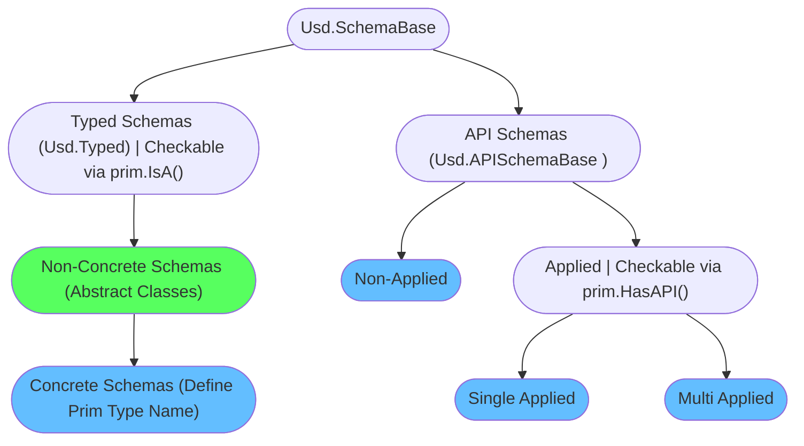

# Schemas
Schemas are to USD what classes are to object orient programming. Let's explain schemas with that analogy in mind:

[ Schemas 在 USD 中的角色，就如同 classes 在面向对象编程中的角色. 让我们带着这种类比来解释 schemas]

- Schemas are templates that define default properties and methods. You can think of each prim in your hierarchy being an instance of a class.

    [ Schemas 是定义默认属性和方法的模板. 你可以将层级结构中的每个prim视为一个类的实例]
- Each prim must (or rather should, technically it is not enforced) have a type name set (see our [prim](./prim.md) section). The type name defines the primary class your prim is an instance of. To dynamically subclass your primary classes with additional classes, USD has the concept of API schemas. These then provide extra metadata/properties or methods that can manipulate your prim data.

    [ 每个prim必须（或者说是应该，在技术上并未强制）设置一个类型名称（参见我们的 [prim](./prim.md) 部分）类型名称定义了你的 prim 所属的主要类. 为了使用额外的类动态地给你的主要类添加子类 USD 提出了 schemas API 的概念 schemas API 提供了额外的元数据/属性或方法用来操作你的 prim 数据]

~~~admonish warning title=""
The examples on this page only talk about how to apply/remove schemas and how to inspect them. In our [production](../../production/overview.md) and [Houdini](../../dcc/houdini/overview.md) section we'll look into the most used ones and run through some production examples.

[ 本章的示例仅讨论如何应用/删除 schemas 以及如何检查它们. 在 [production](../../production/overview.md) 和 [Houdini](../../dcc/houdini/overview.md) 部分，我们将研究最常用的一些制作案例]
~~~

# Table of Contents [目录]
1. [API Overview In-A-Nutshell](#summary)
2. [What should I use it for?](#usage)
3. [Resources](#resources)
4. [Overview](#overview)
6. [Creating/Using schemas in your code](#schemasPracticalGuide)
7. [Prim Definition](#schemasPrimDefinition)
8. [Prim Type Info](#schemasPrimDefinition)
9. [Schema Classes](#schemasClasses)
    1. [Schema Registry](#schemasRegistry)
    2. [Schema Kind](#schemasKind) 

## TL;DR - Metadata In-A-Nutshell [概述]<a name="summary"></a>
- Schemas are like classes in OOP that each prim in your hierarchy then instances. They provide properties (with fallback values) and metadata as well as methods (`Get<PropertName>`/`Set<PropertName>`/Utility functions) to manipulate your prim data.

    [ Schemas 类似于面向对象编程中的 classes，你的层级结构中的每个 prim 都是这些类的实例. 它们提供了属性（带有返回值）和元数据，以及用于操作 prim 数据的方法(如 Get<PropertName>/Set<PropertName>/Utility functions) ]
- There are two different base schema types (See the [overview](#overview) section for more info):

    [ 下面是两种不同的基本 schema（有关详细信息，请参阅[概述](#overview) 部分）]
    - **Typed Schemas**:
        - Define prim type name (OOP: The main class of your prim), like `Cube`/`Mesh`/`Xform`

            [ 需要定义 prim 类型名称（相当于面向对象编程中 prim 的主类），例如 Cube / Mesh / Xform]
        - Provide metadata/properties and methods to edit these

            [ 提供元数据/属性和编辑方法]
        - Checkable via `prim.IsA(<SchemaClassName>)`

            [ 可以通过 prim.IsA(\<SchemaClassName\>) 进行检查验证]
    - **API Schemas (Class Naming Convention `<SchemaClassName>API`)**:
        - Do not define prim type name (OOP: A subclass that inherits to your main class)

            [ 不需要定义prim类型名称（相当于面向对象编程中 继承到主类的子类）]
        - Is divided in:

            [ 分为以下两类]
            - **Non-Applied API schemas**:
                - Add convenience methods to manipulate common prim data like properties and core metadata (like `kind`/`clips`).

                    [ 为常见的 prim 数据（如属性和核心元数据，如 kind/clips ）添加便利方法]
            - **Applied API schemas**:
                - Supplement typed schemas by adding additional metadata/properties and methods to edit these

                    [ 通过为 schemas 添加额外的元数据/属性和编辑方法，来补充它们]
                - Checkable via `prim.HasAPI(<SchemaClassName>)`

                    [ 可以通过 prim.HasAPI(\<SchemaClassName\>) 进行检查验证]
- A prims composed schema definition can be accessed via `prim.GetPrimDefinition()`. This defines a prim's full type signature, similar to how you can inherit from multiple classes in OOP `class (<TypedSchemaClass>, <AppliedAPISchemaA>, <AppliedAPISchemaA>)`.

    [ 通过 prim.GetPrimDefinition() 可以访问由 prims 组成的 Schema definition 返回 prim 的所有类型签名，类似于在面向对象编程中可以从多个类继承 (\<TypedSchemaClass\>, \<AppliedAPISchemaA\>, \<AppliedAPISchemaA\>)]
- You can generate your own as described in our [plugin schemas](../plugins/schemas.md) section.

    [ 您可以按照 [plugin schemas](../plugins/schemas.md) 部分中的描述生成您自己的 schemas]

## What should I use it for? <a name="usage"></a>

[我应该用它做什么？]

~~~admonish tip
We'll be using schema classes a lot in production, so we recommend familiarizing yourself with the below examples.

[ 我们将在生产中大量使用 schema 类，因此我们建议您熟悉以下示例]

They are the main interface for your prims in the high level API that gives you getters/setters for all the standard properties that ship with Usd.

[ 它们是高级 API 中 prims 的主接口，为您提供 USD 附带的所有标准属性的 getter/setter 方法]

```python
{{#include ../../../../code/core/elements.py:schemasOverview}}
```

The schema classes then give you access to all of the schemas Get/Set methods and utility functions.

[ schema 类使您可以访问所有 schemas Get/Set 方法和实用函数]
~~~

## Resources [资源]<a name="resources"></a>
- [API Docs](https://openusd.org/release/api/_usd__page__generating_schemas.html)
- [Schema Registry](https://openusd.org/dev/api/class_usd_schema_registry.html)
- [Generating a schema](https://openusd.org/release/tut_generating_new_schema.html)
- [Prim Definition](https://openusd.org/dev/api/class_usd_prim_definition.html)
- [Prim Type Info](https://openusd.org/dev/api/class_usd_prim_type_info.html)

## Overview [概述]<a name="overview"></a>

Here is a flow chart of how the schema inheritance is setup:

[ 以下是 schema 继承的流程图：]



All the blue colored endpoints are the ones you'll set/apply/use via code, the green one you won't instantiate directly, but you can use it to check for inheritance.

[ 所有蓝色的端点都是您将通过代码进行设置/应用/使用的端点，而绿色的端点您不会直接实例化，但您可以使用它来检查继承关系]

- `Typed Schemas (Usd.Typed)`:
    - The base class for all schemas that define prim types, hence the name `Typed Schemas`

        [ 定义 prim 类型所有 schemas 的基类，因此名称为 Typed Schemas]
    - Defines properties and metadata that is attached to prims that have this type.

        [ 为此类型的 prims 定义了相关的属性和元数据]
    - We can check if it is applied to a prim via `prim.IsA(<className>)`

        [ 我们可以通过 prim.IsA(\<className\>) 检查它是否应用于 prim]
    - Accessible via `SchemaClass(prim)` e.g. `UsdGeom.Imageable(prim)` (Non-concrete), `UsdGeom.Xform(prim)`(concrete), to get access to the methods. To actually apply the schema, we have to set the type name as described below. Accessing a typed schema on a prim with a different type name will result in errors once you try to get/set data. To actually not guess what the typed Python class is we can run `prim.GetPrimTypeInfo().GetSchemaType().pythonClass(prim)`.

        [ 可通过 SchemaClass(prim) 访问, 例如 UsdGeom.Imageable(prim) (Non-concrete), UsdGeom.Xform(prim)(concrete) 的访问方法. 在实际应用中, 我们需要按照下面所描述的那样设置类型名称. 当我们尝试在一个 prim 上访问特定类型的 schema 时,如果 prim 的类型名称与 schema  定义的类型名称不匹配,那么获取或设置数据时就会遇到问题. 为了避免去猜测 prim 对象对应的 Python 类是什么, 我们可以运行 prim.GetPrimTypeInfo().GetSchemaType().pythonClass(prim)]
- `Typed Schemas (Usd.Typed)` -> `Non-Concrete Schemas`:
    - The non-concrete schemas are like abstract classes in OOP. They are schemas that concrete schemas can inherit from. The purpose of these is to define common properties/metadata that a certain type of typed schemas need. (For example lights all share a non-concrete schema for the essential properties.)

        [ 非具体 Schemas 类似于面向对象编程中的抽象类. 它们是可以被具体 Schemas 继承的. 这些非具体 Schemas 的目的是定义某种 Schemas 类型所需的公共属性/元数据（例如，所有灯光都共享一个非具体 Schemas ，用于定义其基础属性）]
    - Do not define a type name (hence non-concrete).

        [ 不需要定义类型名称（因此是非具体的）]
- `Typed Schemas (Usd.Typed)` -> `Non-Concrete Schemas` -> `Concrete Schemas`:
    - Defines a type name

        [ 需要定义类型名称]
    - In OOP terms you can think of it as the primary base class that your prim is instancing.

        [ 从面向对象编程的角度来说，你可以将其视为你的 prim 实例化的主要基类.]
    - Applied via `Prim.SetTypeName(<typeName>)`/`PrimSpec.typeName="<typeName>"`/`SchemaClass.Define(stage, Sdf.Path("/path"))`

        [ 通过 Prim.SetTypeName(\<typeName\>)/PrimSpec.typeName="\<typeName\>"/SchemaClass.Define(stage, Sdf.Path("/path")) 使用]

Here is an example of the inheritance graph of the [UsdGeom.Imageable](https://openusd.org/dev/api/class_usd_geom_imageable.html) typed non-concrete schema:

[ 以下是 UsdGeom.Imageable 类型的 non-concrete schema 的继承图示例]

~~~admonish note title="Click to expand content" collapsible=true

~~~

- `API Schemas (Usd.APISchemaBase)`
    - The base class for all API Schemas, subclasses must end with `API`

        [ 所有 API Schema 的基类，子类必须以 API 结尾]
    - In OOP terms, API schemas are classes that your primary (typed) class can inherit from to gain access to convenience methods, but also additional metadata/properties.

        [ 从面向对象编程的角度来看，API schemas 就相当于类，你的主要（类型）类可以继承这些 API schemas，从而获得便捷的访问方法，同时也能访问其他的元数据/属性]
- `API Schemas (Usd.APISchemaBase)` -> `Non-Applied API Schemas`:
    - Provide only methods to manipulate existing prim data like properties and core metadata (like `kind`/`clips`). Their common usage is to add convenience methods to manipulate common prim data.

        [ 仅提供操作现有 prim 数据的方法，如属性和核心元数据（如 kind / clips ）它们的常见方式是添加便捷方法来操作常见的 prim 数据]
    - They do not define any metadata/properties.

        [ 他们不定义任何元数据/属性]
    - The schema name is not written to the `apiSchemas` metadata, it therefore does not contribute to the prim definition.

        [ schema 名称不会写入 apiSchemas 元数据，因此它不会对 prim 定义做出贡献]
    - Code: Applied via `SchemaClassAPI(prim)` e.g. `Usd.ClipsAPI(prim)`

        [ Code：通过 SchemaClassAPI(prim) 应用，例如 Usd.ClipsAPI(prim)]
- `API Schemas (Usd.APISchemaBase)` -> `Applied API Schemas`:
    - Adds additional metadata/properties to prim and provides methods to manipulate these.

        [ 为 prim 添加额外的元数据/属性, 并且提供操作修改方法]
    - The schema name is added to the `apiSchemas` metadata, it contributes to the prim definition.

        [ schema 名称被添加到 apiSchemas 元数据中，它有助于 prim 定义]
    - We can check if it is applied to a prim via `prim.HasAPI(<APISchemaType>)`

        [ 我们可以通过 prim.HasAPI(\<APISchemaType\>) 检查它是否应用于 prim]
    - Applied via `SchemaClassAPI.Apply(prim)` e.g. `UsdGeom.ModelAPI.Apply(prim)`/`prim_spec.SetInfo("apiSchemas", Sdf.TokenListOp.Create(prependedItems=["GeomModelAPI"]))`

        [ 通过 SchemaClassAPI.Apply(prim) 使用，例如 UsdGeom.ModelAPI.Apply(prim) / prim_spec.SetInfo("apiSchemas", Sdf.TokenListOp.Create(prependedItems=["GeomModelAPI"]))]
- `API Schemas (Usd.APISchemaBase)` -> `Applied API Schemas` -> `Single Apply API Schemas`:
    - Can only be applied once per prim

        [ 每个 prim 只能应用一次]
- `API Schemas (Usd.APISchemaBase)` -> `Applied API Schemas` -> `Multi Apply API Schemas`:
    - Can be applied multiple times with a different instance name, properties are namespaced with the instance name.

        [ 可以使用不同的实例名称多次应用，属性以实例名称命名]

If you want to see a list of off the schema classes that ship with USD by default check out the [Usd.SchemaBase API docs](
https://openusd.org/dev/api/class_usd_schema_base.html) page, it has a full inheritance diagram.

[ 如果你想查看USD默认提供的 schema 类的列表，可以查阅 [Usd.SchemaBase API docs](
https://openusd.org/dev/api/class_usd_schema_base.html) 文档页面，它有一个完整的继承关系图]

~~~admonish tip
As covered in our [prim](./prim.md#schemas) section, Usd has a PrimDefinition/PrimTypeInfo classes we can use to inspect all properties and metadata given through applied and typed schemas on a given prim. This prim definition/type info carry the full type signature of a given prim.

[ 正如我们在 [prim](./prim.md#schemas) 章节所讨论的那样，USD 有 PrimDefinition 和 PrimTypeInfo 这两个类，我们可以使用它们来检查给定 prim 上通过 applied 和 typed schemas 所赋予的所有属性和元数据. 这个 prim definition/type 信息包含了给定 prim 的所有类型签名]
~~~


## Creating/Using schemas in production [ 在生产中创建/使用 schemas]<a name="schemasPracticalGuide"></a>

Let's first look at typed schemas:

[ 我们首先看一下类型 typed schemas]

~~~admonish tip title="Pro Tip | Find class from type name"
To get the class from the prim, we can run:

[ 要从 prim 获取类，我们可以运行]

```python
# From type name
prim_type_name = prim.GetTypeName()
prim_typed_schema = Usd.SchemaRegistry.GetTypeFromName(prim_type_name).pythonClass(prim)
# From prim type info
prim_typed_schema = prim.GetPrimTypeInfo().GetSchemaType().pythonClass(prim)
```
This way we don't have to find and import the right class ourselves.

[ 这样我们就不必自己查找并导入正确的类]

~~~

To summarize the below code:

[ 用下面的代码总结一下]

~~~admonish tip title="Pro Tip | Best practices how to apply schemas"
```python
{{#include ../../../../code/core/elements.py:schemasOverview}}
```
~~~

~~~admonish info title=""
```python
{{#include ../../../../code/core/elements.py:schemasTyped}}
```
~~~

~~~admonish important
The 'IsA' check is a very valuable check to see if something is an instance of a (base) class. It is similar to Python's isinstance method.

[ “IsA” 是非常有用的检查，用于查看某物是否是（基）类的实例. 它类似于 Python 的 isinstance 方法 ]
~~~

And the API schemas:

~~~admonish info title=""
```python
{{#include ../../../../code/core/elements.py:schemasAPI}}
```
~~~

## Prim Definition <a name="schemasPrimDefinition"></a>
With the [prim definition](https://openusd.org/dev/api/class_usd_prim_definition.html) we can inspect what the schemas provide. Basically you are inspecting the class (as to the prim being the instance, if we compare it to OOP paradigms).
In production, you won't be using this a lot, it is good to be aware of it though. If you change things here, you are actually on run-time modifying the base class, which might cause some weird issues.

[ 通过 [prim definition](https://openusd.org/dev/api/class_usd_prim_definition.html) 可以帮助我们了解 schemas 的内容，就像我们查看类的定义一样（与面向对象的范式相比较， prim 就是这个类的实例）实际生产环境中，这种检查不会经常被用到，但了解它是很有好处的. 此外，如果我们尝试在这个定义中做修改，那么就会实时地改变基类，这可能会引发一些难以预料的问题]

~~~admonish info title=""
```python
{{#include ../../../../code/core/elements.py:dataContainerPrimTypeDefinition}}
```
~~~

## Prim Type Info <a name="schemasPrimTypeInfo"></a>
The [prim type info](https://openusd.org/dev/api/class_usd_prim_type_info.html) holds the composed type info of a prim. You can think of it as as the class that answers Python `type()` like queries for Usd. It caches the results of type name and applied API schema names, so that `prim.IsA(<typeName>)` checks can be used to see if the prim matches a given type.

[ [prim type info](https://openusd.org/dev/api/class_usd_prim_type_info.html) 保存了一个 prim 的组合类型信息.你可以将其视为 USD 中类似于 Python 的 type() 函数. 它缓存了类型名称和已应用API模式名称的结果，以便可以使用 prim.IsA(<typeName>)检查来确定 prim 是否匹配给定的类型 ]

~~~admonish info title=""
```python
{{#include ../../../../code/core/elements.py:dataContainerPrimTypeInfo}}
```
~~~

## Schema Classes <a name="schemasClasses"></a>
We can lookup all registered schemas via the plugin registry as well as find out what plugin provided a schema.

[ 我们可以通过插件注册表查找所有注册的 Schema，并找出哪个插件提供了 Schema]

Before we do that let's clarify some terminology:

[ 在这样做之前，让我们明确恩一些术语]

- `Schema Type Name`: The name of the schema class, e.g. `Cube`, `Imageable`, `SkelBindingAPI`

    [ Schema Type Name ：schema 类的名称，例如 Cube 、 Imageable 、 SkelBindingAPI]
- `Tf.Type.typeName` registry name: The full registered type name `UsdGeomCube`, `UsdGeomImageable`, `UsdSkelBindingAPI`

    [ Tf.Type.typeName 注册表名称：完整的注册类型名称 UsdGeomCube 、 UsdGeomImageable 、 UsdSkelBindingAPI]

We can map from `schema type name` to `Tf.Type.typeName` via:

[ 我们可以通过以下方式从 schema type name 映射到 Tf.Type.typeName]

```python
registry = Usd.SchemaRegistry()
registry.GetTypeFromName("Cube").typeName # Returns: "UsdGeomCube"
```
We can map from `Tf.Type.typeName` to `schema type name` via:

[ 我们可以通过以下方式从 Tf.Type.typeName 映射到 schema type name]

```python
registry = Usd.SchemaRegistry()
registry.GetSchemaTypeName("UsdGeomCube") # Returns: "Cube"
```

### Schema Registry <a name="schemasRegistry"></a>

Let's list all the schemas:

[ 让我们列出所有 schemas ]

~~~admonish info title=""
```python
{{#include ../../../../code/core/elements.py:schemasPluginRegistry}}
```
~~~

This allows us to also look up the Tf.Type from schema (type) names,
which we can then use in `IsA()` checks.

[ 我们还可以从 schema（类型）名称查找 Tf.Type，然后我们可以在 IsA() 检查中使用它]

~~~admonish info title=""
```python
{{#include ../../../../code/core/elements.py:schemasRegistry}}
```
~~~

A practical use case of looking thru the registry, is that we can grab the prim definitions. We can use these to inspect what properties a schema creates. We can use this to for example builds UIs that list all the schema attributes.

[ 通过查看 USD 中的注册表，我们可以获取到 prim 的定义信息，这些定义信息描述了不同 schema 所包含的属性和功能. 例如，我们可以利用这些定义来构建出一个列出所有 schema 属性的 UI 界面]

~~~admonish info title=""
```python
{{#include ../../../../code/core/elements.py:schemasRegistryToPrimDefinition}}
```
~~~

### Schema Kind <a name="schemasKind"></a>

We can also inspect the schema kind. The kind defines (if we look at our inheritance tree in [overview](#overview)) what kind of schema it is.

[ 我们还可以检查 schema kind. kind 定义了（如果我们查看一下我们的继承树 [overview](#overview) ） schema 的类型 ]

The kind can be one of:

[ 类型可以是以下之一]
- Usd.SchemaKind.AbstractBase
- Usd.SchemaKind.AbstractTyped
- Usd.SchemaKind.ConcreteTyped
- Usd.SchemaKind.NonAppliedAPI
- Usd.SchemaKind.SingleApplyAPI
- Usd.SchemaKind.MultipleApplyAPI

~~~admonish info title=""
```python
{{#include ../../../../code/core/elements.py:schemasKind}}
```
~~~
