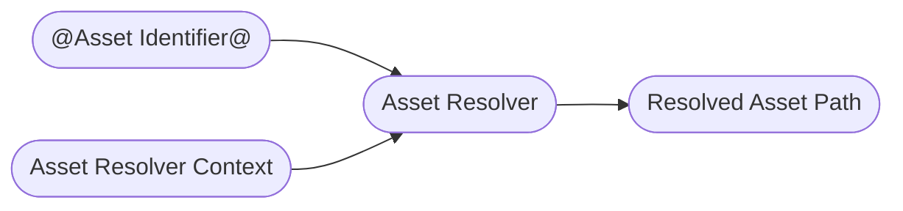

# Asset Resolver [资产解析器]
The [Asset Resolver](https://openusd.org/dev/api/ar_page_front.html) is one of those core Usd topics you have to face eventually and can't get around if you plan on using Usd in production. To summarize its functionality in a simple diagram:

[ 资产解析器是您最终必须面对的 USD 核心主题之一，如果您计划在生产中使用美元，则无法回避. 用一个简单的图表总结其功能]

~~~admonish tip title=""

~~~
You can kind of think of your asset resolver as a little black box that takes an input path, processes it and spits out a file path/URI that can be opened as a file/streamed data from. It allows you to hook into Usd's file path lookups in order to redirect where the actual file is or to pin an asset identifier to an older version. This is probably the most common use case in VFX pipelines, as when rendering on the farm, you want your Usd stage to be in the exact same state as in your live scene.

[ 您可以将资产解析器视为一个小黑匣子，它接受输入路径，对其进行处理并输出可作为文件/流数据打开的文件路径/URI. 它允许您 hook Usd 的文件路径查找，以便重定向实际文件所在的位置或将资产标识符固定到旧版本. 这可能是 VFX 流程中最常见的用例，因为在农场渲染时，您希望 Usd stage 处于与提交农场时场景完全相同的状态]

In Usd itself, asset paths are separated from normal strings so that they can be identified as something that has to run through the resolver. In the Usd file, you'll see the `@assset_identifier@` syntax:

[ 在 Usd 中，资产路径与普通字符串分开，以便可以将它们识别为必须通过解析器运行的内容. 在 Usd 文件中，您将看到 @assset_identifier@ 语法]

~~~admonish tip title=""
```python
def "bicycle" (
    assetInfo = {
        dictionary UsdSurvivalGuide = {
            asset Asset = @assetMetadata@
            asset[] AssetDependencyPaths = [@dependencyPathA@, @dependencyPathB@]
        }
    }
    prepend references = @/opt/hfs19.5/houdini/usd/assets/pig/pig.usd@
){
    custom asset Asset = @someAsset@
    custom asset[] AssetArray = [@someAssetA@, @someAssetB@]
}

```
~~~

All file based composition arcs use [asset paths](https://openusd.org/dev/api/class_sdf_path.html) as well as any metadata (especially `assetInfo`) and any (custom) attributes of type `Asset`/`AssetArray`. In Usd files the naming convention for asset paths is `Asset`, in the API it is `pxr.Sdf.AssetPath`. So any time you see the `@...@` syntax, just remember it is an asset path.

[ 所有基于文件的合成弧都使用 [资产路径](https://openusd.org/dev/api/class_sdf_path.html) 以及任何元数据（尤其是 assetInfo ）和 任何（自定义）Asset / AssetArray 类型的属性. 在 Usd 文件中，资产路径的命名约定为 Asset ，在 API 中为 pxr.Sdf.AssetPath .因此，每当您看到 @...@ 语法时，请记住它是一个资产路径]

An important thing to note is that asset resolvers only go in one direction (at least in the Usd API): From asset identifier to resolved asset path. I assume this is because you can have multiple asset identifiers that point the the same resolved asset path. Depending on your asset resolver implementation, you can also make it bidirectional.

[ 需要注意的一件重要事情是，资产解析器是单向解析（至少在 Usd API 中）：从资产标识符到解析的资产路径. 我认为这是因为您可以有多个资产标识符指向相同的资产路径. 根据您的资产解析器实现，您也可以将其设为双向解析]

# Table of Contents [目录]
1. [Asset Resolvers In-A-Nutshell](#summary)
1. [What should I use it for?](#usage)
1. [Resources](#resources)
1. [Asset Resolver](#assetResolver)
1. [Asset Resolver Contexts](#assetResolverContext)
1. [Common Resolver Code Examples](#assetResolverAPI)
    1. [Initialization](#assetResolverAPIInitialization)
    1. [Scoped resolver caches](#assetResolverAPIScopedResolverCaches)
    1. [Creating/Opening a stage with a resolver context](#assetResolverAPIStageContext)
    1. [Resolving a path with a given bound context](#assetResolverAPIContextResolve)
    1. [Asset Paths vs Resolved Paths](#assetResolverAPIAssetPathVsResolvedPaths)

## TL;DR - Asset Resolvers In-A-Nutshell [概述]<a name="summary"></a>
Asset resolvers resolve asset identifiers (encoded in Usd with the `@...@` syntax) to loadable file paths/URIs.

[ 资产解析器将资产标识符（ usd 中使用 @...@ 语法编码）解析为可加载文件路径/URI]

~~~admonish tip title=""

~~~
It is Usd's abstraction of where to pull the actual data from and offers you the possibility to add custom pinning or data source redirection mechanisms. To guide the resolver, Usd adds the option of passing in an `Asset Resolver Context`, which is just a very simple class (with pretty much no methods you need to re-implement), that your resolver can use to aid resolution.

[ 它是 Usd 对从何处提取实际数据的抽象，并为您提供添加自定义固定或数据源重定向机制的可能性. 为了更方便的使用解析器，Usd 添加了传入“Asset Resolver Context” 的选项，这只是一个非常简单的类（几乎不需要您重新实现的方法），您的解析器可以使用它来帮助解析]

Contexts are handled per stage: They are optionally given on stage open and can also be shared between stages. If you do not provide a context, your resolver will provide a default fallback context.

[ Contexts 按 stage 进行处理：它们可以选择在 stage 打开时给出，也可以在 stage 之间共享. 如果您不提供 contexts，您的解析器将使用默认的 contexts ]

To resolve an asset identifier you can call:

[ 要解析资产标识符，您可以调用]
~~~admonish tip title=""
```python
{{#include ../../../../code/core/elements.py:assetResolverStageContextResolve}}
```
~~~
If you don't want to use any context you can call:

[ 如果您不想使用任何 context ，您可以调用]
~~~admonish tip title=""
```python
{{#include ../../../../code/core/elements.py:assetResolverResolve}}
```
~~~

One important thing to not confuse is the `Ar.ResolvedPath` and the `Sdf.AssetPath` classes.
The `Sdf.AssetPath` is the class you instantiate when you set any asset path related field/property/composition arc when writing to your layer/stage. It does not resolve anything, it only has dummy properties which just reflect what you pass to the constructor.

[ 不要混淆 Ar.ResolvedPath 和 Sdf.AssetPath . Sdf.AssetPath 是在写入 layer/stage 时设置任何与资产路径相关的 field/property/composition arc  时实例化的类. 它不解决任何问题，它只有虚拟属性，仅反映您传递给构造函数的内容]

~~~admonish tip title=""
```python
{{#include ../../../../code/core/elements.py:assetResolverAssetPath}}
```
~~~

To soften the blow on the steep asset resolver implementation learning curve we provide production ready asset resolvers here in our [GitHub Repository](https://github.com/LucaScheller/VFX-UsdAssetResolver).
These include:

[ 为了减轻资产解析器学习难度，我们在 [GitHub 存储库](https://github.com/LucaScheller/VFX-UsdAssetResolver) 中提供了生产可用的资产解析器. 这些包括]
- A fully functional file based resolver with pinning support and on runtime modification.

    [ 一个功能齐全的基于文件的解析器，具有固定支持和运行时修改]
- A fully functional python based resolver with feature parity to the file resolver, that you can use to debug/prototype your resolver. This might be enough for very small studios, who don't access thousands of assets.

    [ 一个功能齐全的基于 python 的解析器，具有与文件解析器相同的功能，您可以使用它来 debug/prototype 您的解析器. 对于不需要访问数千种资产的小型工作室来说，这可能已经足够了]
- A hybrid pre-cached python resolver is in the works, keep an eye on this repo for updates.

    [ 混合预缓存 python 解析器正在开发中，请关注此存储库以获取更新]

This should help you get up and running (or at least protoype easily and possibly outsource the C++ implementation if you need a lot of customization).

[ 这应该可以帮助您启动并运行（或者至少可以轻松地进行原型设计，如果您需要大量自定义，还可以外包 C++ 实现）]

~~~admonish danger
Currently the asset resolvers only ship with instructions for compiling against Houdini on Linux. It is on the roadmap to include Windows instructions as well as to create a build pipeline via GitHub, so that you don't necessarily have to self compile it. We'll keep you posted :)

[ 目前，资产解析器仅附带在 Linux 上针对 Houdini 进行编译的说明. 路线图上包括 Windows 指令以及通过 GitHub 创建流程，因此您不必自行编译它.们会随时通知您:]
~~~

All the implementation details and examples can be found in the below resources links. We separated it from these docs, as it is a big enough topic on its own.

[ 所有实施细节和示例都可以在以下资源链接中找到. 我们将其与这些文档分开，因为它本身就是一个足够大的主题]

~~~admonish important title="Compiling against USD"
Most DCCs ship with a customized USD build, where most vendors adhere to the [VFX Reference Platform](https://vfxplatform.com/) and only change USD with major version software releases. They do backport important production patches though from time to time. That's why we recommend using the USD build from the DCC instead of trying to self compile and link it to the DCC, as this guarantees the most stability. This does mean though, that you have to compile all plugins against each (major version) releases of each individual DCC.

[ 大多数 DCC 都附带定制的 USD 版本，其中大多数供应商都遵循 [VFX 参考平台](https://vfxplatform.com/)，并且仅随着主要版本软件发布而更改 USD. 他们有时会向后移植重要的生产补丁. 这就是为什么我们建议使用 DCC 的 USD 构建，而不是尝试自编译并将其链接到 DCC，因为这可以保证最大的稳定性. 但这确实意味着，您必须针对每个 DCC 的每个（主要版本）版本编译所有插件]
~~~

## What should I use it for? <a name="usage"></a>

[ 我应该用它做什么？]

~~~admonish tip
We'll be using the asset resolver to redirect file paths for different reasons, mainly:

[ 出于不同的原因，我们将使用资产解析器来重定向文件路径，主要是]
- Pinning: As USD pipelines are often based on "the latest asset/shot gets automatically refreshed/loaded" principle, we use the asset resolver to pin a USD stage to a specific version/state, so that it doesn't receive any asset/shot updates anymore.

    [ Pinning：由于 USD 流程通常基于“最新资产/镜头自动刷新/加载”原则，因此我们使用资产解析器将 USD Stage 固定到特定版本/状态，以便它不会接收任何资产/镜头更新]
- Redirecting the path from a custom identifier to an actual data resource. You'll only be using this aspect, if your resolver is not file based and instead URI (`myCustomURIPrefix:<identifier>`) based.

    [ 将路径从自定义标识符重定向到实际数据资源. 仅当您的解析器不是基于文件而是基于 URI ( myCustomURIPrefix:\<identifier\> ) 时，您才会使用此方面]
~~~

## Resources [资源]<a name="resources"></a>
- [Asset Resolver API Docs](https://openusd.org/dev/api/class_ar_resolver.html)
- [Asset Resolver Context API Docs](https://openusd.org/dev/api/class_ar_resolver_context.html)
- [Usd Asset Resolver - Reference Implementations - GitHub Repository](https://github.com/LucaScheller/VFX-UsdAssetResolver)
- [Usd Asset Resolver - Reference Implementations - Documentation](https://lucascheller.github.io/VFX-UsdAssetResolver/)

## Asset Resolver [资产解析器]<a name="assetResolver"></a>
You can register multiple asset resolvers via the plugin system:

[ 您可以通过插件系统注册多个资产解析器]

- There must be one primary resolver that is not URI based. As a fallback the default resolver will be used

    [ 必须有一个不基于 URI 的主解析器. 作为默认的解析器]
- Any number of URI based resolvers: These resolvers will be called when they find a path prefixed with the scheme name syntax `"<scheme>:..."` for example `http://usdSurvivalGuide/assets/bicycle.usd`)

    [ 任意数量的基于 URI 的解析器：当这些解析器找到以方案名称语法 "\<scheme\>:..." 为前缀的路径（例如 http://usdSurvivalGuide/assets/bicycle.usd ）时，将调用这些解析器]

Here is an example for a primary resolver plugin .json file:

[ 以下是主解析器插件 .json 文件的示例]
~~~admonish note title="To see the file click here" collapsible=true
```json
{
    "Plugins": [
        {
            "Info": {
                "Types": {
                    "MyPrimaryResolver": {
                        "bases": ["ArResolver"],
                        "implementsContexts" : true
                    }
                }
            },
            "LibraryPath": "../lib/myPrimaryResolver.so",
            "Name": "myPrimaryResolver",
            "Root": ".",
            "Type": "library"
        }
    ]
}
```
~~~

And an example for a URI resolver plugin .json file:

[ URI 解析器插件 .json 文件的示例]

~~~admonish note title="To see the file click here" collapsible=true
```json
{
    "Plugins": [
        {
            "Info": {
                "Types": {
                    "HybridResolver": {
                        "bases": ["MyUriResolver"],
                        "implementsContexts" : true
                    }
                }
            },
            "LibraryPath": "../lib/myUriResolver.so",
            "Name": "myUriResolver",
            "Root": ".",
            "Type": "library"
        }
    ]
}
```
~~~

The Usd files save the asset identifiers with the `@someString@` syntax. Depending on the resolver context, these identifiers might resolve to different 
paths. This allows us to save the pinned state of a Usd file. For example if we have an asset path `@assets/bicycle@` we might resolve it to  `@/server/assets/bicycle/bicycle_latest.usd@` which points to a symlink of the latest bicycle USD file. Once we submit a rendering, we usually want to pin the whole Usd file to the state it is actively being viewed in. To do that we collect all asset paths and then store their current mapping. This way we can then map the bicycle to the active version by storing `@assets/bicycle@` -> `@/server/assets/bicycle/bicycle_v003.usd@` in our resolver context.

[ Usd 文件使用 @someString@ 语法保存资产标识符. 根据解析器 context ，这些标识符可能解析为不同的路径. 这允许我们保存 USD 文件的固定状态. 例如，如果我们有一个资产路径 @assets/bicycle@ ，我们可能会将其解析为 @/server/assets/bicycle/bicycle_latest.usd@ ，它指向最新自行车 USD 文件的符号链接. 提交渲染后，我们通常希望将整个 Usd 文件固定到当前的状态. 为此，我们收集所有资源路径，然后存储它们当前的映射. 这样我们就可以通过在解析器上下文中存储 @assets/bicycle@ -> @/server/assets/bicycle/bicycle_v003.usd@ 将自行车映射到当前激活的版本]
~~~admonish danger
An asset identifier can be a string with any characters except `[]` brackets, as these are used for reading .usdz package files.

[ 资产标识符可以是包含除 [] 括号之外的任何字符的字符串，因为这些字符用于读取 .usdz 包文件]
~~~

## Asset Resolver Contexts <a name="assetResolverContext"></a>
To assist the resolver with processing asset paths, Usd adds the option of passing in an `Asset Resolver Context`. The context is just a very simple class, that your resolver can use to aid path resolution. A simple context only needs to implement:

[ 为了帮助解析器处理资产路径，Usd 添加了传入 Asset Resolver Context 的选项. context 只是一个非常简单的类，您的解析器可以使用它来帮助路径解析. 一个简单的上下文只需要实现]
```
- Default and copy constructors
- < and == operators
- hash_value
```
The rest is up to you to implement and Python expose.

[ 剩下的就由你来实现通过 Python 公开]

Contexts are handled per stage: They are optionally given on stage open and can also be shared between stages. If you do not provide a context, your resolver will provide a default fallback context. You can not change the context without re-opening the stage, but you can implement methods to modify the active stages and then signal a change notification to the stages. The resolvers listed above implement different methods to modify the mapping pairs. Are refresh can be called as follows:

[ contexts 按 stage 进行处理：它们可以选择在 stage 打开时给出，也可以在 stage 之间共享. 如果您不提供 context，您的解析器将提供默认 context . 您无法在不重新打开 stage 的情况下更改 context ，但您可以实现方法来修改 active stage ，然后向 stage 发出更改通知. 上面列出的解析器实现不同的方法来修改映射. 刷新可以调用如下：]
~~~admonish tip title=""
```python
{{#include ../../../../code/core/elements.py:assetResolverContextRefresh}}
```
~~~

As you can see the ```stage.GetPathResolverContext()``` actually returns a list and not a single resolver context. This is because there can be multiple resolvers running at the same time. As stated above a single primary resolver and multiple URI-resolvers, you therefore have a resolver context per resolver.

[ 正如您所看到的， stage.GetPathResolverContext() 实际上返回一个列表，而不是单个解析器 context . 这是因为可以有多个解析器同时运行. 如上所述，单个主解析器和多个 URI 解析器，因此每个解析器都有一个解析器 context ]
~~~admonish tip title=""
```python
{{#include ../../../../code/core/elements.py:assetResolverContextAccess}}
```
~~~

~~~admonish warning title="Resolver Contexts Per Resolver in C++"
There can only be a single resolver context object instance of the same class in the resolver context. Usually each resolver ships with its own context class, if the resolver tries to create another instance of the resolver context, it will be ignored when trying to add it the the bound context list.
This is nothing you have to worry about in Python, we'd just thought we'd mention it here 
for completeness, as it can cause some head-scratching when coding a resolver.

[ 解析器 context 中只能有一个同一类的解析器 context 对象实例. 通常每个解析器都附带有自己的 context ，如果解析器尝试创建解析器 context 的另一个实例，则在尝试将其添加到绑定 context 列表时它将被忽略. 在 Python 中，这不是你需要担心的，我们只是想在这里提及它以保持完整性，因为在编写解析器时它可能会导致一些令人头疼的问题]
~~~

~~~admonish warning title="Refresh Resolver Contexts in Python"
When implementing the context in C++, make sure that the internal data is accessed via a shared pointer as Usd currently creates resolver context copies when exposed via Python
instead of passing thru the pointer. Otherwise calling ```ArNotice::ResolverChanged(*ctx).Send();``` won't work!
See for more info: [Usd Interest Forum Thread](https://groups.google.com/g/usd-interest/c/9JrXGGbzBnQ/m/_f3oaqBdAwAJ)

[ 在 C++ 中实现 context 时，请确保通过共享指针访问内部数据，因为 Usd 目前在通过 Python 公开时创建解析器 context 副本，而不是通过指针传递. 否则调用 ArNotice::ResolverChanged(*ctx).Send(); 将不起作用！有关更多信息，请参阅：[Usd Interest Forum Thread](https://groups.google.com/g/usd-interest/c/9JrXGGbzBnQ/m/_f3oaqBdAwAJ)]
~~~


## Common Resolver Code Examples <a name="assetResolverAPI"></a>
Let's look at some practical examples that you'll use in the day to day work, we'll discuss Houdini specifics in the Houdini section of this guide:

[ 让我们看一下您将在日常工作中使用的一些实际示例，我们将在本指南的 Houdini 部分讨论 Houdini 的具体细节]

#### Initialization <a name="assetResolverAPIInitialization"></a>
To see if your resolver is being loaded you can set the `TF_DEBUG` environment variable to `AR_RESOLVER_INIT`:

[ 要查看您的解析器是否正在加载，您可以将 TF_DEBUG 环境变量设置为 AR_RESOLVER_INIT]

~~~admonish tip title=""
```bash
export TF_DEBUG=AR_RESOLVER_INIT
```
~~~
This will log the following to stdout if you use our FileResolver:

[ 如果您使用我们的 FileResolver，这会将以下内容记录到标准输出]

~~~admonish tip title=""
```
ArGetResolver(): Using asset resolver FileResolver from plugin ../dist/fileResolver/lib/fileResolver.so for primary resolver
ArGetResolver(): Found URI resolver ArDefaultResolver
ArGetResolver(): Found URI resolver FS_ArResolver
ArGetResolver(): Using FS_ArResolver for URI scheme(s) ["op", "opdef", "oplib", "opdatablock"]
ArGetResolver(): Found URI resolver FileResolver
ArGetResolver(): Found package resolver USD_NcPackageResolver
ArGetResolver(): Using package resolver USD_NcPackageResolver for usdlc from plugin usdNc
ArGetResolver(): Using package resolver USD_NcPackageResolver for usdnc from plugin usdNc
ArGetResolver(): Found package resolver Usd_UsdzResolver
ArGetResolver(): Using package resolver Usd_UsdzResolver for usdz from plugin usd
```
~~~

For more information about debugging, check out our [Debugging & Performance Profiling](../profiling/overview.md) section.

[ 有关调试的更多信息，请查看我们的 [调试和性能分析](../profiling/overview.md) 部分]

To check what the active primary resolver is, you can also run:

[ 要检查活动的主解析器是什么，您还可以运行]
~~~admonish tip title=""
```python
{{#include ../../../../code/core/elements.py:assetResolverBound}}
```
~~~
It is important that you import the Python module of your resolver first, otherwise you won't get your Python object when calling `Ar.GetUnderlyingResolver()`.

[ 首先导入解析器的 Python 模块很重要，否则在调用 “Ar.GetUnderlyingResolver()” 时将无法获取 Python 对象]

#### Scoped resolver caches <a name="assetResolverAPIScopedResolverCaches"></a>
To ensure that we always get the same resolved paths, you can use a scoped resolver cache. When working in DCCs, you don't have to worry about this as the DCC should handle this for you.

[ 为了确保我们始终获得相同的解析路径，您可以使用范围解析器缓存. 在 DCC 工作时，您不必担心这个问题，因为 DCC 应该为您处理这个问题]
~~~admonish tip title=""
```python
{{#include ../../../../code/core/elements.py:assetResolverScopedCache}}
```
~~~

#### Creating/Opening a stage with a resolver context <a name="assetResolverAPIStageContext"></a>
~~~admonish tip title=""
```python
{{#include ../../../../code/core/elements.py:assetResolverContextCreation}}
```
~~~

#### Resolving a path with a given bound context <a name="assetResolverAPIContextResolve"></a>
This is probably most used resolved method you'll use. It resolves the asset identifier using the active stage's context.

[ 这可能是您将使用的最常用的解析方法. 它使用 active stage`s context 解析资产标识符]
~~~admonish tip title=""
```python
{{#include ../../../../code/core/elements.py:assetResolverStageContextResolve}}
```
~~~

If you don't want to use any context you can call:

[ 如果您不想使用任何 context，您可以调用]
~~~admonish tip title=""
```python
{{#include ../../../../code/core/elements.py:assetResolverResolve}}
```
~~~

#### Asset Paths vs Resolved Paths <a name="assetResolverAPIAssetPathVsResolvedPaths"></a>
One important thing to not confuse is the `Ar.ResolvedPath` and the `Sdf.AssetPath` classes.
The `Sdf.AssetPath` is the class you instantiate when you set any asset path related field/property/composition arc when writing to your layer/stage. It does not resolve anything, it only has dummy properties which just reflect what you pass to the constructor.

[ 不要混淆 Ar.ResolvedPath 和 Sdf.AssetPath . Sdf.AssetPath 是在写入 layer/stage 时设置任何与资产路径相关的 field/property/composition arc 时实例化的类. 它不解决任何问题，它只有虚拟属性，仅反映您传递给构造函数的内容]
~~~admonish tip title=""
```python
{{#include ../../../../code/core/elements.py:assetResolverAssetPath}}
```
~~~


